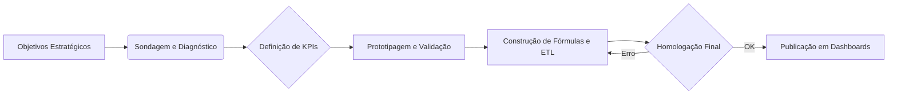
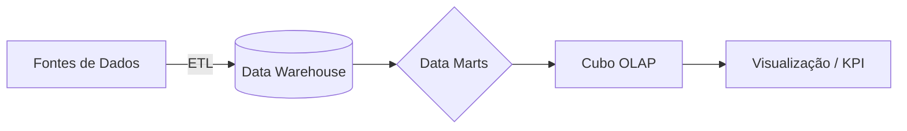
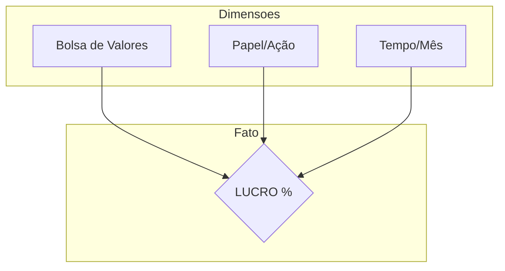
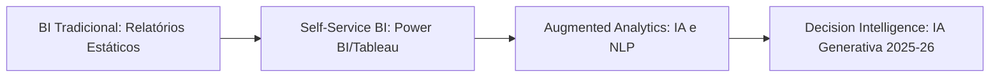

# Unidade I - Introdução, OLAP e ferramentas

## 1. KPI

### Conceitos Fundamentais

- **Definição:** KPIs são indicadores numéricos que medem o desempenho de um processo em relação aos objetivos estratégicos da organização.
- **Função Principal:** Atuam como veículos de comunicação, permitindo que a gestão entenda se a empresa está no caminho certo para atingir suas metas.
- **Diferencial:** Diferente de uma métrica comum, um KPI é "chave", ou seja, ele é vital para o sucesso do negócio e deve levar a uma tomada de decisão ou ação.

### Atributos de um bom KPI

Para que um indicador seja considerado um KPI eficaz, ele deve possuir:

- **Disponibilidade:** Deve ser possível coletar e acessar os dados necessários.
- **Mensurabilidade:** Deve ser quantitativo e fácil de medir.
- **Importância:** Deve ser relevante para o objetivo que se pretende alcançar.
- **Confiabilidade:** Os dados que alimentam o KPI devem ser precisos e fidedignos.

### Alinhamento Estratégico

- Os indicadores não devem existir isoladamente; eles precisam estar conectados à **estratégia da empresa**.
- **Exemplo Prático:** Se o objetivo é aumentar a satisfação do cliente, o KPI pode ser o NPS (Net Promoter Score). Se o foco é eficiência operacional, o KPI pode ser o tempo médio de ciclo de produção.

### Adições Importantes (Contexto de IA e ML)

- **KPIs em Projetos de ML:** Em ciência de dados, muitas vezes focamos em métricas técnicas (como Acurácia ou F1-Score). No entanto, para o negócio, o KPI relevante seria o "Impacto Financeiro da redução de erros" ou "Taxa de Retenção de Clientes" gerada pelo modelo.
- **Cuidado com as "Vanity Metrics":** Evite indicadores que parecem bons no papel (ex: número de visualizações), mas que não auxiliam na tomada de decisão real (Data Discovery ajuda a filtrar isso).

---

## 1.1 Finalidades e Ciclo de Vida dos KPIs

### O Propósito Real

Além de medir, os KPIs possuem funções estratégicas vitais:

- **Empoderamento:** Favorecem a participação das partes interessadas, que podem contribuir com visões baseadas em fatos, não em "achismos".
- **Capacidade Organizacional:** Exigem e promovem a melhoria da articulação interna e descentralização da tomada de decisão.
- **Cultura de Dados:** Quando as reuniões passam a ser baseadas nesses números, a conversa muda e o foco se torna o desenvolvimento sustentável.

### A Armadilha dos "200 Indicadores"

- **Erro Comum:** Empresas tentam monitorar tudo de uma vez (ex: 200 indicadores no início de um projeto).
- **Estratégia Recomendada:** Comece pequeno ("Start Small"). Selecione um "número mágico" (5 a 10 indicadores chave).
- **Evolução:** Conforme a maturidade de dados da empresa cresce, desmembra-se esses indicadores em visões mais detalhadas.

### O Ciclo de Vida de Construção de um KPI

Para definir KPIs que funcionam, deve-se seguir um fluxo lógico:

1.  **Objetivos:** Entender claramente o que a organização quer atingir.
2.  **Sondagem/Pré-diagnóstico:** Identificar o que é possível mensurar.
3.  **Estabelecimento:** Definir os indicadores iniciais.
4.  **Validação Preliminar (Prototipagem):** Antes de codificar, simule (ex: Excel/Tabela Dinâmica) e valide com o usuário se aquele número faz sentido.
5.  **Construção da Fórmula:** Definir a regra de negócio exata para o cálculo.
6.  **Definição de Responsáveis:** Todo KPI precisa de um "dono" (gestor) que responda pelo resultado.
7.  **Coleta e ETL:** Implementação técnica (Data Warehouse/Data Lake) para extração e carga dos dados.
8.  **Validação Final (Homologação):** Passo crítico. O usuário deve validar se o número no sistema reflete a realidade antes da publicação. Publicar dados errados destrói a confiança no projeto.
9.  **Publicação (Dashboards):**
    - _Estratégico:_ Visão macro para alta gestão, sem muita interação.
    - _Tático:_ Para gerentes, permitindo identificar desvios e tomar ações corretivas rápidas.

### Exemplo Prático: NPS (Net Promoter Score) no Ensino

Como transformar uma métrica em KPI :

- **O Cenário:** Avaliação de curso (notas 0-10).
- **A Métrica:** A nota média ou a distribuição de notas.
- **O KPI (A Meta de Negócio):**
  - _Objetivo:_ Aumentar o "boca a boca" positivo.
  - _KPI 1:_ Ter > 70% de respostas na pesquisa.
  - _KPI 2:_ 100% dos detratores (notas baixas) devem ser abordados/contactados.
  - _KPI 3:_ Manter nota média dos professores acima de 4.5 (em escala de 5).

> **Insight:** "Se você não entende, não controla. Se não controla, não pode melhorar."

---

## 2 Sistemas de Suporte à Decisão

### Definição e Propósito

- **O que é:** Um sistema interativo, flexível e adaptável, desenvolvido para apoiar a solução de problemas gerenciais **não estruturados**. Ele utiliza dados e interfaces amigáveis para aperfeiçoar a tomada de decisão.
- **Objetivo:** Não serve apenas para acesso rápido à informação, mas para fornecer capacidade de análise e formatação à medida das necessidades do usuário.

### Tipos de Problemas Gerenciais

A necessidade de um SSD depende do nível de estruturação do problema:

1.  **Estruturados:** Variáveis conhecidas e consequências previsíveis. Não exigem SSD complexo (ex: folha de pagamento).
2.  **Semi-estruturados:** Algumas variáveis não são claras. O sistema ajuda, mas o julgamento humano é necessário.
3.  **Não Estruturados:** Alto risco e incerteza. Não há histórico ou padrão claro (ex: abrir uma fábrica em um novo país, como o caso da Mercedes em Juiz de Fora).

### Evolução Histórica do Processamento de Decisão

A evolução das ferramentas reflete a capacidade de processamento e a cultura de dados das épocas:

- **1950 - 1980 (Era do Papel):**
  - Processos manuais, cartões perfurados, telex.
  - Agências bancárias dependiam de listas impressas e verificações manuais de saldo.
- **1980 - 1990 (Era das Planilhas):**
  - Surgimento do Lotus 1-2-3 e Excel.
  - Início da informatização pessoal, mas com muita entrada de dados manual.
- **Anos 1990 (Era da Conectividade e OLAP):**
  - Surgimento de ferramentas de suporte à decisão online (SQL, Relatórios).
  - Nascimento do **OLAP** (Online Analytical Processing) para visualização de dados multidimensionais.
  - Início do conceito de **Data Mining** (embora o termo "mineração" implique saber o que se busca, aqui o foco é descobrir padrões desconhecidos/KDD).
- **Anos 2000 - 2010+ (Era da Análise Avançada e Big Data):**
  - Aplicativos de análise customizáveis.
  - Explosão do Big Data e modelos preditivos complexos.

### Modelos de SSD

Os sistemas atuais utilizam diferentes tipos de modelos para apoiar decisões:

#### 1. Modelo Estático (Relacionamentos)

- Estabelece conexões entre variáveis fixas.
- _Exemplo:_ Analisar vendas de um produto específico cruzando com idade e renda do consumidor.

#### 2. Modelo de Previsão (Forecasting)

- Alimentado com dados históricos para projetar o futuro.
- _Exemplo:_ Prever vendas futuras ou movimentos da concorrência.

#### 3. Modelo de Otimização

- Determina a alocação eficiente de recursos.
- _Exemplo:_ Definir o ponto exato de reposição de estoque para evitar indisponibilidade sem gerar excesso.

#### 4. Análise de Sensibilidade (What-If)

- Responde a perguntas do tipo "O que acontece se...?".
- _Exemplo:_ "Qual a consequência no market share se eu aumentar o preço do produto X em 5%?".
- _Objetivo:_ Medir e monitorar riscos previamente.

---

## 3 OLAP: Online Analytical Processing

### O que é OLAP?

- **Definição:** É uma tecnologia de computação que permite aos usuários extrair e visualizar dados de diferentes pontos de vista (multidimensionalidade).
- **Concepção:** Surgiu nos anos 90 para resolver a lentidão dos relatórios estáticos e permitir que o próprio usuário final "navegasse" pelos dados.
- **O Mito do "Online":** O termo "Online" não significa necessariamente tempo real (streaming), mas sim a capacidade de resposta interativa e rápida às consultas do usuário.

### Ambiente Transacional (OLTP) vs. Ambiente Analítico (OLAP)

Para garantir performance, o SSD moderno separa os ambientes:

- **OLTP (Online Transactional Processing):** Focado no dia a dia, operações de inserção, deleção e atualização (Ex: passar uma compra no caixa). É otimizado para transações rápidas.
- **OLAP (Online Analytical Processing):** Focado na análise de grandes volumes de dados históricos. É otimizado para leitura e agregações (Ex: "Qual foi o faturamento total por região no último ano?").
  > **Nota:** Recomenda-se isolar o ambiente analítico do transacional para não "travar" o sistema de produção da empresa.

### Características Principais (Regras de Codd)

Para um sistema ser considerado OLAP, ele deve oferecer:

1.  **Visão Conceitual Multidimensional:** Organização dos dados em dimensões (Tempo, Produto, Geografia) e medidas (Vendas, Quantidade).
2.  **Transparência:** O usuário não precisa saber de onde o dado vem ou como é processado.
3.  **Acessibilidade:** Deve conseguir cruzar dados de diversas fontes.
4.  **Performance de Resposta:** As consultas devem ser rápidas, independente do volume.
5.  **Manipulação de Dados:** Capacidade de realizar cálculos complexos e cruzamentos ad-hoc.

### O Movimento Self-Service BI

O professor destaca uma mudança de paradigma a partir de 2010 com ferramentas como **Tableau** e **Qlik**:

- **Antigamente:** O usuário "encomendava" um relatório para a TI e esperava dias pela entrega.
- **Hoje (Self-Service):** A TI prepara a estrutura de dados (o Cubo ou modelo) e o usuário final, com interfaces amigáveis (drag-and-drop), constrói seus próprios gráficos e dashboards.
- **Perfil do Usuário Atual:** Gestores modernos são mais alfabetizados em dados e preferem autonomia para gerar seus próprios insights sem envolver código ou funções complexas.

### Objetivo Final

Transformar dados brutos em informações capazes de dar suporte às decisões gerenciais de forma:

- **Amigável** (Interface intuitiva).
- **Flexível** (Permite mudar a visão do dado rapidamente).
- **Em tempo hábil** (Entregar a informação a quem precisa no momento certo).

---

## 3.1 Arquitetura de um Projeto de BI / OLAP

### Visão Geral da Arquitetura

Um projeto de BI profissional não conecta a ferramenta de visualização diretamente à base de dados de produção. Ele segue uma estrutura de camadas para garantir integridade e performance:

#### 1. Fontes de Dados (Data Sources)

- **Origens Internas:** Sistemas transacionais (ERP, CRM), bases SQL.
- **Origens Externas:** Arquivos CSV, XML, JSON, dados de raspagem (scraping) ou APIs de terceiros.

#### 2. ETL (Extract, Transform, Load)

- É a camada crítica onde ocorre a "limpeza" e padronização.
- O dado é extraído da origem, transformado (regras de negócio, conversão de tipos) e carregado no destino analítico.

#### 3. Data Warehouse (DW) e Data Marts

- **Data Warehouse:** O repositório central, robusto e histórico da organização.
- **Data Marts:** "Fatias" do DW focadas em áreas específicas (ex: Marketing, RH, Financeiro). Facilitam a gestão e o acesso rápido.

### O Cubo OLAP (Multidimensionalidade)

A arquitetura culmina na criação do **Cubo**, que organiza os dados em:

- **Dimensões (Eixos):** As perspetivas de análise.
  - _Exemplo:_ Tempo (Dia 15), Local (Belo Horizonte), Produto (Cerveja).
- **Medidas/Fatos (Valores):** Os indicadores numéricos que queremos analisar.
  - _Exemplo:_ Quantidade vendida, Valor total vendido.
- **Hierarquias:** Organização dentro das dimensões.
  - _Exemplo:_ Família de Bebidas -> Tipo (Alcoólica) -> Categoria (Cerveja) -> Marca.

### Ponto de Atenção: Performance

- O professor alerta que a combinação de múltiplas dimensões (ex: 853 municípios em Minas Gerais x milhares de produtos x tempo) pode gerar volumes de dados gigantescos.
- **Desafio Técnico:** O projeto deve ser desenhado para ser performático, selecionando bem o que será processado e entregue ao utilizador para evitar lentidão no SSD.

### Crítica ao Mercado Atual

- **O problema:** Muitos projetos atuais ignoram essas camadas e conectam ferramentas de dashboard diretamente em bases desestruturadas.
- **A consequência:** Perda de "uma única versão da verdade" e problemas graves de escala e performance no futuro.

---

## 3.2 Cubos OLAP: Modelagem e Visualização

### Anatomia de um Cubo (Exemplo Prático)

A montagem de um cubo ocorre na junção das dimensões no seu menor nível de detalhe (granularidade).

**Exemplo: Mercado de Ações**

- **Dimensões:** Bolsa de Valores (Local), Papel (Empresa/Ação), Tempo (Mês).
- **Medida (KPI):** Lucratividade (%).
- **Fato:** O registro de que o "Papel X" na "Bolsa Y" no "Mês Z" rendeu "5%".

#### O Processo de Gravação

Diferente de uma tabela comum, o Cubo "pré-calcula" as combinações para que, quando o gestor filtrar por "Rio de Janeiro" e "Janeiro", a resposta seja instantânea.

### Design e Storytelling de Dados

O professor enfatiza que um projeto OLAP não termina na base de dados; ele termina na tela do utilizador. Antes de desenvolver, é preciso definir:

#### 1. Seleção de Componentes Visuais

Cada KPI deve ter um formato ideal de visualização:

- **Cartões:** Para números isolados e críticos (Ex: Lucro Total).
- **Gráficos de Linha:** Para tendências temporais (Evolução mensal).
- **Gráficos de Rosca/Barra:** Para comparação entre categorias.
- **Mapas:** Para distribuição geográfica.

#### 2. Identidade Visual e Padrões

- **Cores:** Utilizar a paleta institucional da empresa (identidade visual).
- **Storytelling:** Organizar os gráficos de forma que contem uma história lógica para o gestor.
- **Validação:** O utilizador deve validar o protótipo (desenho) antes da carga real dos dados.

### Operações em Cubos (Navegação)

Embora a aula foque na montagem, ela introduz a lógica das operações que permitem explorar o dado:

- **Slicing (Fatiar):** Selecionar apenas uma dimensão (Ex: Ver apenas dados de "São Paulo").
- **Dicing (Dados em cubos):** Selecionar um sub-cubo cruzando várias dimensões.
- **Drill-down / Roll-up:** Navegar na hierarquia (Ex: Sair do ano e detalhar por mês, ou vice-versa).

### Insight para IA e Machine Learning

> "Os dados utilizados no OLAP para validação podem ser fictícios durante o desenvolvimento, mas o carregamento final (Data Load) deve ser rigoroso. Para modelos de ML, a estrutura de cubo facilita a criação de 'Feature Stores', onde as variáveis já estão agregadas e prontas para o treino."

---

## 3.3 Ferramentas OLAP e o Mercado de BI

### O Quadrante Mágico do Gartner

O professor utiliza o Quadrante Mágico como referência para classificar as ferramentas em quatro categorias: **Líderes, Desafiadores, Visionários e Players de Nicho**.

#### As Três Grandes (Líderes)

1.  **Microsoft (Power BI):** Atualmente a líder absoluta. O sucesso se deve à integração com o ecossistema Microsoft, facilidade de aprendizado e preço competitivo.
2.  **Salesforce (Tableau):** Adquirida pela Salesforce em 2019. É reconhecida pelo seu poder visual superior (Data Storytelling) e recursos analíticos avançados.
3.  **Qlik (Qlik Sense/QlikView):** Pioneira no modelo associativo de dados, continua forte entre os líderes pela sua capacidade de processamento em memória.

### Ferramentas em Foco na Disciplina

- **Tableau:** Será a ferramenta principal utilizada para as análises práticas desta disciplina. O foco será na construção de histórias baseadas em dados (Storytelling), deixando a parte de modelagem pesada de Data Marts para um segundo momento.
- **Power BI:** Citada como a ferramenta com maior oferta de vagas no LinkedIn, sendo essencial para o perfil do profissional de dados atual.

### Status do Mercado: Horizonte 2025 - 2026 (Adição)

Atualizando a analise para 2026, aqui estão os pontos fundamentais:

#### 1. A Era do "AI-First BI"

As ferramentas não são mais apenas de "visualização", mas de **análise generativa**.

- **Microsoft Fabric & Copilot:** O Power BI agora está integrado ao Fabric (plataforma de dados unificada). O Copilot permite criar dashboards e cálculos DAX apenas via comandos de voz ou texto.
- **Tableau Pulse:** Utiliza IA generativa para enviar "insights proativos" diretamente no Slack ou e-mail do gestor, antes mesmo de ele abrir o dashboard.

#### 2. Unified Data Platforms

A arquitetura mudou de "ferramentas isoladas" para plataformas ponta-a-ponta.

- O foco agora é o **Data Lakehouse** (Databricks/Snowflake), onde o OLAP acontece diretamente sobre dados armazenados em nuvem, eliminando a necessidade de mover dados constantemente entre camadas.

#### 3. Métricas Headless (Semantic Layer)

O conceito de "Cubo" evoluiu para a **Camada Semântica Centralizada**. Ferramentas como dbt (Semantic Layer) e Cube.js permitem definir a métrica uma única vez e consumi-la no Power BI, Tableau ou diretamente em aplicações de Python, garantindo a "única versão da verdade".

### Reflexão

> "Saber clicar nos botões do Tableau ou Power BI é o básico. O diferencial do especialista em IA será entender a modelagem multidimensional por trás e como integrar os modelos preditivos para que o dashboard não mostre apenas o passado, mas sugira a próxima melhor ação."

---

## Estudo de caso

- [Toyota Motor Sales USA (BI e Eficiência Logística)](./case-studies/toyota-case.md)

---

## Bibliografia e Recursos

### Bibliografia Básica

- **GAMA**, Joao. _Knowledge Discovery from Data Streams_. Chapman and Hall/CRC, 2010. (E-book).
- **HALL**, Mark; **FRANK**, Eibe; **WITTEN**, Ian. _Data Mining: Concepts and Techniques_. 3rd Edition. Massachusetts (USA): Morgan Kaufman, 2011. (O'Reilly). (E-book).
- **INFORMATION RETRIEVAL JOURNAL**. Netherlands: Springer. ISSN 1573-7659. [Acesso ao Journal](https://www.springer.com/journal/10791).
- **KAMBER**, Micheline; **PEI**, Jian; **HAN**, Jiawei. _Data Mining: Concepts and Techniques_. 3rd Edition. Massachusetts (USA): Morgan Kaufman, 2011. (E-book).
- **LAROSE**, Daniel T. _Discovering Knowledge in Data: An Introduction to Data Mining_. 2nd Edition. New Jersey (USA): Wiley, 2014. (O’Reilly). (E-book).
- **LAROSE**, Daniel T.; **LAROSE**, Chantal D. _Data Mining and Predictive Analytics_. 2nd Edition. New Jersey (USA): Wiley, 2015. (E-book).

### Bibliografia Complementar

- **CASTRO**, Leandro Nunes de; **FERRARI**, Daniel Gomes. _Introdução à mineração de dados: conceitos básicos, algoritmos e aplicações_. São Paulo: Saraiva, 2016. (E-book).
- **DATA MINING AND KNOWLEDGE DISCOVERY**. Netherlands: Springer, 1999-. ISSN 1384-5810. [Acesso ao Journal](https://link.springer.com/journal/10618/volumes-and-issues).
- **FOUCHÉ**, Guy; **LANGIT**, Lynn. _Foundations of SQL Server 2008 R2 Business Intelligence_. 2.ed. New York, NY: Apress, 2011. (E-book).
- **SWANSON**, Sandra. _Self-Service Analytics_. Sebastopol, CA: O'Reilly Media, Inc., 2016. (E-book).

---

[Previous](./summary.md)
[Next](./02-data-driven-data-discovery.md)
