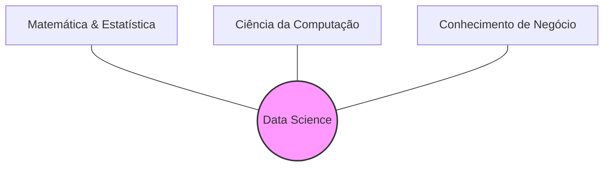
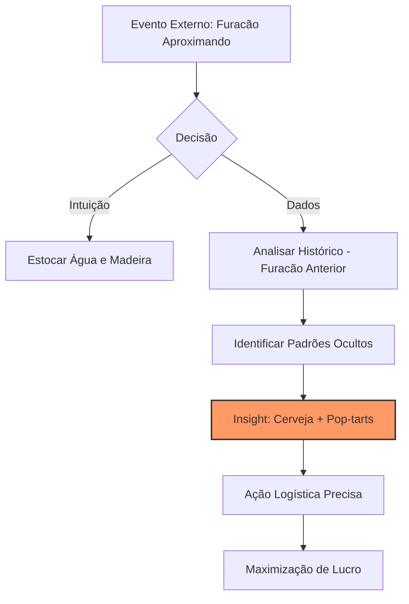
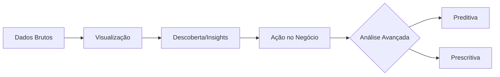

# Unidade II – Data-Driven e Data Discovery

## 1. Cultura Data-Driven: Panorama Geral

### Conceito

Ser _Data-Driven_ (orientado a dados) não é apenas sobre possuir grandes bancos de dados ou uma equipe numerosa de cientistas. É uma mudança cultural onde as decisões deixam de ser baseadas apenas no "feeling" (intuição/achismo) e passam a ser fundamentadas em evidências extraídas dos dados.

### Pessoas no Centro

O professor destaca que a tecnologia é secundária. O sucesso de uma organização orientada a dados depende da **interação complexa** entre:

1.  Os dados que a empresa possui.
2.  Onde estão armazenados.
3.  **Como as pessoas trabalham com eles.**
4.  Quais problemas são considerados valiosos para o negócio.

> **Ponto Chave:** "As respostas para perguntas como 'Quem controla os dados?' e 'A quem se reportam?' são mais importantes do que qual banco de dados utilizar."

### O Papel do Cientista de Dados

A profissão não cria nada fundamentalmente novo (estatísticos e analistas já existiam), mas combina habilidades de uma maneira inédita.

#### O "Tripé" de Competências

Para ser eficaz, o profissional precisa equilibrar três áreas:

1.  **Matemática e Estatística:** Para modelar e validar.
2.  **Programação/Computação:** Para manipular e processar.
3.  **Conhecimento de Domínio/Negócio:** Para entender o problema real.

---

## 1.1. Organizações Data-Driven

### O Conceito na Prática

Empresas orientadas a dados (Data-Driven) não são apenas as gigantes de tecnologia ("Big Techs" como Google, Amazon, Facebook, LinkedIn). Organizações tradicionais ("Brick and Mortar") podem e devem utilizar dados para guiar decisões estratégicas.

### Estudo de Caso: Walmart (O Pioneirismo)

O Walmart é citado como um dos maiores exemplos de cultura de dados fora da bolha da internet.

#### 1. A Evolução da Coleta (Do Manual ao Código de Barras)

- **O Problema (Anos 70/80):** A entrada de dados era manual (digitação de valores na caixa registradora). Isso gerava erros, impossibilitava o controle de estoque item a item e não permitia saber _o que_ estava sendo vendido, apenas _quanto_.
- **A Solução:** Adoção pioneira do **Código de Barras**.
- **O Impacto:**
  - Rastreabilidade exata do item (SKU) vendido.
  - Automação da reposição: O sistema identifica a baixa no estoque e aciona a cadeia de suprimentos (Logística/Compras) automaticamente.
  - Análise de tendências regionais e sazonais.

#### 2. Infraestrutura (Big Data antes do termo existir)

O Walmart construiu um dos maiores Data Warehouses do planeta. Em 2010, já operavam com **600 Terabytes a 1 Petabyte** de dados, um volume 30x maior que a Biblioteca do Congresso dos EUA na época.

### Market Basket Analysis (Análise de Cesta de Compras)

O objetivo é identificar correlações entre produtos: "Quem compra X, tem alta probabilidade de comprar Y".

#### A Lenda da Cerveja e das Fraldas

Um dos casos mais famosos de mineração de dados (Data Mining) citado na aula:

- **O Insight:** Homens jovens, às sextas-feiras, compravam fraldas e cerveja juntos.
- **A Ação:** O Walmart posicionou as gôndolas de fraldas próximas às de cerveja (ou snacks próximos a fraldas) para facilitar a "venda cruzada".
- **O Resultado:** Aumento significativo nas vendas de ambos os itens.
- **Nota de Enriquecimento (Contexto AI/ML):** Em Machine Learning, isso é resolvido com **Regras de Associação** (algoritmos como _Apriori_ ou _Eclat_). O objetivo é encontrar a probabilidade condicional $P(B|A)$ — a probabilidade de comprar B dado que comprou A.

### Estudo de Caso: O Furacão Frances (Análise Preditiva)

Este caso demonstra como dados vencem a intuição ("Gut Feeling").

- **O Cenário (2004):** O furacão Frances estava se aproximando da Flórida.
- **A Abordagem Tradicional (Intuição):** Estoque de itens de sobrevivência básica (água, madeira, lanternas).
- **A Abordagem Data-Driven:** A equipe de BI analisou o comportamento de consumo durante o furacão Charley (ocorrido um mês antes).
- **A Descoberta (Insight dos Dados):**
  - Houve um aumento extraordinário na venda de **Cerveja** (fase pré-furacão).
  - Houve um consumo 7x maior que a média de **Pop-tarts de Morango** (fase pós-furacão/café da manhã sem eletricidade).
- **A Ação:** A logística enviou caminhões extras carregados especificamente com esses itens para a rota do furacão, garantindo abastecimento e lucro.

---

## 1.2. O Que NÃO é Data-Driven? (Armadilhas e Desafios)

### A Ilusão do Sucesso e a Síndrome do "HiPPO"

O professor utiliza o livro _"Como as Gigantes Caem"_ (Jim Collins) para ilustrar que o sucesso passado não garante o futuro. A arrogância ("excesso de confiança") leva ao declínio.

Um dos maiores inimigos da cultura Data-Driven é a figura do **HiPPO** (Highest Paid Person's Opinion - A opinião da pessoa mais bem paga na sala).

- **O Problema:** Reuniões onde a decisão é tomada baseada apenas no "feeling" do chefe, ignorando as análises e o trabalho da equipe.
- **A Solução:** Decisões baseadas em evidências. Os dados não tomam a decisão sozinhos, mas servem de suporte inegável.

### O "Trabalho Sujo" (A Realidade do Cientista de Dados)

Apresentar gráficos bonitos é a parte fácil. A realidade de uma organização orientada a dados passa por:

- **Limpeza Exaustiva:** A preparação e limpeza dos dados (Data Wrangling) costuma consumir **cerca de 70% do tempo** de um projeto de dados.
- **O Fator Humano:** Sistemas que permitem "brechas" (ex: aceitar "data de hoje" para o campo "data de nascimento") poluem a base. A qualidade do dado começa na entrada, não no painel final.

### Estudo de Caso: Twitter (O Poder da Descoberta)

Este caso demonstra como fazer as perguntas certas e explorar os dados pode salvar uma empresa.

#### O Desafio (2009)

- O Twitter tinha muito "hype", mas um problema gravíssimo de retenção: **3 em cada 4 pessoas paravam de usar o serviço após dois meses**.
- Sem usuários engajados, o modelo de negócio (propaganda) não se sustentaria.

#### A Investigação (O Método Científico)

Em vez de simplesmente copiar o que o Facebook fazia (sugerir conexões pelo catálogo de e-mails), o Twitter olhou para os seus próprios dados.

1.  **Primeira Descoberta:** Usuários que entravam no sistema pelo menos 7 vezes no primeiro mês tinham 90% de probabilidade de voltar. Mas isso não era uma "ação" que a empresa pudesse forçar.
2.  **A Escavação:** Ao analisar os usuários altamente engajados, descobriram o "número mágico": **Quem seguia 30 ou mais pessoas tornava-se um utilizador de longo prazo**.
3.  **O Comportamento:** Analisando _quem_ eles seguiam, perceberam que o interesse era em **conteúdo** (2/3) e não apenas em conexões mútuas (1/3).

#### A Solução e o Resultado

- **Ação:** O Twitter mudou o seu _onboarding_. Passou a ensinar o que era um "tweet" e a sugerir perfis baseados em interesses (ex: NBA, Notícias) e depois pessoas com afinidade.
- **Resultado:** Apesar de tornar o processo inicial mais longo ("atrito"), a mudança gerou um **aumento de 30% nas conclusões de cadastro** e **aumento de 20% no engajamento de longo prazo**.
- **A Lição:** Demorou 2,5 anos para chegar a este resultado através de muita testagem. Cultura Data-Driven é um processo contínuo e não um passe de mágica.

---

## 1.3. Perguntas de Negócio: Data-Driven vs. Tradicional

A principal distinção entre organizações orientadas a dados e organizações tradicionais reside na orientação temporal e no propósito das perguntas formuladas aos seus conjuntos de dados.

### Organizações Não Data-Driven (Foco no Passado)

Empresas que não possuem uma cultura de dados tendem a utilizar a informação apenas para descrever eventos que já ocorreram. As perguntas são reativas e focadas no espelho retrovisor.

- **Quantidade de vendas**: Quantos itens do produto X foram vendidos no mês passado?
- **Desempenho regional**: Como foram as vendas na região de Natal no ano passado?
- **Logística e perdas**: Quantas unidades foram devolvidas na última semana?
- **Financeiro**: Qual foi a receita e o lucro no último trimestre?
- **RH**: Quantos funcionários foram contratados no último ano?

O risco dessa abordagem é a limitação à análise descritiva, onde o gestor apenas toma conhecimento do fato após ele ter se consolidado, perdendo a janela de oportunidade para intervenções estratégicas.

### Organizações Data-Driven (Foco no Futuro)

Empresas orientadas a dados utilizam modelos preditivos e prescritivos. As perguntas visam antecipar cenários para otimizar recursos e mitigar riscos.

- **Previsão de demanda**: Quantos itens do produto X serão vendidos no próximo mês?
- **Planejamento sazonal**: Como serão as vendas por região no Natal deste ano?
- **Prevenção de perdas**: Quantas unidades correm o risco de serem devolvidas ou perdidas no próximo ciclo?
- **Gestão de Churn**: Quais clientes apresentam comportamento que indica uma possível desistência do serviço em breve?
- **Otimização de marketing**: Qual o canal de publicidade terá o melhor retorno sobre investimento para a campanha da próxima semana?

### O Ciclo da Descoberta e Tomada de Decisão

Para que uma organização mude o patamar de suas perguntas, é necessário seguir um fluxo de maturidade analítica:

1. **Dados Organizados**: A existência de dados acessíveis e confiáveis é o pré-requisito. Sem dados organizados, as respostas ao passado já são imprecisas, tornando as previsões de futuro impossíveis.
2. **Criação de Histórias**: Além de responder "quem", "o quê" e "onde", a organização deve ser capaz de contar uma história em torno da descoberta dos dados, conectando diferentes variáveis para explicar comportamentos.
3. **Suporte à Decisão Humana**: O sistema aponta indícios e faz recomendações, mas a decisão final cabe ao ser humano, que utiliza seu conhecimento de domínio para validar a aplicabilidade das previsões.

### Casos de Expansão e Monitoramento de Mercado

Grandes organizações exemplificam o uso de dados para expansão e adaptação contínua:

- **Coca-Cola**: Monitora padrões de consumo global para identificar tendências de saúde. Ao perceber a queda no interesse por açúcar e sódio, a empresa não apenas reformula produtos, mas utiliza dados de mercado para adquirir marcas regionais de sucos e águas (como o caso do Guaraná Jesus no Nordeste ou marcas de sucos naturais), garantindo a manutenção da sua cota de mercado (market share).
- **Amazon e Netflix**: Utilizam o histórico de navegação e consumo não apenas para recomendar o que você quer ver agora, mas para decidir quais novos produtos devem ser estocados ou quais séries devem ser produzidas para garantir assinaturas nos próximos trimestres.

---

## 2.1. O que é Data Discovery?

O conceito de Data Discovery representa uma evolução no modo como os dados são explorados dentro das organizações. Enquanto o BI tradicional dependia de relatórios estáticos e pré-definidos pela TI, o Data Discovery foca na exploração interativa e na autonomia do usuário.

### Definição e Propósito

Data Discovery é o processo que permite aos usuários desenvolver e refinar visualizações e análises de dados, sejam eles estruturados (bancos de dados tradicionais) ou não estruturados (textos, logs, redes sociais).

- **Termos de Pesquisa**: A análise utiliza termos de busca e navegação intuitiva em vez de consultas complexas em SQL.
- **Agilidade**: Elimina a dependência excessiva do setor de TI para a criação de relatórios, reduzindo o tempo entre a pergunta de negócio e a resposta visual.
- **Acessibilidade**: As ferramentas modernas permitem o acesso e a composição de informações em múltiplos dispositivos, como tablets e smartphones, promovendo a análise em todo lugar.

#### Etapas do Data Discovery

O processo de descoberta não se resume apenas a olhar para um gráfico; ele segue um fluxo de amadurecimento:

1. **Preparação e Integração**: Coleta de dados de fontes diversas.
2. **Visualização de Dados**: Transformação dos dados em representações visuais para identificação de padrões.
3. **Descoberta de Informações**: Fase exploratória onde insights ocultos são revelados através da interação com os dados.
4. **Influência nos Negócios**: O momento em que a análise gera ações concretas e decisões estratégicas.

#### Níveis de Análise

O Data Discovery serve de base para diferentes níveis de profundidade analítica:

- **Análise Descritiva e Diagnóstica**: Foca no que aconteceu e por que aconteceu.
- **Análise Preditiva**: Utiliza modelos estatísticos e algoritmos de ML para identificar o que provavelmente acontecerá.
- **Análise Prescritiva**: Sugere caminhos e ações para otimizar os resultados futuros.

### Ferramentas e Comparação Técnica

O professor estabelece uma comparação entre o uso de ferramentas visuais (como Tableau e Power BI) e o uso de linguagens de programação (Python e R) no contexto de descoberta de dados.

#### Ferramentas Visuais (Tableau/Power BI)

- **Intuição**: São ferramentas de arrastar e soltar (drag-and-drop), facilitando a navegação interativa.
- **Público**: Voltadas para usuários de negócio e analistas que precisam de respostas rápidas sem necessariamente dominar código.
- **Visualização**: Possuem um apelo visual muito forte e facilitam o storytelling de dados.

#### Linguagens de Programação (Python/R)

- **Poder de Previsão**: Embora ferramentas visuais ofereçam algumas previsões, linguagens como Python e R permitem a construção de modelos de ML muito mais complexos e customizados.
- **Curva de Aprendizado**: Exigem conhecimento de algoritmos e sintaxe, o que pode ser uma barreira para usuários puramente de negócio.
- **Integração**: É comum integrar o processamento feito em Python/R com a visualização final em ferramentas de Data Discovery para unir o poder estatístico com a facilidade visual.

### Conexão com IA/ML

O Data Discovery é frequentemente a etapa de Análise Exploratória de Dados (EDA) em um projeto de Machine Learning. Antes de treinar qualquer modelo, o cientista de dados utiliza técnicas de descoberta para entender a distribuição dos dados, identificar correlações e detectar anomalias (outliers) que poderiam prejudicar a performance do algoritmo. A descoberta de dados bem feita reduz o erro na escolha das variáveis (feature selection) para a Inteligência Artificial.

---

## Análise Descritiva

---

## Análise Preditiva

---

## Análise Prescritiva.

---

## Bibliografia e Recursos

### Bibliografia Básica

- **ANDREATTO**, R. _Construindo um Data Warehouse e Analisando suas Informações com Data Mining e OLAP_. Monografia Final de Curso. Faculdade de Ciências Administrativas, Faculdade de Valinhos. 1999.
- **BARBIERI**, Carlos. _BI - Business Intelligence: Modelagem e tecnologia_. Rio de Janeiro: Axcel Books, 2001.
- **CARVALHO**, B.F. _Arquiteturas de Ferramentas OLAP_. SQL Magazine, Rio de Janeiro, ano 1, ed. 9, p.12-16, 2004.
- **DWBrasil**. _OLAP_. 2007. Disponível em: [Acesso em 24 outubro 2007].
- **INMON**, W. H. _Como Construir o Data Warehouse_. Rio de Janeiro: Campus, 1997.

---

[Previous](./01-introduction-olap-tools.md)
[Next](./03-data-analysis-with-tools.md)
