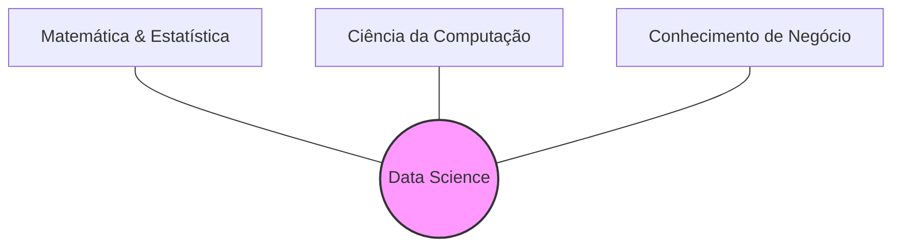
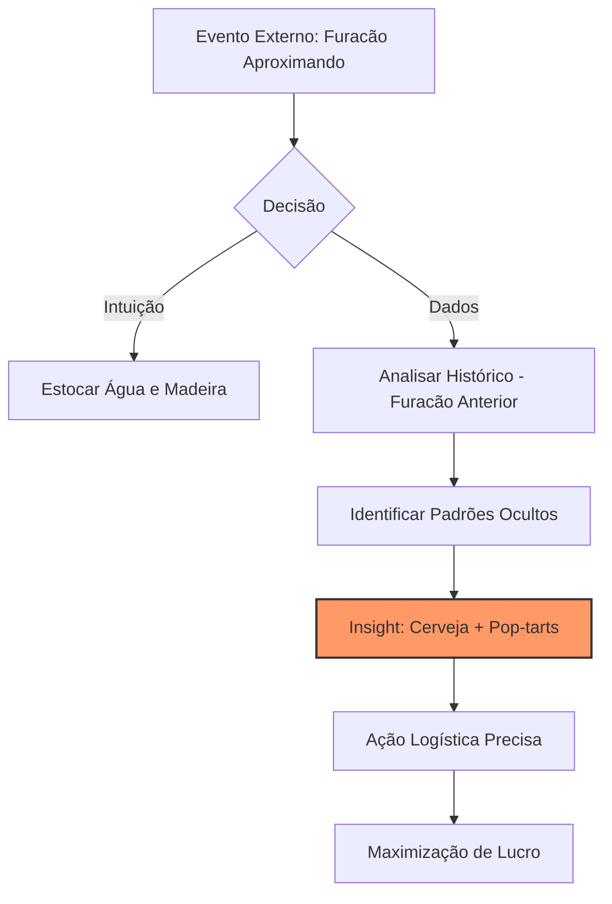

# Unidade II – Data-Driven e Data Discovery

## 1. Cultura Data-Driven: Panorama Geral

### Conceito

Ser _Data-Driven_ (orientado a dados) não é apenas sobre possuir grandes bancos de dados ou uma equipe numerosa de cientistas. É uma mudança cultural onde as decisões deixam de ser baseadas apenas no "feeling" (intuição/achismo) e passam a ser fundamentadas em evidências extraídas dos dados.

### Pessoas no Centro

O professor destaca que a tecnologia é secundária. O sucesso de uma organização orientada a dados depende da **interação complexa** entre:

1.  Os dados que a empresa possui.
2.  Onde estão armazenados.
3.  **Como as pessoas trabalham com eles.**
4.  Quais problemas são considerados valiosos para o negócio.

> **Ponto Chave:** "As respostas para perguntas como 'Quem controla os dados?' e 'A quem se reportam?' são mais importantes do que qual banco de dados utilizar."

### O Papel do Cientista de Dados

A profissão não cria nada fundamentalmente novo (estatísticos e analistas já existiam), mas combina habilidades de uma maneira inédita.

#### O "Tripé" de Competências

Para ser eficaz, o profissional precisa equilibrar três áreas:

1.  **Matemática e Estatística:** Para modelar e validar.
2.  **Programação/Computação:** Para manipular e processar.
3.  **Conhecimento de Domínio/Negócio:** Para entender o problema real.

---

## 1.1. Organizações Data-Driven

### O Conceito na Prática

Empresas orientadas a dados (Data-Driven) não são apenas as gigantes de tecnologia ("Big Techs" como Google, Amazon, Facebook, LinkedIn). Organizações tradicionais ("Brick and Mortar") podem e devem utilizar dados para guiar decisões estratégicas.

### Estudo de Caso: Walmart (O Pioneirismo)

O Walmart é citado como um dos maiores exemplos de cultura de dados fora da bolha da internet.

#### 1. A Evolução da Coleta (Do Manual ao Código de Barras)

- **O Problema (Anos 70/80):** A entrada de dados era manual (digitação de valores na caixa registradora). Isso gerava erros, impossibilitava o controle de estoque item a item e não permitia saber _o que_ estava sendo vendido, apenas _quanto_.
- **A Solução:** Adoção pioneira do **Código de Barras**.
- **O Impacto:**
  - Rastreabilidade exata do item (SKU) vendido.
  - Automação da reposição: O sistema identifica a baixa no estoque e aciona a cadeia de suprimentos (Logística/Compras) automaticamente.
  - Análise de tendências regionais e sazonais.

#### 2. Infraestrutura (Big Data antes do termo existir)

O Walmart construiu um dos maiores Data Warehouses do planeta. Em 2010, já operavam com **600 Terabytes a 1 Petabyte** de dados, um volume 30x maior que a Biblioteca do Congresso dos EUA na época.

### Market Basket Analysis (Análise de Cesta de Compras)

O objetivo é identificar correlações entre produtos: "Quem compra X, tem alta probabilidade de comprar Y".

#### A Lenda da Cerveja e das Fraldas

Um dos casos mais famosos de mineração de dados (Data Mining) citado na aula:

- **O Insight:** Homens jovens, às sextas-feiras, compravam fraldas e cerveja juntos.
- **A Ação:** O Walmart posicionou as gôndolas de fraldas próximas às de cerveja (ou snacks próximos a fraldas) para facilitar a "venda cruzada".
- **O Resultado:** Aumento significativo nas vendas de ambos os itens.
- **Nota de Enriquecimento (Contexto AI/ML):** Em Machine Learning, isso é resolvido com **Regras de Associação** (algoritmos como _Apriori_ ou _Eclat_). O objetivo é encontrar a probabilidade condicional $P(B|A)$ — a probabilidade de comprar B dado que comprou A.

### Estudo de Caso: O Furacão Frances (Análise Preditiva)

Este caso demonstra como dados vencem a intuição ("Gut Feeling").

- **O Cenário (2004):** O furacão Frances estava se aproximando da Flórida.
- **A Abordagem Tradicional (Intuição):** Estoque de itens de sobrevivência básica (água, madeira, lanternas).
- **A Abordagem Data-Driven:** A equipe de BI analisou o comportamento de consumo durante o furacão Charley (ocorrido um mês antes).
- **A Descoberta (Insight dos Dados):**
  - Houve um aumento extraordinário na venda de **Cerveja** (fase pré-furacão).
  - Houve um consumo 7x maior que a média de **Pop-tarts de Morango** (fase pós-furacão/café da manhã sem eletricidade).
- **A Ação:** A logística enviou caminhões extras carregados especificamente com esses itens para a rota do furacão, garantindo abastecimento e lucro.

---

## Visão geral sobre Data Mining

---

## Análise Descritiva

---

## Análise Preditiva

---

## Análise Prescritiva.

---

## Bibliografia e Recursos

### Bibliografia Básica

- **ANDREATTO**, R. _Construindo um Data Warehouse e Analisando suas Informações com Data Mining e OLAP_. Monografia Final de Curso. Faculdade de Ciências Administrativas, Faculdade de Valinhos. 1999.
- **BARBIERI**, Carlos. _BI - Business Intelligence: Modelagem e tecnologia_. Rio de Janeiro: Axcel Books, 2001.
- **CARVALHO**, B.F. _Arquiteturas de Ferramentas OLAP_. SQL Magazine, Rio de Janeiro, ano 1, ed. 9, p.12-16, 2004.
- **DWBrasil**. _OLAP_. 2007. Disponível em: [Acesso em 24 outubro 2007].
- **INMON**, W. H. _Como Construir o Data Warehouse_. Rio de Janeiro: Campus, 1997.

---

[Previous](./01-introduction-olap-tools.md)
[Next](./03-data-analysis-with-tools.md)
