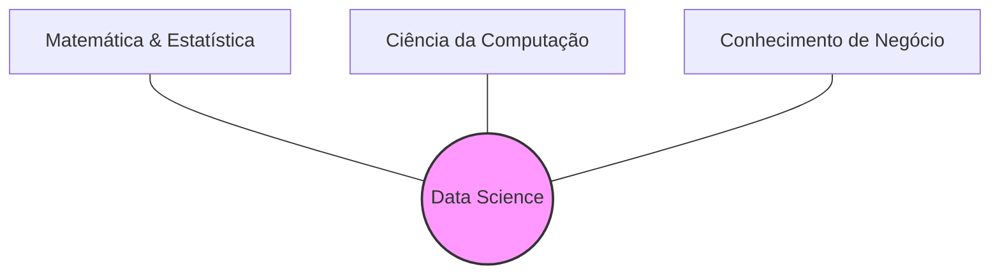

# Unidade II – Data-Driven e Data Discovery

## 1. Cultura Data-Driven: Panorama Geral

### Conceito

Ser _Data-Driven_ (orientado a dados) não é apenas sobre possuir grandes bancos de dados ou uma equipe numerosa de cientistas. É uma mudança cultural onde as decisões deixam de ser baseadas apenas no "feeling" (intuição/achismo) e passam a ser fundamentadas em evidências extraídas dos dados.

### Pessoas no Centro

O professor destaca que a tecnologia é secundária. O sucesso de uma organização orientada a dados depende da **interação complexa** entre:

1.  Os dados que a empresa possui.
2.  Onde estão armazenados.
3.  **Como as pessoas trabalham com eles.**
4.  Quais problemas são considerados valiosos para o negócio.

> **Ponto Chave:** "As respostas para perguntas como 'Quem controla os dados?' e 'A quem se reportam?' são mais importantes do que qual banco de dados utilizar."

### O Papel do Cientista de Dados

A profissão não cria nada fundamentalmente novo (estatísticos e analistas já existiam), mas combina habilidades de uma maneira inédita.

#### O "Tripé" de Competências

Para ser eficaz, o profissional precisa equilibrar três áreas:

1.  **Matemática e Estatística:** Para modelar e validar.
2.  **Programação/Computação:** Para manipular e processar.
3.  **Conhecimento de Domínio/Negócio:** Para entender o problema real.

---

## Visão geral sobre Data Mining

---

## Análise Descritiva

---

## Análise Preditiva

---

## Análise Prescritiva.

---

## Bibliografia e Recursos

### Bibliografia Básica

- **ANDREATTO**, R. _Construindo um Data Warehouse e Analisando suas Informações com Data Mining e OLAP_. Monografia Final de Curso. Faculdade de Ciências Administrativas, Faculdade de Valinhos. 1999.
- **BARBIERI**, Carlos. _BI - Business Intelligence: Modelagem e tecnologia_. Rio de Janeiro: Axcel Books, 2001.
- **CARVALHO**, B.F. _Arquiteturas de Ferramentas OLAP_. SQL Magazine, Rio de Janeiro, ano 1, ed. 9, p.12-16, 2004.
- **DWBrasil**. _OLAP_. 2007. Disponível em: [Acesso em 24 outubro 2007].
- **INMON**, W. H. _Como Construir o Data Warehouse_. Rio de Janeiro: Campus, 1997.

---

[Previous](./01-introduction-olap-tools.md)
[Next](./03-data-analysis-with-tools.md)
