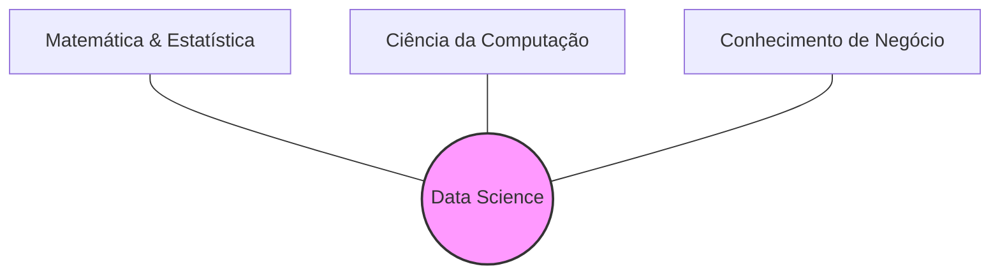
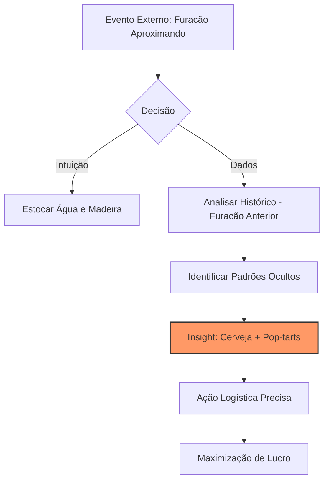
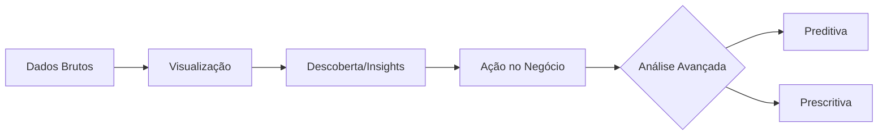
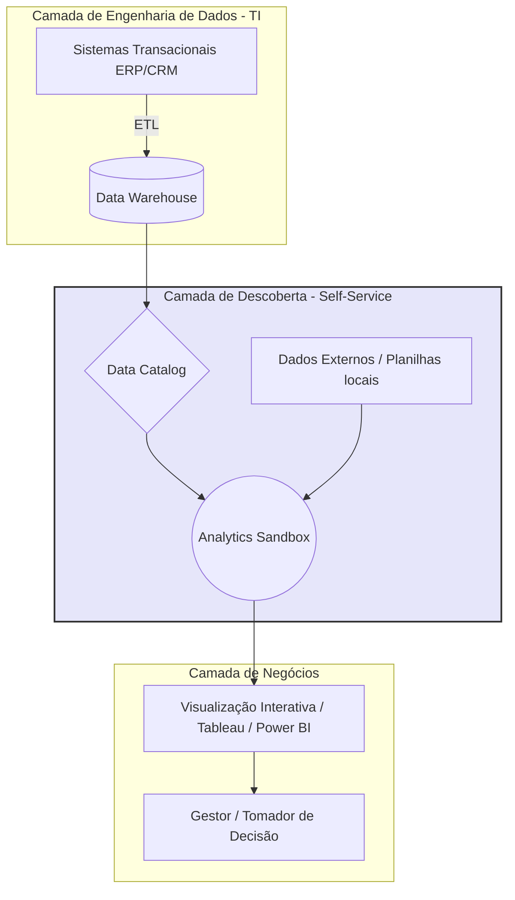

# Unidade II – Data-Driven e Data Discovery

## 1. Cultura Data-Driven: Panorama Geral

### Conceito

Ser _Data-Driven_ (orientado a dados) não é apenas sobre possuir grandes bancos de dados ou uma equipe numerosa de cientistas. É uma mudança cultural onde as decisões deixam de ser baseadas apenas no "feeling" (intuição/achismo) e passam a ser fundamentadas em evidências extraídas dos dados.

### Pessoas no Centro

O professor destaca que a tecnologia é secundária. O sucesso de uma organização orientada a dados depende da **interação complexa** entre:

1.  Os dados que a empresa possui.
2.  Onde estão armazenados.
3.  **Como as pessoas trabalham com eles.**
4.  Quais problemas são considerados valiosos para o negócio.

> **Ponto Chave:** "As respostas para perguntas como 'Quem controla os dados?' e 'A quem se reportam?' são mais importantes do que qual banco de dados utilizar."

### O Papel do Cientista de Dados

A profissão não cria nada fundamentalmente novo (estatísticos e analistas já existiam), mas combina habilidades de uma maneira inédita.

#### O "Tripé" de Competências

Para ser eficaz, o profissional precisa equilibrar três áreas:

1.  **Matemática e Estatística:** Para modelar e validar.
2.  **Programação/Computação:** Para manipular e processar.
3.  **Conhecimento de Domínio/Negócio:** Para entender o problema real.

```mermaid
graph TD
    A[Matemática & Estatística] --- Center((Data Science))
    B[Ciência da Computação] --- Center
    C[Conhecimento de Negócio] --- Center

    style Center fill:#f9f,stroke:#333,stroke-width:2px
```

---

## 1.1. Organizações Data-Driven

### O Conceito na Prática

Empresas orientadas a dados (Data-Driven) não são apenas as gigantes de tecnologia ("Big Techs" como Google, Amazon, Facebook, LinkedIn). Organizações tradicionais ("Brick and Mortar") podem e devem utilizar dados para guiar decisões estratégicas.

### Estudo de Caso: Walmart (O Pioneirismo)

O Walmart é citado como um dos maiores exemplos de cultura de dados fora da bolha da internet.

#### 1. A Evolução da Coleta (Do Manual ao Código de Barras)

- **O Problema (Anos 70/80):** A entrada de dados era manual (digitação de valores na caixa registradora). Isso gerava erros, impossibilitava o controle de estoque item a item e não permitia saber _o que_ estava sendo vendido, apenas _quanto_.
- **A Solução:** Adoção pioneira do **Código de Barras**.
- **O Impacto:**
  - Rastreabilidade exata do item (SKU) vendido.
  - Automação da reposição: O sistema identifica a baixa no estoque e aciona a cadeia de suprimentos (Logística/Compras) automaticamente.
  - Análise de tendências regionais e sazonais.

#### 2. Infraestrutura (Big Data antes do termo existir)

O Walmart construiu um dos maiores Data Warehouses do planeta. Em 2010, já operavam com **600 Terabytes a 1 Petabyte** de dados, um volume 30x maior que a Biblioteca do Congresso dos EUA na época.

### Market Basket Analysis (Análise de Cesta de Compras)

O objetivo é identificar correlações entre produtos: "Quem compra X, tem alta probabilidade de comprar Y".

#### A Lenda da Cerveja e das Fraldas

Um dos casos mais famosos de mineração de dados (Data Mining) citado na aula:

- **O Insight:** Homens jovens, às sextas-feiras, compravam fraldas e cerveja juntos.
- **A Ação:** O Walmart posicionou as gôndolas de fraldas próximas às de cerveja (ou snacks próximos a fraldas) para facilitar a "venda cruzada".
- **O Resultado:** Aumento significativo nas vendas de ambos os itens.
- **Nota de Enriquecimento (Contexto AI/ML):** Em Machine Learning, isso é resolvido com **Regras de Associação** (algoritmos como _Apriori_ ou _Eclat_). O objetivo é encontrar a probabilidade condicional $P(B|A)$ — a probabilidade de comprar B dado que comprou A.

### Estudo de Caso: O Furacão Frances (Análise Preditiva)

Este caso demonstra como dados vencem a intuição ("Gut Feeling").

```mermaid
graph TD
    A[Evento Externo: Furacão Aproximando] --> B{Decisão}
    B -- Intuição --> C[Estocar Água e Madeira]
    B -- Dados --> D[Analisar Histórico - Furacão Anterior]
    D --> E[Identificar Padrões Ocultos]
    E --> F[Insight: Cerveja + Pop-tarts]
    F --> G[Ação Logística Precisa]
    G --> H[Maximização de Lucro]

    style F fill:#f96,stroke:#333,stroke-width:2px
```

- **O Cenário (2004):** O furacão Frances estava se aproximando da Flórida.
- **A Abordagem Tradicional (Intuição):** Estoque de itens de sobrevivência básica (água, madeira, lanternas).
- **A Abordagem Data-Driven:** A equipe de BI analisou o comportamento de consumo durante o furacão Charley (ocorrido um mês antes).
- **A Descoberta (Insight dos Dados):**
  - Houve um aumento extraordinário na venda de **Cerveja** (fase pré-furacão).
  - Houve um consumo 7x maior que a média de **Pop-tarts de Morango** (fase pós-furacão/café da manhã sem eletricidade).
- **A Ação:** A logística enviou caminhões extras carregados especificamente com esses itens para a rota do furacão, garantindo abastecimento e lucro.

---

## 1.2. O Que NÃO é Data-Driven? (Armadilhas e Desafios)

### A Ilusão do Sucesso e a Síndrome do "HiPPO"

O professor utiliza o livro _"Como as Gigantes Caem"_ (Jim Collins) para ilustrar que o sucesso passado não garante o futuro. A arrogância ("excesso de confiança") leva ao declínio.

Um dos maiores inimigos da cultura Data-Driven é a figura do **HiPPO** (Highest Paid Person's Opinion - A opinião da pessoa mais bem paga na sala).

- **O Problema:** Reuniões onde a decisão é tomada baseada apenas no "feeling" do chefe, ignorando as análises e o trabalho da equipe.
- **A Solução:** Decisões baseadas em evidências. Os dados não tomam a decisão sozinhos, mas servem de suporte inegável.

### O "Trabalho Sujo" (A Realidade do Cientista de Dados)

Apresentar gráficos bonitos é a parte fácil. A realidade de uma organização orientada a dados passa por:

- **Limpeza Exaustiva:** A preparação e limpeza dos dados (Data Wrangling) costuma consumir **cerca de 70% do tempo** de um projeto de dados.
- **O Fator Humano:** Sistemas que permitem "brechas" (ex: aceitar "data de hoje" para o campo "data de nascimento") poluem a base. A qualidade do dado começa na entrada, não no painel final.

### Estudo de Caso: Twitter (O Poder da Descoberta)

Este caso demonstra como fazer as perguntas certas e explorar os dados pode salvar uma empresa.

#### O Desafio (2009)

- O Twitter tinha muito "hype", mas um problema gravíssimo de retenção: **3 em cada 4 pessoas paravam de usar o serviço após dois meses**.
- Sem usuários engajados, o modelo de negócio (propaganda) não se sustentaria.

#### A Investigação (O Método Científico)

Em vez de simplesmente copiar o que o Facebook fazia (sugerir conexões pelo catálogo de e-mails), o Twitter olhou para os seus próprios dados.

1.  **Primeira Descoberta:** Usuários que entravam no sistema pelo menos 7 vezes no primeiro mês tinham 90% de probabilidade de voltar. Mas isso não era uma "ação" que a empresa pudesse forçar.
2.  **A Escavação:** Ao analisar os usuários altamente engajados, descobriram o "número mágico": **Quem seguia 30 ou mais pessoas tornava-se um utilizador de longo prazo**.
3.  **O Comportamento:** Analisando _quem_ eles seguiam, perceberam que o interesse era em **conteúdo** (2/3) e não apenas em conexões mútuas (1/3).

#### A Solução e o Resultado

- **Ação:** O Twitter mudou o seu _onboarding_. Passou a ensinar o que era um "tweet" e a sugerir perfis baseados em interesses (ex: NBA, Notícias) e depois pessoas com afinidade.
- **Resultado:** Apesar de tornar o processo inicial mais longo ("atrito"), a mudança gerou um **aumento de 30% nas conclusões de cadastro** e **aumento de 20% no engajamento de longo prazo**.
- **A Lição:** Demorou 2,5 anos para chegar a este resultado através de muita testagem. Cultura Data-Driven é um processo contínuo e não um passe de mágica.

---

## 1.3. Perguntas de Negócio: Data-Driven vs. Tradicional

A principal distinção entre organizações orientadas a dados e organizações tradicionais reside na orientação temporal e no propósito das perguntas formuladas aos seus conjuntos de dados.

### Organizações Não Data-Driven (Foco no Passado)

Empresas que não possuem uma cultura de dados tendem a utilizar a informação apenas para descrever eventos que já ocorreram. As perguntas são reativas e focadas no espelho retrovisor.

- **Quantidade de vendas**: Quantos itens do produto X foram vendidos no mês passado?
- **Desempenho regional**: Como foram as vendas na região de Natal no ano passado?
- **Logística e perdas**: Quantas unidades foram devolvidas na última semana?
- **Financeiro**: Qual foi a receita e o lucro no último trimestre?
- **RH**: Quantos funcionários foram contratados no último ano?

O risco dessa abordagem é a limitação à análise descritiva, onde o gestor apenas toma conhecimento do fato após ele ter se consolidado, perdendo a janela de oportunidade para intervenções estratégicas.

### Organizações Data-Driven (Foco no Futuro)

Empresas orientadas a dados utilizam modelos preditivos e prescritivos. As perguntas visam antecipar cenários para otimizar recursos e mitigar riscos.

- **Previsão de demanda**: Quantos itens do produto X serão vendidos no próximo mês?
- **Planejamento sazonal**: Como serão as vendas por região no Natal deste ano?
- **Prevenção de perdas**: Quantas unidades correm o risco de serem devolvidas ou perdidas no próximo ciclo?
- **Gestão de Churn**: Quais clientes apresentam comportamento que indica uma possível desistência do serviço em breve?
- **Otimização de marketing**: Qual o canal de publicidade terá o melhor retorno sobre investimento para a campanha da próxima semana?

### O Ciclo da Descoberta e Tomada de Decisão

Para que uma organização mude o patamar de suas perguntas, é necessário seguir um fluxo de maturidade analítica:

1. **Dados Organizados**: A existência de dados acessíveis e confiáveis é o pré-requisito. Sem dados organizados, as respostas ao passado já são imprecisas, tornando as previsões de futuro impossíveis.
2. **Criação de Histórias**: Além de responder "quem", "o quê" e "onde", a organização deve ser capaz de contar uma história em torno da descoberta dos dados, conectando diferentes variáveis para explicar comportamentos.
3. **Suporte à Decisão Humana**: O sistema aponta indícios e faz recomendações, mas a decisão final cabe ao ser humano, que utiliza seu conhecimento de domínio para validar a aplicabilidade das previsões.

### Casos de Expansão e Monitoramento de Mercado

Grandes organizações exemplificam o uso de dados para expansão e adaptação contínua:

- **Coca-Cola**: Monitora padrões de consumo global para identificar tendências de saúde. Ao perceber a queda no interesse por açúcar e sódio, a empresa não apenas reformula produtos, mas utiliza dados de mercado para adquirir marcas regionais de sucos e águas (como o caso do Guaraná Jesus no Nordeste ou marcas de sucos naturais), garantindo a manutenção da sua cota de mercado (market share).
- **Amazon e Netflix**: Utilizam o histórico de navegação e consumo não apenas para recomendar o que você quer ver agora, mas para decidir quais novos produtos devem ser estocados ou quais séries devem ser produzidas para garantir assinaturas nos próximos trimestres.

---

## 2.1. O que é Data Discovery?

O conceito de Data Discovery representa uma evolução no modo como os dados são explorados dentro das organizações. Enquanto o BI tradicional dependia de relatórios estáticos e pré-definidos pela TI, o Data Discovery foca na exploração interativa e na autonomia do usuário.

### Definição e Propósito

Data Discovery é o processo que permite aos usuários desenvolver e refinar visualizações e análises de dados, sejam eles estruturados (bancos de dados tradicionais) ou não estruturados (textos, logs, redes sociais).

- **Termos de Pesquisa**: A análise utiliza termos de busca e navegação intuitiva em vez de consultas complexas em SQL.
- **Agilidade**: Elimina a dependência excessiva do setor de TI para a criação de relatórios, reduzindo o tempo entre a pergunta de negócio e a resposta visual.
- **Acessibilidade**: As ferramentas modernas permitem o acesso e a composição de informações em múltiplos dispositivos, como tablets e smartphones, promovendo a análise em todo lugar.

#### Etapas do Data Discovery

O processo de descoberta não se resume apenas a olhar para um gráfico; ele segue um fluxo de amadurecimento:

1. **Preparação e Integração**: Coleta de dados de fontes diversas.
2. **Visualização de Dados**: Transformação dos dados em representações visuais para identificação de padrões.
3. **Descoberta de Informações**: Fase exploratória onde insights ocultos são revelados através da interação com os dados.
4. **Influência nos Negócios**: O momento em que a análise gera ações concretas e decisões estratégicas.

#### Níveis de Análise

O Data Discovery serve de base para diferentes níveis de profundidade analítica:

- **Análise Descritiva e Diagnóstica**: Foca no que aconteceu e por que aconteceu.
- **Análise Preditiva**: Utiliza modelos estatísticos e algoritmos de ML para identificar o que provavelmente acontecerá.
- **Análise Prescritiva**: Sugere caminhos e ações para otimizar os resultados futuros.

```mermaid
graph LR
    A[Dados Brutos] --> B[Visualização]
    B --> C[Descoberta/Insights]
    C --> D[Ação no Negócio]
    D --> E{Análise Avançada}
    E --> F[Preditiva]
    E --> G[Prescritiva]
```

### Ferramentas e Comparação Técnica

O professor estabelece uma comparação entre o uso de ferramentas visuais (como Tableau e Power BI) e o uso de linguagens de programação (Python e R) no contexto de descoberta de dados.

#### Ferramentas Visuais (Tableau/Power BI)

- **Intuição**: São ferramentas de arrastar e soltar (drag-and-drop), facilitando a navegação interativa.
- **Público**: Voltadas para usuários de negócio e analistas que precisam de respostas rápidas sem necessariamente dominar código.
- **Visualização**: Possuem um apelo visual muito forte e facilitam o storytelling de dados.

#### Linguagens de Programação (Python/R)

- **Poder de Previsão**: Embora ferramentas visuais ofereçam algumas previsões, linguagens como Python e R permitem a construção de modelos de ML muito mais complexos e customizados.
- **Curva de Aprendizado**: Exigem conhecimento de algoritmos e sintaxe, o que pode ser uma barreira para usuários puramente de negócio.
- **Integração**: É comum integrar o processamento feito em Python/R com a visualização final em ferramentas de Data Discovery para unir o poder estatístico com a facilidade visual.

### Conexão com IA/ML

O Data Discovery é frequentemente a etapa de Análise Exploratória de Dados (EDA) em um projeto de Machine Learning. Antes de treinar qualquer modelo, o cientista de dados utiliza técnicas de descoberta para entender a distribuição dos dados, identificar correlações e detectar anomalias (outliers) que poderiam prejudicar a performance do algoritmo. A descoberta de dados bem feita reduz o erro na escolha das variáveis (feature selection) para a Inteligência Artificial.

---

## 2.2 Self-Service Analytics (SSA)

### Evolução da Descoberta

O conceito de Self-Service Analytics (SSA) é o ápice do Data Discovery. O objetivo é remover o gargalo tradicional onde a área de negócios depende exclusivamente do departamento de TI para gerar relatórios, capacitando os próprios usuários a extrair, analisar e visualizar os dados de forma autônoma.

#### O Gargalo do BI Tradicional vs. A Promessa do SSA

- **O Fluxo do BI Tradicional (A lentidão)**: No modelo clássico, os dados saem dos sistemas (ERP, CRM) e vão para um Data Warehouse (DW) extremamente rígido. Se um gestor precisa de uma nova visão, ele abre um chamado para o desenvolvedor de BI (TI). O desenvolvedor modela, cria o painel e entrega. Esse ciclo, segundo o Gartner, pode levar de 2 a 4 meses. É focado em "uma única versão da verdade", mas peca na agilidade.
- **O Fluxo do Self-Service Analytics (A agilidade)**: A TI deixa de ser a "fábrica de relatórios" e passa a ser a "provedora de dados". A TI cria um Catálogo de Dados e um Analytics Sandbox (um ambiente seguro de experimentação). O Analista de Negócios acessa esse ambiente, cruza os dados corporativos com planilhas externas que ele possui, e cria seus próprios dashboards interativos em tempo hábil.

#### A Armadilha do "Pseudo Self-Service"

- **O Erro**: Usuários simplesmente extraem planilhas dos sistemas, carregam diretamente para dentro de ferramentas como Power BI ou Tableau em suas máquinas locais e constroem tudo ali, sem armazenar o dado em um banco de dados centralizado.
- **A Consequência**: Cria-se o "Múltiplas versões da verdade". Se a ferramenta mudar no futuro ou o funcionário sair da empresa, todo o processo de limpeza e modelagem (feito dentro do arquivo local) é perdido. A governança desaparece.

### Dissecando a Arquitetura de Self-Service Analytics

1. Coleta Centralizada (TI / Engenharia de Dados):
   1. A TI continua responsável por extrair dados brutos (Sistemas, Bancos de Dados) e mantê-los no Data Warehouse principal.
2. Preparação Orientada ao Negócio (Sandbox):
   1. Cria-se um Data Catalog (Catálogo de Dados) para que o usuário saiba o que existe disponível.
   2. Os dados são levados para um Analytics Sandbox (caixa de areia). Aqui, o usuário de negócios pode cruzar os dados oficiais da empresa com dados externos (planilhas locais, dados da web) de forma controlada.
3. Consumo e Analytics (Usuário Final):
   1. Apoiado por Analistas de Negócios e especialistas, o usuário constrói e consome os dashboards. A informação é rapidamente explorada e os insights são gerados sem a espera de meses do modelo tradicional.

```mermaid
graph TD
    subgraph TI_Engenharia [Camada de Engenharia de Dados - TI]
        A[Sistemas Transacionais ERP/CRM] -->|ETL| B[(Data Warehouse)]
    end

    subgraph Sandbox [Camada de Descoberta - Self-Service]
        B --> C{Data Catalog}
        C --> D((Analytics Sandbox))
        E[Dados Externos / Planilhas locais] --> D
    end

    subgraph Consumo [Camada de Negócios]
        D --> F[Visualização Interativa / Tableau / Power BI]
        F --> G[Gestor / Tomador de Decisão]
    end

    style Sandbox fill:#e6e6fa,stroke:#333,stroke-width:2px
```

### O Ciclo de Evolução (Pessoas, Dados e Análise)

Para que o SSA não seja apenas a compra de um software novo, a organização precisa evoluir simultaneamente em três pilares:

- **Evoluir Pessoas**: Descentralizar as responsabilidades. Criar novos papéis, como o Citizen Data Scientist (o usuário de negócios que possui noções de análise avançada) e o Data Steward (o guardião da qualidade do dado no setor).
- **Evoluir Dados**: Não se limitar apenas aos dados estruturados do sistema financeiro. Adicionar novas fontes (redes sociais, dados públicos, corretores de dados) e novos tipos de dados (texto não estruturado, áudio, logs de IoT).
- **Evoluir Análises**: Passar da simples análise diagnóstica para perguntas de linguagem natural (Natural Language Query), análises geoespaciais e introdução de rotinas de Auto Machine Learning dentro dos painéis.

### Conexão com IA/ML

O conceito de Analytics Sandbox (citado nos fluxogramas de governança) é exatamente o ambiente de trabalho do Cientista de Dados. Em projetos tradicionais de software, o código vai de "Desenvolvimento" para "Produção". Em Machine Learning, o cientista precisa de um Sandbox — um ambiente onde ele tem acesso a grandes volumes de dados de produção para testar hipóteses, treinar algoritmos, errar e iterar, sem o risco de derrubar o sistema principal da empresa. O Data Discovery feito pelo usuário de negócios no Sandbox frequentemente serve como a etapa de "Engenharia de Variáveis" (Feature Engineering) que alimentará um modelo preditivo construído logo em seguida pela equipe técnica.

---

## 2.3 Diferenças entre Self-Service Analytics e BI Tradicional

### Benefícios e Implantação do Self-Service Analytics

A transição de um modelo de Business Intelligence centralizado e tradicional para uma cultura de Self-Service Analytics gera impactos positivos tanto para os consumidores da informação quanto para os mantenedores da infraestrutura.

#### Benefícios Claros (Negócios vs. TI)

- **Para a Área de Negócios**: Garante a liberdade e a autonomia para que o próprio usuário manipule os dados em seu ambiente, permitindo a construção rápida de relatórios e a exploração contínua de novas perguntas sem depender de filas de chamados.
- **Para a Área de TI**: Reduz drasticamente o tempo e o custo operacional gastos na criação de relatórios estáticos, liberando os profissionais técnicos e engenheiros de dados para atuar no que realmente importa: arquitetura, governança e preparo de bases para análises avançadas (como Machine Learning).

#### Recomendações de Implantação (O Método Gartner)

Implementar o SSA não é instalar um software e liberar o acesso a todos simultaneamente. O Instituto Gartner recomenda um ciclo contínuo e evolutivo para garantir a governança e a usabilidade:

```mermaid
graph LR
    A[Planejar] --> B[Pilotar]
    B --> C[Implantar]
    C --> D[Aprender/Avaliar]
    D --> E[Usar]
    E --> F[Expandir/Suportar]
    F --> A

    style B fill:#e6e6fa,stroke:#333,stroke-width:2px
```

A criação de um **projeto piloto** com usuários dispostos a testar e homologar os dados é a etapa mais crítica antes de abrir o catálogo de dados para a organização inteira.

### Estudo de Caso Prático: Acidentes de Trânsito em BH

Para conectar a teoria do Data Discovery com a prática analítica, a disciplina utiliza um conjunto de bases de dados reais e abertas da Prefeitura de Belo Horizonte (PBH) sobre acidentes de trânsito.

#### Entendendo a Base de Dados

O projeto envolve a manipulação de quatro bases distintas (boletins de ocorrência, veículos, localização/logradouros e pessoas envolvidas). O principal desafio técnico em modelagens relacionais como essa é encontrar a chave comum (primary key) para cruzar as informações, que neste caso é o número do Boletim de Ocorrência (B.O.).

> _Na vida real, bases públicas ou corporativas apresentam falhas de preenchimento e valores nulos constantes, exigindo rigor no tratamento antes da análise._

#### A Metodologia da Entrevista

Antes de arrastar gráficos em uma ferramenta visual, o Cientista de Dados ou Analista de BI precisa entender o domínio do problema. A abordagem correta inicia-se com uma entrevista estruturada junto aos especialistas do negócio:

1. **Preparação**: Notificar os participantes e enviar as perguntas com antecedência para alinhamento.
2. **Execução**: Apresentar os objetivos, definir o tempo limite e realizar a entrevista estimulando o usuário a deliberar sobre o cenário.
3. **Formalização**: Registrar tudo (gravação ou anotações) e, obrigatoriamente, gerar uma ata de aprovação. O aceite formal do usuário ("feedback") garante que as análises futuras atenderão às regras de negócio corretas.

#### Levantamento de Hipóteses (Perguntas de Negócio)

A partir da entrevista, levantam-se as perguntas norteadoras que guiarão a descoberta de dados no painel interativo. Exemplos do estudo de caso:

- Existe relação matemática entre o volume de tráfego e o aumento no número de acidentes?
- Quais os tipos de acidentes mais comuns e como eles se correlacionam com horários específicos ou pavimentação local?
- Qual é o perfil do condutor (idade, tempo de carteira, indícios de embriaguez) envolvido nas fatalidades?

### Conexão com IA e Machine Learning (Feature Selection)

O conhecimento de negócio extraído nas entrevistas do processo de Data Discovery é vital para os modelos de IA. Quando um analista identifica visualmente ou por meio de entrevistas (ex: "o perfil de homens de vinte e poucos anos tem mais sinistros em seguros de veículos") que determinadas variáveis influenciam o resultado final, ele está realizando uma etapa primária de Seleção de Atributos (Feature Selection). Entregar essas variáveis já filtradas e entendidas ao algoritmo de Machine Learning aumenta significativamente a acurácia e o poder preditivo do modelo, garantindo que o algoritmo não perca tempo processando "ruído".

---

## Análise Descritiva

### Introdução

A Análise Descritiva é a fase inicial do processo de estudo de dados. Seu objetivo é organizar, resumir e descrever um conjunto de características observadas, permitindo que o analista entenda com clareza o que está acontecendo na organização e como chegamos a determinado cenário.

#### Propósito e Características

- **Identificação de Padrões e Anomalias**: Permite mapear tendências recorrentes, além de detectar dados dispersos (outliers) e registros incorretos que não seguem o comportamento geral do conjunto.
- **Imparcialidade**: A principal vantagem desta etapa é conferir imparcialidade ao estudo, evitando que a empresa tome decisões baseadas puramente na intuição ou em juízos de valor.
- **Qualidade da Base**: Projetos que ignoram a adequação dos dados correm o risco de gerar respostas muito precisas para os problemas errados. A confiabilidade, precisão, granularidade e atualidade dos dados são métricas vitais para o sucesso da análise.

### Taxonomia de Dados (Tipos de Variáveis)

Compreender a natureza de cada dado é um fundamento estatístico essencial para definir qual tratamento ou algoritmo aplicar. As variáveis dividem-se em dois grandes grupos:

#### Variáveis Qualitativas (Categóricas)

Representam características que não possuem significado quantitativo (não faz sentido calcular a média de uma categoria).

- **Nominais**: Não existe uma ordem ou hierarquia natural entre as categorias.
  - **Exemplos**: Sexo, cor dos olhos, estado civil, região.
- **Ordinais**: Existe uma ordenação clara ou ranking entre as categorias.
  - **Exemplos**: Nível de escolaridade (Ensino Médio, Superior), classificação de risco (baixo, médio, alto), classe social.

#### Variáveis Quantitativas (Numéricas)

Representam valores reais, provenientes de contagens ou medições.

- **Discretas**: Resultam de contagens, assumindo apenas números inteiros (finitos ou enumeráveis).
  - **Exemplos**: Número de filhos, quantidade de itens vendidos, quantidade de acidentes.
- **Contínuas**: Resultam de medições, podendo assumir qualquer valor dentro de uma reta real (aceitam casas decimais).
  - **Exemplos**: Peso, altura, pressão arterial, faturamento financeiro.

**Atenção Analítica**: Nem toda variável representada por números é quantitativa. Um número de CPF, um CEP residencial ou o número da carteira de identidade são, na verdade, variáveis qualitativas nominais (servem apenas como rótulos). Da mesma forma, uma variável contínua como "Idade" pode ser transformada em qualitativa ordinal se for agrupada em faixas etárias.

### Distribuição de Frequências

Para interpretar volumes extensos de dados, a estatística descritiva recorre à distribuição de frequências, que pode ser demonstrada em tabelas ou gráficos:

- **Frequência Absoluta**: A contagem direta de indivíduos ou ocorrências dentro de uma classe/categoria.
- **Frequência Relativa**: A representação percentual que aquela classe tem sobre o volume total.
- **Frequência Acumulada**: A soma sucessiva das frequências, excelente para observar volumes acumulados ao longo do tempo ou de categorias ordinais.

Para **variáveis contínuas**, devido à infinidade de valores possíveis, é necessário criar intervalos de classes (ex: Peso de 25,0 a 49,9 kg). Nesses casos, a visualização mais indicada para acompanhar a distribuição é o Histograma.

### Séries Temporais

O tempo é uma dimensão fundamental na análise descritiva. Uma Série Temporal consiste em um conjunto de observações sobre uma variável ordenado no tempo (diariamente, mensalmente, anualmente).

- **Objetivo**: Conhecer o comportamento da série ao longo do tempo, identificando crescimentos, estabilidades ou declínios.
- **Sazonalidade**: É a sucessão regular de picos e vales. Por exemplo, o aumento do fluxo de passageiros de avião em meses de férias escolares segue um padrão cíclico.
- **Transição para o Futuro**: O mapeamento exato de uma série temporal e seus padrões históricos (análise descritiva) é o que permite alimentar modelos estatísticos para projetar cenários e tendências (análise preditiva).

### O Ciclo da Análise Descritiva

Para garantir que a análise responda de forma objetiva aos dilemas do negócio, o profissional deve seguir um fluxo estruturado:

```mermaid
graph LR
    A[1. Identificação do Problema] --> B[2. Coleta de Dados]
    B --> C[3. Crítica dos Dados]
    C --> D[4. Apresentação dos Dados]
    D --> E[5. Análise e Interpretação]
```

1. **Identificação do Problema**: Entender claramente qual é a dúvida ou métrica que o usuário de negócios precisa validar.
2. **Coleta de Dados**: Buscar os dados nas fontes corretas.
3. **Crítica dos Dados**: Avaliar a qualidade, tratar inconsistências e preparar a base. O dado bruto por si só não resolve o problema.
4. **Apresentação dos Dados**: Construção de dashboards, gráficos adequados e aplicação de Data Storytelling.
5. **Análise e Interpretação**: O momento em que o tomador de decisão consome a informação e define os rumos de forma embasada, substituindo o achismo pela cultura orientada a dados.

### Conexão com IA e Machine Learning (Engenharia de Recursos)

A taxonomia dos dados é um dos conceitos mais importantes antes de treinar qualquer modelo de Machine Learning. Os algoritmos matemáticos não conseguem processar palavras como "Alto" ou "Baixo". Portanto, o Cientista de Dados precisará aplicar técnicas de transformação (como One-Hot Encoding para dados nominais ou Label Encoding para ordinais) para converter variáveis qualitativas em matrizes numéricas interpretáveis pelas redes neurais. Dominar a estatística descritiva é a garantia de que as variáveis de entrada (features) terão a qualidade necessária para produzir predições com alta acurácia.

---

## Análise Preditiva

---

## Análise Prescritiva.

---

## Bibliografia e Recursos

### Bibliografia Básica

- **ANDREATTO**, R. _Construindo um Data Warehouse e Analisando suas Informações com Data Mining e OLAP_. Monografia Final de Curso. Faculdade de Ciências Administrativas, Faculdade de Valinhos. 1999.
- **BARBIERI**, Carlos. _BI - Business Intelligence: Modelagem e tecnologia_. Rio de Janeiro: Axcel Books, 2001.
- **CARVALHO**, B.F. _Arquiteturas de Ferramentas OLAP_. SQL Magazine, Rio de Janeiro, ano 1, ed. 9, p.12-16, 2004.
- **DWBrasil**. _OLAP_. 2007. Disponível em: [Acesso em 24 outubro 2007].
- **INMON**, W. H. _Como Construir o Data Warehouse_. Rio de Janeiro: Campus, 1997.

---

[Previous](./01-introduction-olap-tools.md)
[Next](./03-data-analysis-with-tools.md)
