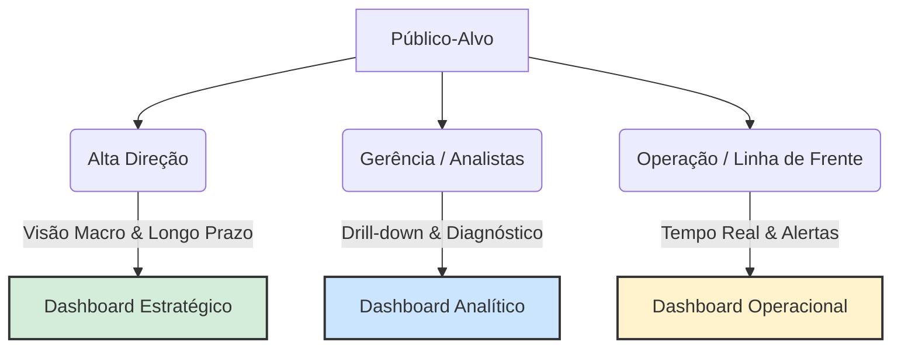

# Unidade III – Análise de Dados com ferramenta

## Público-Alvo

### O Papel do Público-Alvo na Visualização de Dados

O desenvolvimento de qualquer solução de visualização de dados (Data Discovery ou BI) deve começar pela compreensão de quem consumirá a informação. Um erro comum no mercado é tentar construir um único painel para atender a toda a empresa, o que gera excesso de informações para alguns e falta de detalhes para outros.

A audiência pode ser dividida de acordo com o nível de detalhe e o horizonte de tempo que necessitam analisar:

- **Alta Gestão (Diretores e C-Level)**: Necessitam de uma visão macro do negócio. O foco é o longo prazo e o acompanhamento de metas globais (ex: Faturamento anual da empresa). Não precisam saber o detalhe da venda de uma loja específica.
- **Gerentes e Analistas**: Atuam na camada tática e necessitam de uma visão de médio prazo. Precisam entender o "porquê" dos resultados macros, cruzando variáveis para diagnóstico (ex: Faturamento dividido por estado ou por categoria de produto).
- **Corpo Operacional**: Necessitam de uma visão micro e de curtíssimo prazo (diário ou tempo real). O foco está na execução e na rotina (ex: Faturamento de uma loja específica no dia de hoje, controle de estoque).
- **Público Externo**: Clientes, fornecedores ou cidadãos (em caso de dados públicos). A visualização deve ser extremamente simples, intuitiva e focada na transparência, sem expor dados sensíveis ou estratégicos da organização.

### O Conceito Fundamental de Dashboard

O professor utiliza a definição clássica de Stephen Few, uma das maiores referências mundiais em visualização de dados:

> "Um dashboard é uma exibição visual das informações mais importantes necessárias para alcançar um ou mais objetivos; consolidadas e organizadas em uma tela única para que a informação possa ser monitorada de relance."

A exigência de ser em uma tela única (Single Screen) não é um capricho estético, mas uma necessidade cognitiva. O cérebro humano tem dificuldade em reter informações ao rolar a página (scroll) ou ao alternar entre abas. A tela única permite que o usuário utilize a sua capacidade de percepção rápida para identificar anomalias, tendências e fazer comparações imediatas.

### Classificação dos Tipos de Dashboards

A estrutura do dashboard deve refletir diretamente o público-alvo mapeado na seção anterior. Eles são divididos em três categorias principais:

#### 1. Dashboard Estratégico

- **Público**: Executivos e Diretores.
- **Características**: Altamente resumido, focado em KPIs (Indicadores-Chave de Desempenho) de alto nível.
- **Frequência/Tempo**: Atualizações menos frequentes (mensais ou trimestrais). Mostra o histórico consolidado e, frequentemente, projeções preditivas para o futuro.

#### 2. Dashboard Analítico

- **Público**: Gerentes e Analistas de Negócio.
- **Características**: Altamente interativo. É o ambiente perfeito para o Data Discovery. Permite o uso intenso de filtros e o Drill-Down (a capacidade de clicar em um dado macro e "mergulhar" até o nível micro).
- **Objetivo**: Diagnosticar causas e cruzar múltiplos dados para encontrar explicações.

#### 3. Dashboard Operacional

- **Público**: Supervisores de linha de frente e equipes operacionais (ex: chão de fábrica, call centers).
- **Características**: Dinâmico, detalhado e focado em alertas imediatos.
- **Frequência/Tempo**: Atualização em tempo real ou quase real (near real-time). O objetivo é garantir que a operação não pare.

### Conexão com IA e Machine Learning (A Interface do Modelo)

O estudo de Data Discovery e Dashboards é fundamental para a Ciência de Dados porque o painel visual é a interface de entrega dos algoritmos de IA.

Um modelo de Machine Learning perfeitamente treinado para prever fraudes de cartão de crédito não tem valor se a informação não chegar à pessoa certa, no momento exato. Neste caso, as predições do algoritmo alimentam um Dashboard Operacional em tempo real na tela do analista de segurança, emitindo um alerta visual para que a transação seja bloqueada. Por outro lado, um modelo de forecasting de vendas alimentará um Dashboard Estratégico, permitindo que a diretoria visualize a receita prevista para o próximo semestre. Desenhar o painel correto garante que o modelo matemático seja, de fato, utilizado pelo negócio.

---

[Previous](./02-data-driven-data-discovery.md)
[Next](./04-data-analysis-practice.md)
