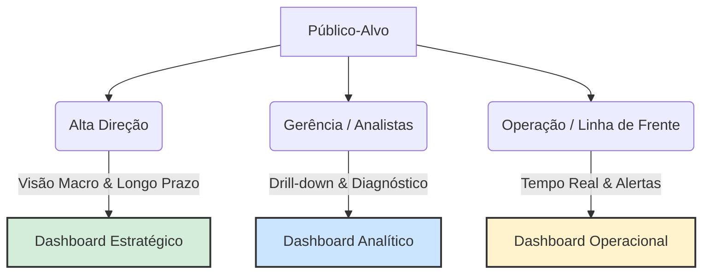
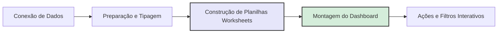
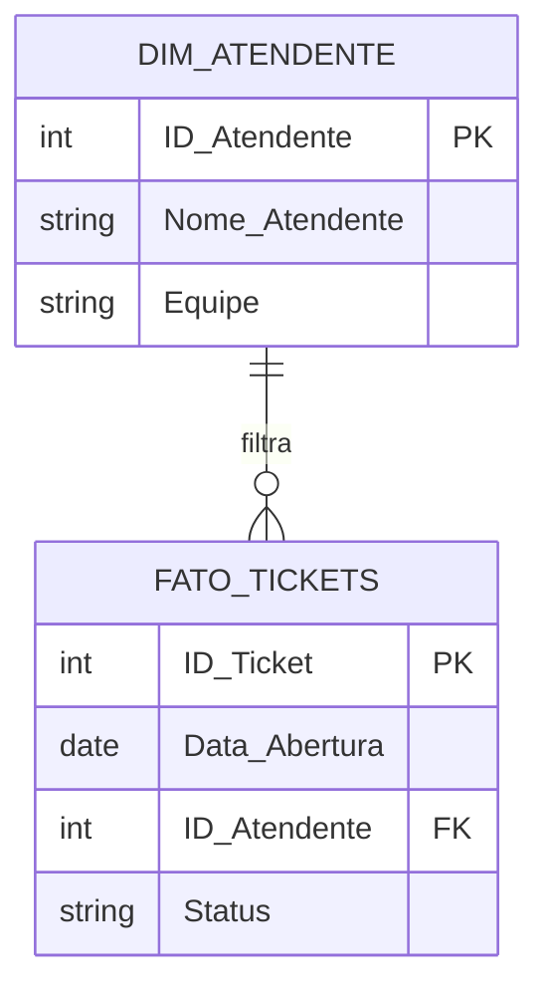
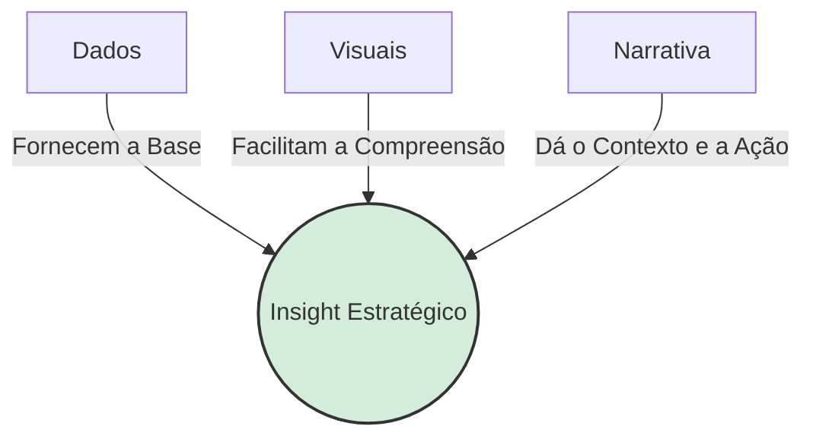
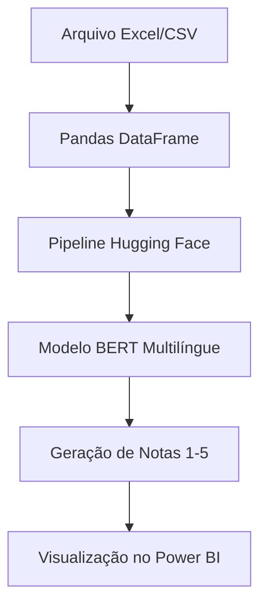

# Unidade III: Análise de Dados com ferramenta

## Público-Alvo

### O Papel do Público-Alvo na Visualização de Dados

O desenvolvimento de qualquer solução de visualização de dados (Data Discovery ou BI) deve começar pela compreensão de quem consumirá a informação. Um erro comum no mercado é tentar construir um único painel para atender a toda a empresa, o que gera excesso de informações para alguns e falta de detalhes para outros.

A audiência pode ser dividida de acordo com o nível de detalhe e o horizonte de tempo que necessitam analisar:

- **Alta Gestão (Diretores e C-Level)**: Necessitam de uma visão macro do negócio. O foco é o longo prazo e o acompanhamento de metas globais (ex: Faturamento anual da empresa). Não precisam saber o detalhe da venda de uma loja específica.
- **Gerentes e Analistas**: Atuam na camada tática e necessitam de uma visão de médio prazo. Precisam entender o "porquê" dos resultados macros, cruzando variáveis para diagnóstico (ex: Faturamento dividido por estado ou por categoria de produto).
- **Corpo Operacional**: Necessitam de uma visão micro e de curtíssimo prazo (diário ou tempo real). O foco está na execução e na rotina (ex: Faturamento de uma loja específica no dia de hoje, controle de estoque).
- **Público Externo**: Clientes, fornecedores ou cidadãos (em caso de dados públicos). A visualização deve ser extremamente simples, intuitiva e focada na transparência, sem expor dados sensíveis ou estratégicos da organização.

### O Conceito Fundamental de Dashboard

O professor utiliza a definição clássica de Stephen Few, uma das maiores referências mundiais em visualização de dados:

> "Um dashboard é uma exibição visual das informações mais importantes necessárias para alcançar um ou mais objetivos; consolidadas e organizadas em uma tela única para que a informação possa ser monitorada de relance."

A exigência de ser em uma tela única (Single Screen) não é um capricho estético, mas uma necessidade cognitiva. O cérebro humano tem dificuldade em reter informações ao rolar a página (scroll) ou ao alternar entre abas. A tela única permite que o usuário utilize a sua capacidade de percepção rápida para identificar anomalias, tendências e fazer comparações imediatas.

### Classificação dos Tipos de Dashboards

A estrutura do dashboard deve refletir diretamente o público-alvo mapeado na seção anterior. Eles são divididos em três categorias principais:

#### 1. Dashboard Estratégico

- **Público**: Executivos e Diretores.
- **Características**: Altamente resumido, focado em KPIs (Indicadores-Chave de Desempenho) de alto nível.
- **Frequência/Tempo**: Atualizações menos frequentes (mensais ou trimestrais). Mostra o histórico consolidado e, frequentemente, projeções preditivas para o futuro.

#### 2. Dashboard Analítico

- **Público**: Gerentes e Analistas de Negócio.
- **Características**: Altamente interativo. É o ambiente perfeito para o Data Discovery. Permite o uso intenso de filtros e o Drill-Down (a capacidade de clicar em um dado macro e "mergulhar" até o nível micro).
- **Objetivo**: Diagnosticar causas e cruzar múltiplos dados para encontrar explicações.

#### 3. Dashboard Operacional

- **Público**: Supervisores de linha de frente e equipes operacionais (ex: chão de fábrica, call centers).
- **Características**: Dinâmico, detalhado e focado em alertas imediatos.
- **Frequência/Tempo**: Atualização em tempo real ou quase real (near real-time). O objetivo é garantir que a operação não pare.

### Conexão com IA e Machine Learning (A Interface do Modelo)

O estudo de Data Discovery e Dashboards é fundamental para a Ciência de Dados porque o painel visual é a interface de entrega dos algoritmos de IA.

Um modelo de Machine Learning perfeitamente treinado para prever fraudes de cartão de crédito não tem valor se a informação não chegar à pessoa certa, no momento exato. Neste caso, as predições do algoritmo alimentam um Dashboard Operacional em tempo real na tela do analista de segurança, emitindo um alerta visual para que a transação seja bloqueada. Por outro lado, um modelo de forecasting de vendas alimentará um Dashboard Estratégico, permitindo que a diretoria visualize a receita prevista para o próximo semestre. Desenhar o painel correto garante que o modelo matemático seja, de fato, utilizado pelo negócio.

---

## Tableau

Esta unidade foca na transição do planejamento analítico para a execução técnica utilizando o Tableau Public, uma das ferramentas de Data Discovery e Visualização de Dados líderes de mercado. O conjunto de dados utilizado como fio condutor é o clássico Superstore (dados de uma loja de departamentos fictícia).

### Entendimento da Base e Prototipação

Antes de abrir a ferramenta de visualização, o fluxo de trabalho de um analista de dados exige duas etapas fundamentais:

#### O Dicionário de Dados

É necessário compreender a granularidade da base. No caso da base Superstore, cada linha representa um item de um pedido, e não o pedido inteiro. As colunas dividem-se logicamente em:

- **Identificadores (IDs)**: Número da linha, ID do Pedido, ID do Cliente, ID do Produto.
- **Datas**: Data do Pedido, Data de Envio.
- **Geografia**: País, Estado, Cidade.
- **Categorização**: Segmento, Categoria, Subcategoria.
- **Métricas Financeiras**: Vendas (Sales), Quantidade, Desconto e Lucro (Profit).

#### O Protótipo (Wireframing)

O professor destaca a importância de desenhar um rascunho (no papel ou em ferramentas como o Figma) do painel antes de construí-lo.

- **Boa Prática de Design**: O padrão visual mais adotado no mercado (Z-Pattern ou F-Pattern) sugere colocar os KPIs (Indicadores Chave) na parte superior da tela. Abaixo deles, posicionam-se os gráficos que explicam esses indicadores (ex: evolução no tempo, divisão geográfica e quebra por categorias).

### Conexão de Dados e Interface do Tableau

A importação dos dados no Tableau Public é o primeiro passo técnico. Ao conectar a um arquivo Excel, o Tableau exige que você arraste a planilha (sheet) específica para a área de preparação de dados para estabelecer a conexão.

#### O Conceito Mais Importante do Tableau: Dimensões vs. Medidas

Ao abrir a área de trabalho (Planilha 1), o Tableau divide automaticamente as colunas da sua base de dados em duas categorias fundamentais, identificadas por cores:

- **Dimensões (Azul - Dados Discretos)**: São dados qualitativos ou categóricos. Eles dizem o que você está medindo. Exemplos: Categoria, Cidade, Data do Pedido. As dimensões criam os "cabeçalhos" ou eixos dos gráficos.
- **Medidas (Verde - Dados Contínuos)**: São dados quantitativos e numéricos. Eles dizem quanto você está medindo. Exemplos: Vendas, Lucro. As medidas são agregadas por padrão (soma, média, contagem) e geram os eixos numéricos dos gráficos.

**Nota**: Recurso de Enriquecimento (Tableau Docs): Para aprofundar esse conceito, que é a base de tudo no software, consulte o artigo oficial: [Dimensões e medidas, azul e verde](https://help.tableau.com/current/pro/desktop/pt-br/datafields_typesandroles.htm).

### Construção de Visualizações (Step-by-Step)

A mecânica do Tableau funciona no modelo "Drag and Drop" (arrastar e soltar) utilizando prateleiras de Linhas, Colunas e Marcas (Cor, Tamanho, Texto, Dica de Ferramenta).

#### Séries Temporais (Gráfico de Linhas)

- **Construção**: Arrasta-se a data para as Colunas e a métrica financeira (ex: Vendas) para as Linhas.
- **Dica Técnica (Datas no Tableau)**: O Tableau, por padrão, agrupa datas de forma discreta (ex: Agrupa todos os meses de Janeiro de todos os anos). Para criar uma linha do tempo contínua, é necessário clicar com o botão direito na pílula de data e alterar para o formato "Mês e Ano" contínuo (o ícone mudará de azul para verde).

#### Análise Categórica (Gráfico de Barras)

- **Construção**: Dimensão (Subcategoria) em uma prateleira e Medida (Vendas) na outra.
- **Boa Prática Analítica**: Gráficos de barras devem sempre ser ordenados em ordem decrescente ou crescente. A ordenação facilita a leitura instantânea de quem são os líderes e os ofensores da métrica.

#### Análise Geoespacial (Mapas de Símbolos/Preenchidos)

- **Construção**: O Tableau reconhece campos geográficos (identificados por um ícone de globo terrestre). Ao arrastar o campo "Estado" para a visualização, o mapa é gerado automaticamente.
- **Uso Estratégico da Cor**: Ao adicionar o "Lucro" (Profit) na prateleira de Cores, o professor aplica uma paleta de cores divergente (Vermelho e Verde). Isso permite identificar imediatamente estados que dão prejuízo (vermelho) contra os que dão lucro (verde), aplicando o conceito de "Preattentive Attributes" na visualização.

#### Gráficos de Proporção (Pizza/Donut)

- Para verificar a composição das vendas por Segmento, utiliza-se a aba Mostre-me (Show Me), que sugere os gráficos ideais com base nas métricas selecionadas (1 dimensão e 1 medida geram um gráfico de pizza).
- **Nota de Design**: O mercado de visualização de dados prefere gráficos de Rosca (Donut) aos de Pizza, pois o espaço central em branco pode ser usado para inserir o valor total absoluto, otimizando o espaço do painel.

#### Cartões de KPI (Key Performance Indicators)

- São valores agregados únicos. Para criá-los, basta arrastar uma medida contínua diretamente para a prateleira de "Texto", sem nenhuma dimensão cortando o dado.
- É mandatório formatar o número (clique com o botão direito > Formatar > Número) para "Moeda Personalizada", ajustando as casas decimais para facilitar a leitura rápida do gestor.

### Fluxo de Trabalho e Melhores Práticas

Para consolidar o processo prático demonstrado nas aulas, o fluxo de desenvolvimento no Tableau segue esta lógica contínua:

### Montagem de Dashboards (Layout e Containers)

Dashboard para fornecer uma visão unificada do negócio.

- **Ajuste de Visualização (Fit)**: Por padrão, os gráficos no Tableau ocupam apenas o espaço necessário para os dados (Padrão). Para painéis responsivos, o professor recomenda alterar a exibição de cada gráfico para "Exibição Inteira" (Entire View) ou "Ajustar à Largura" (Fit Width), garantindo que o gráfico ocupe todo o espaço do contêiner sem barras de rolagem.
- **Limpeza Visual**: Ocultar títulos desnecessários dos eixos e das planilhas ajuda a maximizar o espaço útil do painel (data-ink ratio).
- **Títulos e Texto**: É recomendável adicionar um objeto de "Texto" no topo do painel para contextualizar a análise (ex: "Dashboard de Vendas").

Nota: Referência Tableau: Para dominar o posicionamento, estude o conceito de Contêineres de Layout (Horizontal e Vertical). Eles agrupam objetos para que o painel se redimensione dinamicamente de acordo com a tela do usuário. Leia mais em: [Criar um Dashboard](https://help.tableau.com/current/pro/desktop/pt-br/dashboards.htm).

### Cálculos de Tabela Rápida (Quick Table Calculations)

Muitas vezes, a métrica bruta (como a soma de Vendas) não responde à pergunta de negócio. O gestor pode querer saber a "Soma Acumulada" ao longo do ano ou o "Crescimento Percentual". O Tableau resolve isso sem a necessidade de programação complexa, através dos Cálculos de Tabela.

- **Como aplicar**: Clicando com o botão direito na medida (pílula verde) já instanciada na visualização e selecionando "Cálculo de Tabela Rápido".
- **Principais cálculos demonstrados**:
  - **Soma Acumulada (Running Total)**: Soma o valor do mês atual com todos os meses anteriores. Útil para acompanhar o atingimento de metas anuais.
  - **Diferença de Percentual (Year-over-Year Growth)**: Compara o período atual com o período anterior (ex: Julho deste ano vs. Julho do ano passado).
- **Revisão de Datas (Discreto vs. Contínuo)**: O professor reforça que para analisar crescimento ao longo do tempo de forma fluida, a pílula de data deve estar como Contínua (Verde), garantindo que o eixo X se comporte como uma linha do tempo cronológica, e não como categorias separadas (Discreta/Azul).

### Análise Preditiva e Tendências (Painel Análise)

O Tableau possui um painel específico chamado Análise (Analytics Pane), que permite arrastar modelos estatísticos diretamente para os gráficos.

- **Linha de Tendência (Trend Line)**: Adiciona uma linha matemática ao gráfico de dispersão ou série temporal para indicar a direção geral dos dados (ex: Linear, Exponencial, Polinomial).
- **Previsão (Forecast)**: Estima valores futuros com base no histórico.
- **Boa Prática Analítica**: Ao gerar uma previsão, o modelo muitas vezes projeta uma queda abrupta no último mês. Isso ocorre porque o mês atual ainda não fechou (os dados estão incompletos). O Tableau permite editar a previsão para "ignorar o último 1 mês", garantindo que a projeção estatística (ex: Suavização Exponencial) não seja corrompida por dados parciais.

Nota: Referência Tableau: O Tableau utiliza um método chamado de Suavização Exponencial (Exponential Smoothing) para suas previsões nativas. Para entender os requisitos matemáticos por trás desse recurso, consulte: [Como a previsão funciona no Tableau.](https://help.tableau.com/current/pro/desktop/pt-br/forecast_how_it_works.htm).

### Filtros Avançados: Análise de Top N

Responder "Quais são os 10 melhores clientes?" é uma tarefa clássica de Data Discovery.

- **Mecânica**: O professor demonstra como arrastar a dimensão (ex: Nome do Cliente) para a prateleira de "Filtros" e utilizar a aba "Início" (Top) para definir a regra "Top 10 por Soma de Vendas".
- **Contexto Visual**: Em listas de Top N, é mandatório ordenar o gráfico em ordem decrescente. Para enriquecer o insight, pode-se colocar a métrica de "Lucro" na prateleira de Cores. Assim, a ferramenta mostra quem mais compra (tamanho da barra) e, simultaneamente, se essa compra gera lucro ou prejuízo para a empresa (cor da barra).

### Interatividade e Ações de Dashboard

A interatividade é o que transforma um relatório estático em uma verdadeira ferramenta de Self-Service Analytics.

- **Usar como Filtro (Use as Filter)**: A maneira mais rápida de criar interatividade é clicar no ícone de funil na borda de um gráfico dentro do dashboard. Isso transforma aquele gráfico em um filtro global. Exemplo: Ao clicar no estado de "São Paulo" no mapa, todos os outros gráficos de barras e KPIs da tela são filtrados para mostrar apenas os dados de São Paulo.
- **Ações (Actions)**: Através do menu Dashboard > Ações, o analista tem um controle granular sobre a interatividade, podendo definir se a ação será disparada ao passar o mouse (Hover), selecionar (Select) ou acessar um menu, e quais planilhas específicas devem ser afetadas.

### Data Storytelling e Histórias (Storyboards)

A última etapa do fluxo de trabalho é a comunicação do insight. Além dos Dashboards, o Tableau oferece o recurso de História (Story).

- **O Conceito**: Uma História funciona como uma apresentação de slides (estilo PowerPoint), mas com os gráficos interativos vivos dentro dela.
- **Pontos da História (Story Points)**: O analista cria uma sequência lógica. Pode começar com um cenário macro (ex: Vendas Globais), adicionar um segundo ponto detalhando um problema (ex: Queda de Lucro na categoria Tecnologia), e um terceiro ponto prescrevendo uma solução.
- **Uso de Texto**: As caixas de legenda permitem adicionar a narrativa que guia o usuário pelo raciocínio analítico, assegurando que o foco (a mensagem principal do dado) não se perca na interpretação livre.

Nota: Referência Tableau: Construir uma história exige planejar o arco narrativo (setup, complicação, resolução). Recomenda-se a leitura do guia oficial: [Melhores Práticas para Contar Histórias com Dados](https://help.tableau.com/current/pro/desktop/pt-br/story_best_practices.htm).

---

## Microsoft Power BI

### Entendimento da Base e Extração de Dados (ETL)

A construção de um painel no Power BI inicia-se muito antes da criação de gráficos. A fase de entendimento do negócio e preparação dos dados é vital para a performance e acurácia do modelo.

#### Compreensão do Domínio

O professor utiliza uma base de dados de chamados de atendimento (Tickets/Helpdesk) para ilustrar o processo. Antes de importar, o analista deve mapear a granularidade (cada linha é um ticket único) e o significado de colunas críticas, como Status, Data de Abertura, Departamento e Nível de Satisfação.

#### Power Query: O Motor de Transformação

Ao utilizar a opção "Obter Dados" (Get Data), a ferramenta abre o Power Query Editor, o ambiente de ETL (Extração, Transformação e Carga) da Microsoft.

- **Tipagem de Dados**: O Power Query tenta adivinhar o tipo de dado automaticamente (passo "Tipo Alterado"). É mandatório revisar se textos estão como ABC, números inteiros como 123 e datas com o ícone de calendário. Tipos errados quebram cálculos futuros.
- **Performance (Exclusão de Colunas)**: Uma regra de ouro no Power BI é importar apenas o necessário. O professor demonstra a exclusão de colunas textuais densas (como a "Descrição" do chamado), pois elas não serão agregadas em gráficos e consomem muita memória RAM no modelo tabular do Power BI.
- **Limpeza e Substituição**: Substituir códigos numéricos por textos descritivos (ex: trocar o ID '1' por 'Financeiro') diretamente no Power Query facilita a leitura do usuário final no dashboard.
- **Referência Oficial (Microsoft Learn)**: Para dominar as transformações, estude a [documentação sobre Formatação e combinação de dados no Power BI Desktop](https://learn.microsoft.com/pt-br/power-bi/connect-data/desktop-shape-and-combine-data).

### Modelagem de Dados: Relacionamentos

No mundo real, os dados raramente residem em uma única tabela plana (flat file). Eles são distribuídos em múltiplas tabelas para otimizar o banco de dados.

- **Tabelas Fato vs. Tabelas Dimensão**: A tabela de chamados, que registra os eventos que acontecem ao longo do tempo, é a Tabela Fato. Uma tabela auxiliar contendo apenas o ID e o Nome dos Atendentes é uma Tabela Dimensão.
- **Criando Relacionamentos**: Na guia "Modelo" do Power BI, o analista deve conectar as tabelas. O professor demonstra como arrastar o campo de "ID do Atendente" da tabela dimensão para a tabela fato, criando um relacionamento de "1 para Muitos" (1:N).
- **Impacto**: O relacionamento permite usar o Nome do Atendente como um filtro dinâmico que "corta" os dados da tabela fato, sem precisar mesclar (fazer VLOOKUP/PROCV) os dados na mesma planilha.

- **Referência Oficial (Microsoft Learn)**: O design ideal para o Power BI é o Star Schema (Esquema em Estrela). Leia sobre [Entender o esquema em estrela e a importância para o Power BI](https://learn.microsoft.com/pt-br/power-bi/guidance/star-schema).

### Construção do Dashboard Analítico (DAX e Visualizações)

A criação do painel exige a transição dos dados brutos para indicadores consolidados e visuais interativos.

#### O Uso de Medidas Explicitas (DAX)

Em vez de simplesmente arrastar colunas numéricas para a tela (cálculo implícito), a melhor prática é criar Medidas utilizando a linguagem DAX (Data Analysis Expressions).
O professor cria uma medida simples para contar o volume de chamados: Total de Tickets = COUNTROWS(Base). Essa medida é então colocada em um visual de Cartão (Card) para servir como o KPI principal no topo da tela.

#### Design e Interatividade

- **Background Customizado**: O layout não precisa ser construído com dezenas de formas no Power BI. Pode-se criar um design de fundo (background) no PowerPoint ou Figma, exportar como imagem e importá-la como "Segundo plano da tela" no Power BI (ajustando a transparência para 0% e o ajuste da imagem para "Ajuste").
- **Segmentação de Dados (Slicers)**: A inserção de filtros, como Mês e Ano, afeta dinamicamente todos os gráficos da página. O Power BI, por padrão, faz com que qualquer clique em uma barra de um gráfico filtre interativamente os demais visuais.

### Dicas de Ferramenta Personalizadas (Report Page Tooltips)

O Power BI permite substituir a caixa de texto preta padrão (que aparece ao passar o mouse sobre um gráfico) por um mini-relatório completo e visual.

- **Como configurar**:
  1. Crie uma nova página e, nas configurações de página, marque "Permitir uso como dica de ferramenta" (Tooltip).
  2. Ajuste o tamanho da tela para "Dica de Ferramenta".
  3. Construa um gráfico detalhado nesta mini-página (ex: Volume de tickets quebrado por Atendente).
  4. Retorne ao painel principal, selecione o gráfico desejado, vá em Formato > Dica de Ferramenta > Tipo: Página de Relatório, e aponte para a página criada.
- **Vantagem Estratégica**: Isso permite manter o dashboard principal "limpo" e macro, mas entrega o detalhamento micro instantaneamente sob demanda do usuário.
- **Referência Oficial (Microsoft Learn)**: [Criar dicas de ferramenta com base em páginas de relatório no Power BI Desktop](https://learn.microsoft.com/pt-br/power-bi/create-reports/desktop-tooltips).

---

## Gráficos

### Cuidados na Utilização de Gráficos (Armadilhas Visuais)

Apesar de ferramentas como o Power BI e o Tableau facilitarem a criação de painéis, elas não impedem o analista de cometer erros lógicos ou de design. A responsabilidade pela precisão e honestidade da visualização é inteiramente do desenvolvedor.

O professor destaca exemplos clássicos de como a má escolha visual pode distorcer a realidade e enganar o público (intencionalmente ou não):

- **O Perigo dos Gráficos 3D**: A perspectiva tridimensional altera a percepção humana de volume e área. Em um exemplo famoso de uma apresentação corporativa, uma fatia de 19,5% posicionada na frente do gráfico em 3D parecia visualmente maior do que a fatia de 21,2% posicionada na parte de trás. A recomendação é clara: evite gráficos 3D em painéis analíticos.
- **Eixos Truncados (Não iniciar no Zero)**: Alterar a escala do eixo Y para que não comece em zero é uma técnica que magnifica pequenas diferenças. O professor cita um gráfico de barras exibido em um canal de notícias onde a diferença entre 35% e 39,6% parecia gigantesca porque o eixo inferior foi cortado.
- **Excesso de Cores e Categorias**: Gráficos de pizza com muitas fatias tornam a comparação de ângulos impossível para o cérebro humano. Nesses casos, o gráfico de barras ordenado é sempre a melhor escolha.
- **Prática Recomendada (Tableau)**: Limite os gráficos de pizza. O cérebro humano processa comprimento e posição com muito mais precisão do que ângulos. Se precisar usar pizza, restrinja a poucas fatias e use para demonstrar relações de "parte do todo" simples.

### O Guia de Sugestão de Gráficos (Chart Chooser)

Para escolher a visualização correta, o analista deve primeiro responder qual é a intenção da análise. O material de apoio divide as escolhas em quatro grandes categorias:

- **Comparação**: Para comparar valores entre categorias (ex: Vendas por departamento). Use Gráficos de Barras ou Colunas. Se a comparação for ao longo do tempo, use Gráficos de Linha.
- **Composição**: Para mostrar como o todo é dividido em partes (ex: Market share). Para dados estáticos, use Gráfico de Pizza (poucas fatias) ou Cascata (Waterfall). Para composição temporal, use Áreas Empilhadas.
- **Distribuição**: Para entender como as frequências de um conjunto de dados se espalham (ex: Faixa etária de clientes). Use Histogramas (para 1 variável) ou Gráficos de Dispersão (para 2 variáveis).
- **Relacionamento**: Para mostrar se há correlação entre variáveis (ex: Desconto afeta o lucro?). Use o Gráfico de Dispersão (Scatter Plot) ou o Gráfico de Bolhas (se houver uma terceira métrica de tamanho).

### Data Storytelling (Contando Histórias com Dados)

Apresentar um dashboard repleto de números não é suficiente; o analista precisa guiar o público através de uma narrativa. O Data Storytelling é a interseção entre dados, elementos visuais e uma narrativa clara para comunicar insights complexos e promover a tomada de decisão.

#### Contexto e Audiência

A narrativa de dados começa pelo entendimento profundo de quem é o público-alvo e qual é o contexto do negócio. Grandes empresas de tecnologia como Amazon e Netflix baseiam a criação de seus produtos (como a série House of Cards) puramente na análise do perfil e comportamento do usuário, entregando exatamente a narrativa que a audiência deseja consumir.

#### Exemplos Históricos de Visualização Narrativa

Para ilustrar o poder do Storytelling antes mesmo da existência dos computadores, o material cita dois marcos da visualização de dados:

1. **O Mapa de Charles Minard (Campanha de Napoleão)**: Um gráfico bidimensional que conseguiu unir seis variáveis distintas (tamanho do exército, latitude, longitude, direção, temperatura e datas) para contar a trágica história da invasão da Rússia por Napoleão.
2. **O Gráfico de Florence Nightingale**: Utilizou um gráfico de área polar (conhecido como coxcomb) para provar ao parlamento britânico que a maioria dos soldados morria de doenças infecciosas em hospitais mal higienizados, e não de ferimentos em batalha. O impacto dessa narrativa visual mudou as práticas médicas militares para sempre.

#### Regras de Ouro do Storytelling Visual

- **Remova a Desordem (Clutter)**: Menos é mais. Remova linhas de grade desnecessárias, bordas e legendas redundantes. Foque no que importa para a história.
- **Atributos Pré-Atentivos**: O cérebro processa certas informações antes mesmo de prestarmos atenção consciente. Utilize cor, tamanho e orientação de forma estratégica para destacar instantaneamente o ponto crítico da sua história (ex: destacar em vermelho apenas a barra que representa prejuízo).
- **Fluxo de Leitura**: O olhar humano ocidental lê da esquerda para a direita, de cima para baixo. Coloque as conclusões mais importantes ou KPIs no canto superior esquerdo do painel.

### Extensibilidade no Power BI: Integração com Python e R

Embora o Power BI e o Tableau possuam vastos catálogos de gráficos nativos, a Ciência de Dados frequentemente exige análises estatísticas complexas ou transformações que fogem do escopo visual padrão. A Microsoft resolve isso permitindo a execução nativa de scripts Python e R dentro do Power BI Desktop.

#### Casos de Uso para R e Python no Power BI

- **Extração e Preparação Avançada (Power Query)**: Você pode usar scripts R ou bibliotecas do Python (como o Pandas) diretamente na etapa de "Obter Dados" para limpar, preencher valores nulos (imputação estatística) ou estruturar dados de forma que a interface gráfica nativa não suporta.
- **Visualizações Customizadas**: Se o Power BI não tem um gráfico de densidade avançado ou um mapa de calor estatístico que você precisa, é possível criar um componente visual que executa código R (ex: biblioteca ggplot2) ou Python (ex: matplotlib, seaborn) diretamente no canvas do relatório.
- **Integração de Machine Learning**: Permite rodar modelos preditivos de bibliotecas como o Scikit-learn (Python) sobre a base de dados importada, gerando uma nova coluna com a previsão (ex: probabilidade de Churn) que será posteriormente exibida nos dashboards nativos.
- **Nota de Configuração**: Para utilizar estes recursos, as linguagens Python e R devem estar instaladas localmente na máquina do desenvolvedor, e os diretórios de instalação devem ser mapeados nas opções globais do Power BI Desktop.

---

## Introdução ao Hugging Face

O Hugging Face é uma plataforma central que revolucionou o campo de NLP, funcionando como um ecossistema colaborativo para Inteligência Artificial.

### O Conceito de Hub e Analogias de Mercado

Para facilitar a compreensão do papel desta ferramenta, podemos utilizar duas analogias principais:

- **O "GitHub" do Machine Learning**: Assim como o GitHub é utilizado para versionar e compartilhar código-fonte, o Hugging Face serve para armazenar, descobrir e compartilhar modelos de IA pré-treinados e datasets.
- **O "Supermercado" de Modelos**: Tradicionalmente, treinar um modelo do zero exige alto poder computacional e meses de trabalho de especialistas, sendo acessível apenas a grandes empresas como Google e Meta. O Hugging Face funciona como um supermercado onde esses modelos estão "na prateleira", prontos para uso imediato, permitindo que desenvolvedores foquem na entrega e aplicação prática em vez do treinamento base.

### Estrutura da Ferramenta

A atuação com Hugging Face divide-se em duas frentes:

- **Hub (Repositório)**: O site oficial onde residem milhões de modelos para tarefas como tradução, resumo de texto, geração de imagens e classificação de sentimentos.
- **Biblioteca (Transformers)**: A biblioteca em Python que permite a manipulação e execução desses modelos localmente ou em nuvem.

### A Função Pipeline e o Fluxo de Trabalho

A função pipeline dentro da biblioteca transformers é o componente que abstrai a complexidade técnica, criando um duto por onde os dados fluem até a saída processada.

#### Etapas Internas do Pipeline

Ao executar uma análise de sentimento, o pipeline realiza automaticamente:

1. **Download do Modelo**: Busca o modelo otimizado no Hub.
2. **Tokenização**: Transforma o texto humano em representações numéricas que a IA consegue processar.
3. **Execução**: Passa os números pelo modelo de redes neurais.
4. **Pós-processamento**: Converte a saída complexa (vetores de probabilidade) em labels compreensíveis, como "Positivo" ou "Negativo", ou notas de 1 a 5.

### Implementação Prática: Python e Power BI

A aplicação prática demonstra como converter frases subjetivas em dados estruturados (notas) para análise de negócios.

#### Configuração do Ambiente

Para execução local, recomenda-se a instalação das seguintes bibliotecas via terminal:

- `pip install pandas` (Manipulação de dados)
- `pip install transformers` (Modelos de IA)
- `pip install torch` (Engine de processamento - PyTorch)
- `pip install matplotlib` (Visualização de dados)

#### O Script de Análise

O diferencial desta implementação é o uso de um modelo multilíngue específico (`nlptown/bert-base-multilingual-uncased-sentiment`), que funciona com alta precisão em Português. Diferente de modelos binários, este classifica o sentimento em uma escala de 1 a 5 estrelas.

#### Integração com Power BI

A integração permite levar o poder da IA para dashboards executivos:

1. **Importação**: O dado bruto é carregado no Power BI Desktop.
2. **Transformação**: Utiliza-se a opção "Executar Script Python" dentro do Power Query para rodar o modelo do Hugging Face sobre as colunas de texto.
3. **Visualização**: Os resultados podem ser exibidos com recursos visuais avançados, como o uso de estrelas (Ratings) para indicar o nível de satisfação do cliente de forma intuitiva.

### Estudos de Caso: Aplicação no Mercado

- **Análise de NPS (Net Promoter Score)**: Empresas utilizam a classificação automática para identificar rapidamente clientes detratores (notas baixas) e promotores (notas altas) em volumes massivos de comentários.
- **Feedback de Produtos**: Identificação de falhas específicas em produtos através do sentimento extraído de reviews em e-commerce.

### Insights e Conexão com IA/ML

A transição do modelo Data-Driven Tradicional para o baseado em IA reside na capacidade de lidar com a ambiguidade da linguagem humana. Enquanto a análise tradicional dependeria de palavras-chave estáticas, o uso de modelos como o BERT (através do Hugging Face) permite entender o contexto da frase.

Esta abordagem exemplifica o conceito de Transfer Learning (Aprendizado por Transferência): utilizamos o conhecimento vasto de modelos treinados por gigantes da tecnologia e o aplicamos a um problema específico de nicho, reduzindo drasticamente o custo e o tempo de desenvolvimento de soluções inteligentes.

---

[Previous](./02-data-driven-data-discovery.md)
[Next](./summary.md)
