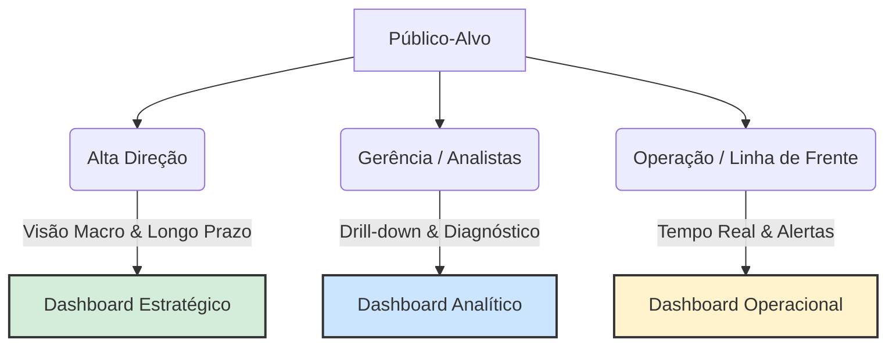
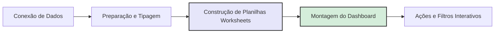
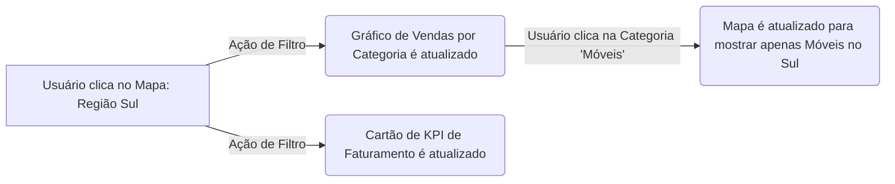

# Unidade III – Análise de Dados com ferramenta

## Público-Alvo

### O Papel do Público-Alvo na Visualização de Dados

O desenvolvimento de qualquer solução de visualização de dados (Data Discovery ou BI) deve começar pela compreensão de quem consumirá a informação. Um erro comum no mercado é tentar construir um único painel para atender a toda a empresa, o que gera excesso de informações para alguns e falta de detalhes para outros.

A audiência pode ser dividida de acordo com o nível de detalhe e o horizonte de tempo que necessitam analisar:

- **Alta Gestão (Diretores e C-Level)**: Necessitam de uma visão macro do negócio. O foco é o longo prazo e o acompanhamento de metas globais (ex: Faturamento anual da empresa). Não precisam saber o detalhe da venda de uma loja específica.
- **Gerentes e Analistas**: Atuam na camada tática e necessitam de uma visão de médio prazo. Precisam entender o "porquê" dos resultados macros, cruzando variáveis para diagnóstico (ex: Faturamento dividido por estado ou por categoria de produto).
- **Corpo Operacional**: Necessitam de uma visão micro e de curtíssimo prazo (diário ou tempo real). O foco está na execução e na rotina (ex: Faturamento de uma loja específica no dia de hoje, controle de estoque).
- **Público Externo**: Clientes, fornecedores ou cidadãos (em caso de dados públicos). A visualização deve ser extremamente simples, intuitiva e focada na transparência, sem expor dados sensíveis ou estratégicos da organização.

### O Conceito Fundamental de Dashboard

O professor utiliza a definição clássica de Stephen Few, uma das maiores referências mundiais em visualização de dados:

> "Um dashboard é uma exibição visual das informações mais importantes necessárias para alcançar um ou mais objetivos; consolidadas e organizadas em uma tela única para que a informação possa ser monitorada de relance."

A exigência de ser em uma tela única (Single Screen) não é um capricho estético, mas uma necessidade cognitiva. O cérebro humano tem dificuldade em reter informações ao rolar a página (scroll) ou ao alternar entre abas. A tela única permite que o usuário utilize a sua capacidade de percepção rápida para identificar anomalias, tendências e fazer comparações imediatas.

### Classificação dos Tipos de Dashboards

A estrutura do dashboard deve refletir diretamente o público-alvo mapeado na seção anterior. Eles são divididos em três categorias principais:

#### 1. Dashboard Estratégico

- **Público**: Executivos e Diretores.
- **Características**: Altamente resumido, focado em KPIs (Indicadores-Chave de Desempenho) de alto nível.
- **Frequência/Tempo**: Atualizações menos frequentes (mensais ou trimestrais). Mostra o histórico consolidado e, frequentemente, projeções preditivas para o futuro.

#### 2. Dashboard Analítico

- **Público**: Gerentes e Analistas de Negócio.
- **Características**: Altamente interativo. É o ambiente perfeito para o Data Discovery. Permite o uso intenso de filtros e o Drill-Down (a capacidade de clicar em um dado macro e "mergulhar" até o nível micro).
- **Objetivo**: Diagnosticar causas e cruzar múltiplos dados para encontrar explicações.

#### 3. Dashboard Operacional

- **Público**: Supervisores de linha de frente e equipes operacionais (ex: chão de fábrica, call centers).
- **Características**: Dinâmico, detalhado e focado em alertas imediatos.
- **Frequência/Tempo**: Atualização em tempo real ou quase real (near real-time). O objetivo é garantir que a operação não pare.

### Conexão com IA e Machine Learning (A Interface do Modelo)

O estudo de Data Discovery e Dashboards é fundamental para a Ciência de Dados porque o painel visual é a interface de entrega dos algoritmos de IA.

Um modelo de Machine Learning perfeitamente treinado para prever fraudes de cartão de crédito não tem valor se a informação não chegar à pessoa certa, no momento exato. Neste caso, as predições do algoritmo alimentam um Dashboard Operacional em tempo real na tela do analista de segurança, emitindo um alerta visual para que a transação seja bloqueada. Por outro lado, um modelo de forecasting de vendas alimentará um Dashboard Estratégico, permitindo que a diretoria visualize a receita prevista para o próximo semestre. Desenhar o painel correto garante que o modelo matemático seja, de fato, utilizado pelo negócio.

---

## Tableau

Esta unidade foca na transição do planejamento analítico para a execução técnica utilizando o Tableau Public, uma das ferramentas de Data Discovery e Visualização de Dados líderes de mercado. O conjunto de dados utilizado como fio condutor é o clássico Superstore (dados de uma loja de departamentos fictícia).

### Entendimento da Base e Prototipação

Antes de abrir a ferramenta de visualização, o fluxo de trabalho de um analista de dados exige duas etapas fundamentais:

#### O Dicionário de Dados

É necessário compreender a granularidade da base. No caso da base Superstore, cada linha representa um item de um pedido, e não o pedido inteiro. As colunas dividem-se logicamente em:

- **Identificadores (IDs)**: Número da linha, ID do Pedido, ID do Cliente, ID do Produto.
- **Datas**: Data do Pedido, Data de Envio.
- **Geografia**: País, Estado, Cidade.
- **Categorização**: Segmento, Categoria, Subcategoria.
- **Métricas Financeiras**: Vendas (Sales), Quantidade, Desconto e Lucro (Profit).

#### O Protótipo (Wireframing)

O professor destaca a importância de desenhar um rascunho (no papel ou em ferramentas como o Figma) do painel antes de construí-lo.

- **Boa Prática de Design**: O padrão visual mais adotado no mercado (Z-Pattern ou F-Pattern) sugere colocar os KPIs (Indicadores Chave) na parte superior da tela. Abaixo deles, posicionam-se os gráficos que explicam esses indicadores (ex: evolução no tempo, divisão geográfica e quebra por categorias).

### Conexão de Dados e Interface do Tableau

A importação dos dados no Tableau Public é o primeiro passo técnico. Ao conectar a um arquivo Excel, o Tableau exige que você arraste a planilha (sheet) específica para a área de preparação de dados para estabelecer a conexão.

#### O Conceito Mais Importante do Tableau: Dimensões vs. Medidas

Ao abrir a área de trabalho (Planilha 1), o Tableau divide automaticamente as colunas da sua base de dados em duas categorias fundamentais, identificadas por cores:

- **Dimensões (Azul - Dados Discretos)**: São dados qualitativos ou categóricos. Eles dizem o que você está medindo. Exemplos: Categoria, Cidade, Data do Pedido. As dimensões criam os "cabeçalhos" ou eixos dos gráficos.
- **Medidas (Verde - Dados Contínuos)**: São dados quantitativos e numéricos. Eles dizem quanto você está medindo. Exemplos: Vendas, Lucro. As medidas são agregadas por padrão (soma, média, contagem) e geram os eixos numéricos dos gráficos.

**Nota**: Recurso de Enriquecimento (Tableau Docs): Para aprofundar esse conceito, que é a base de tudo no software, consulte o artigo oficial: [Dimensões e medidas, azul e verde](https://help.tableau.com/current/pro/desktop/pt-br/datafields_typesandroles.htm).

### Construção de Visualizações (Step-by-Step)

A mecânica do Tableau funciona no modelo "Drag and Drop" (arrastar e soltar) utilizando prateleiras de Linhas, Colunas e Marcas (Cor, Tamanho, Texto, Dica de Ferramenta).

#### Séries Temporais (Gráfico de Linhas)

- **Construção**: Arrasta-se a data para as Colunas e a métrica financeira (ex: Vendas) para as Linhas.
- **Dica Técnica (Datas no Tableau)**: O Tableau, por padrão, agrupa datas de forma discreta (ex: Agrupa todos os meses de Janeiro de todos os anos). Para criar uma linha do tempo contínua, é necessário clicar com o botão direito na pílula de data e alterar para o formato "Mês e Ano" contínuo (o ícone mudará de azul para verde).

#### Análise Categórica (Gráfico de Barras)

- **Construção**: Dimensão (Subcategoria) em uma prateleira e Medida (Vendas) na outra.
- **Boa Prática Analítica**: Gráficos de barras devem sempre ser ordenados em ordem decrescente ou crescente. A ordenação facilita a leitura instantânea de quem são os líderes e os ofensores da métrica.

#### Análise Geoespacial (Mapas de Símbolos/Preenchidos)

- **Construção**: O Tableau reconhece campos geográficos (identificados por um ícone de globo terrestre). Ao arrastar o campo "Estado" para a visualização, o mapa é gerado automaticamente.
- **Uso Estratégico da Cor**: Ao adicionar o "Lucro" (Profit) na prateleira de Cores, o professor aplica uma paleta de cores divergente (Vermelho e Verde). Isso permite identificar imediatamente estados que dão prejuízo (vermelho) contra os que dão lucro (verde), aplicando o conceito de "Preattentive Attributes" na visualização.

#### Gráficos de Proporção (Pizza/Donut)

- Para verificar a composição das vendas por Segmento, utiliza-se a aba Mostre-me (Show Me), que sugere os gráficos ideais com base nas métricas selecionadas (1 dimensão e 1 medida geram um gráfico de pizza).
- **Nota de Design**: O mercado de visualização de dados prefere gráficos de Rosca (Donut) aos de Pizza, pois o espaço central em branco pode ser usado para inserir o valor total absoluto, otimizando o espaço do painel.

#### Cartões de KPI (Key Performance Indicators)

- São valores agregados únicos. Para criá-los, basta arrastar uma medida contínua diretamente para a prateleira de "Texto", sem nenhuma dimensão cortando o dado.
- É mandatório formatar o número (clique com o botão direito > Formatar > Número) para "Moeda Personalizada", ajustando as casas decimais para facilitar a leitura rápida do gestor.

### Fluxo de Trabalho e Melhores Práticas

Para consolidar o processo prático demonstrado nas aulas, o fluxo de desenvolvimento no Tableau segue esta lógica contínua:

### Montagem de Dashboards (Layout e Containers)

Dashboard para fornecer uma visão unificada do negócio.

- **Ajuste de Visualização (Fit)**: Por padrão, os gráficos no Tableau ocupam apenas o espaço necessário para os dados (Padrão). Para painéis responsivos, o professor recomenda alterar a exibição de cada gráfico para "Exibição Inteira" (Entire View) ou "Ajustar à Largura" (Fit Width), garantindo que o gráfico ocupe todo o espaço do contêiner sem barras de rolagem.
- **Limpeza Visual**: Ocultar títulos desnecessários dos eixos e das planilhas ajuda a maximizar o espaço útil do painel (data-ink ratio).
- **Títulos e Texto**: É recomendável adicionar um objeto de "Texto" no topo do painel para contextualizar a análise (ex: "Dashboard de Vendas").

Nota: Referência Tableau: Para dominar o posicionamento, estude o conceito de Contêineres de Layout (Horizontal e Vertical). Eles agrupam objetos para que o painel se redimensione dinamicamente de acordo com a tela do usuário. Leia mais em: [Criar um Dashboard](https://help.tableau.com/current/pro/desktop/pt-br/dashboards.htm).

### Cálculos de Tabela Rápida (Quick Table Calculations)

Muitas vezes, a métrica bruta (como a soma de Vendas) não responde à pergunta de negócio. O gestor pode querer saber a "Soma Acumulada" ao longo do ano ou o "Crescimento Percentual". O Tableau resolve isso sem a necessidade de programação complexa, através dos Cálculos de Tabela.

- **Como aplicar**: Clicando com o botão direito na medida (pílula verde) já instanciada na visualização e selecionando "Cálculo de Tabela Rápido".
- **Principais cálculos demonstrados**:
  - **Soma Acumulada (Running Total)**: Soma o valor do mês atual com todos os meses anteriores. Útil para acompanhar o atingimento de metas anuais.
  - **Diferença de Percentual (Year-over-Year Growth)**: Compara o período atual com o período anterior (ex: Julho deste ano vs. Julho do ano passado).
- **Revisão de Datas (Discreto vs. Contínuo)**: O professor reforça que para analisar crescimento ao longo do tempo de forma fluida, a pílula de data deve estar como Contínua (Verde), garantindo que o eixo X se comporte como uma linha do tempo cronológica, e não como categorias separadas (Discreta/Azul).

### Análise Preditiva e Tendências (Painel Análise)

O Tableau possui um painel específico chamado Análise (Analytics Pane), que permite arrastar modelos estatísticos diretamente para os gráficos.

- **Linha de Tendência (Trend Line)**: Adiciona uma linha matemática ao gráfico de dispersão ou série temporal para indicar a direção geral dos dados (ex: Linear, Exponencial, Polinomial).
- **Previsão (Forecast)**: Estima valores futuros com base no histórico.
- **Boa Prática Analítica**: Ao gerar uma previsão, o modelo muitas vezes projeta uma queda abrupta no último mês. Isso ocorre porque o mês atual ainda não fechou (os dados estão incompletos). O Tableau permite editar a previsão para "ignorar o último 1 mês", garantindo que a projeção estatística (ex: Suavização Exponencial) não seja corrompida por dados parciais.

Nota: Referência Tableau: O Tableau utiliza um método chamado de Suavização Exponencial (Exponential Smoothing) para suas previsões nativas. Para entender os requisitos matemáticos por trás desse recurso, consulte: [Como a previsão funciona no Tableau.](https://help.tableau.com/current/pro/desktop/pt-br/forecast_how_it_works.htm).

### Filtros Avançados: Análise de Top N

Responder "Quais são os 10 melhores clientes?" é uma tarefa clássica de Data Discovery.

- **Mecânica**: O professor demonstra como arrastar a dimensão (ex: Nome do Cliente) para a prateleira de "Filtros" e utilizar a aba "Início" (Top) para definir a regra "Top 10 por Soma de Vendas".
- **Contexto Visual**: Em listas de Top N, é mandatório ordenar o gráfico em ordem decrescente. Para enriquecer o insight, pode-se colocar a métrica de "Lucro" na prateleira de Cores. Assim, a ferramenta mostra quem mais compra (tamanho da barra) e, simultaneamente, se essa compra gera lucro ou prejuízo para a empresa (cor da barra).

### Interatividade e Ações de Dashboard

A interatividade é o que transforma um relatório estático em uma verdadeira ferramenta de Self-Service Analytics.

- **Usar como Filtro (Use as Filter)**: A maneira mais rápida de criar interatividade é clicar no ícone de funil na borda de um gráfico dentro do dashboard. Isso transforma aquele gráfico em um filtro global. Exemplo: Ao clicar no estado de "São Paulo" no mapa, todos os outros gráficos de barras e KPIs da tela são filtrados para mostrar apenas os dados de São Paulo.
- **Ações (Actions)**: Através do menu Dashboard > Ações, o analista tem um controle granular sobre a interatividade, podendo definir se a ação será disparada ao passar o mouse (Hover), selecionar (Select) ou acessar um menu, e quais planilhas específicas devem ser afetadas.

### Data Storytelling e Histórias (Storyboards)

A última etapa do fluxo de trabalho é a comunicação do insight. Além dos Dashboards, o Tableau oferece o recurso de História (Story).

- **O Conceito**: Uma História funciona como uma apresentação de slides (estilo PowerPoint), mas com os gráficos interativos vivos dentro dela.
- **Pontos da História (Story Points)**: O analista cria uma sequência lógica. Pode começar com um cenário macro (ex: Vendas Globais), adicionar um segundo ponto detalhando um problema (ex: Queda de Lucro na categoria Tecnologia), e um terceiro ponto prescrevendo uma solução.
- **Uso de Texto**: As caixas de legenda permitem adicionar a narrativa que guia o usuário pelo raciocínio analítico, assegurando que o foco (a mensagem principal do dado) não se perca na interpretação livre.

Nota: Referência Tableau: Construir uma história exige planejar o arco narrativo (setup, complicação, resolução). Recomenda-se a leitura do guia oficial: [Melhores Práticas para Contar Histórias com Dados](https://help.tableau.com/current/pro/desktop/pt-br/story_best_practices.htm).

---

[Previous](./02-data-driven-data-discovery.md)
[Next](./04-data-analysis-practice.md)
