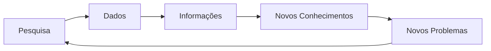
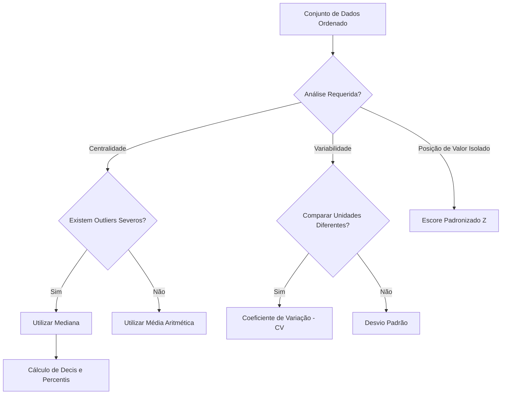
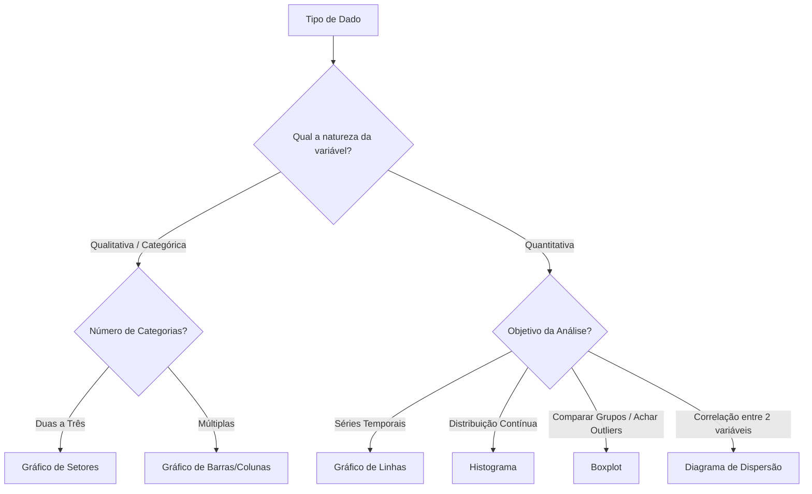

# Unidade I: Estatística Descritiva

---

## 1 Conceitos Fundamentais e Objetivos

A estatística é definida como o conjunto de técnicas para coletar, organizar, descrever, analisar e interpretar dados. No cotidiano, ela se manifesta desde previsões meteorológicas até indicadores econômicos e censos demográficos.

### 1.1 Processo de Pesquisa

A análise estatística é um processo interativo que visa resolver problemas ou produzir novos conhecimentos. O fluxo básico segue a lógica:



### 1.2 Tipos de Estudos

- **Estudo Observacional**: As características de uma população são levantadas sem manipulação, como em pesquisas eleitorais ou de mercado.
- **Estudo Experimental**: Grupos são manipulados para avaliar o efeito de diferentes tratamentos, como testes de novos medicamentos ou rendimento de processos químicos.

---

## 2. População, Amostra e Medidas

O sucesso de um estudo estatístico depende da definição clara do alvo de interesse e de como os dados serão extraídos.

- **População**: Conjunto total de itens (pessoas, produtos, resultados) que são o alvo principal da pesquisa.
- **Censo**: Quando o estudo abrange todos os elementos da população.
- **Amostra**: Subconjunto da população selecionado para o estudo. É utilizada quando a população é grande demais para ser estudada por completo.
- **Amostragem**: Processo criterioso de escolha da amostra, que pode ser aleatória simples, sistemática, estratificada, entre outras.

### 2.1 Parâmetro vs. Estatística

A distinção entre esses termos reside na origem do dado:

- **Parâmetro**: Medida numérica que descreve uma característica de toda a população.
- **Estatística**: Medida numérica que descreve uma característica de uma amostra.

---

## 3. Classificação de Variáveis (Tipos de Dados)

Os dados (ou variáveis) são classificados conforme sua natureza, o que determina o tipo de análise estatística aplicável.

| Categoria Principal        | Subdivisão | Descrição                                             | Exemplo                               |
| -------------------------- | ---------- | ----------------------------------------------------- | ------------------------------------- |
| Qualitativos (Categóricos) | Nominal    | Categorias sem ordem ou hierarquia.                   | Meio de transporte, cor da pele.      |
|                            | Ordinal    | Categorias que seguem uma ordenação ou hierarquia.    | Nível de satisfação, escolaridade.    |
| Quantitativos (Numéricos)  | Discreto   | Resultam de contagens; geralmente números inteiros.   | Número de alunos, ligações recebidas. |
|                            | Contínuo   | Resultam de medições; podem assumir valores decimais. | Peso, temperatura, altura.            |

---

## 4. Áreas da Estatística

A disciplina divide-se em quatro grandes frentes:

1. **Amostragem e Planejamento**: Escolha criteriosa dos elementos do estudo.
2. **Estatística Descritiva**: Organização e resumo de informações complexas por meio de médias, índices e gráficos.
3. **Probabilidade**: Teoria matemática para estudar a incerteza de fenômenos aleatórios.
4. **Estatística Inferencial**: Tomada de decisões sobre a população com base em dados amostrais, lidando com margens de erro e incertezas.

---

## 5. Medidas de Tendência Central

As medidas de tendência central resumem uma distribuição de dados por meio de um único valor representativo, indicando o centro de massa da amostra.

- **Média Aritmética:** Obtida pela soma dos valores dividida pelo tamanho da amostra ($n$). A média populacional é representada pelo parâmetro grego $\mu$, enquanto a amostral é a estatística $\bar{x}$ . Ela é altamente sensível a valores discrepantes (_outliers_), pois cada ponto tem peso no cálculo final.
- **Mediana:** É o valor que divide a amostra ordenada estritamente ao meio. Do mínimo até a mediana, concentram-se 50% dos dados, restando 50% até o valor máximo. Ao contrário da média, a mediana não é severamente distorcida por _outliers_.
- **Moda:** Consiste no valor de maior frequência em um conjunto de observações. Possui uma característica exclusiva: é a única medida de tendência central aplicável a variáveis qualitativas e categóricas (como o meio de transporte mais utilizado).

### Estudo de Caso: Ruído em Cruzamento Urbano

Um pesquisador mediu o ruído em decibéis durante 18 dias.

- A média foi de 108,44 dB e a mediana foi calculada a partir das posições centrais, resultando em 108,5 dB.
- **Análise:** A proximidade estreita entre a média e a mediana sugere uma distribuição simétrica, indicando ausência de valores extremos anômalos, o que valida a média como um excelente representante da amostra.

### Insights / Conexão com IA/ML

- **Robustez de Loss Functions:** No treinamento de redes neurais ou modelos de regressão, a intuição por trás da Média e Mediana orienta a escolha da função de custo. Otimizar o Erro Médio Absoluto (MAE) puxa as predições para a Mediana (mais robusto), enquanto otimizar o Erro Quadrático Médio (MSE) puxa para a Média, sendo mais penalizado por anomalias.
- **Feature Engineering:** Em pipelines puramente _Data-Driven_, a imputação de dados faltantes numéricos (NaN) por meio da Mediana é mandatória quando a variável possui uma distribuição assimétrica, evitando que o modelo herde o viés de _outliers_.

---

## 6. Medidas de Dispersão

Duas amostras podem apresentar médias idênticas, porém com comportamentos internos radicalmente distintos. As medidas de dispersão capturam a variabilidade espacial dos dados em relação ao seu centro.

- **Amplitude:** A distância direta entre o valor máximo e mínimo da amostra. É uma medida frágil, pois ignora completamente o comportamento dos dados intermediários.
- **Variância ($s^2$ para amostra, $\sigma^2$ para população):** Representa a média dos desvios quadráticos de cada ponto em relação à média do grupo. Seu cálculo resulta em uma medida na mesma unidade original elevada ao quadrado (ex: metros quadrados, minutos quadrados), dificultando interpretações diretas.
  $$s^2=\frac{\sum_{i=1}^{n}(x_i-\bar{x})^2}{n-1}$$
- **Desvio Padrão ($s$ ou $\sigma$):** É a raiz quadrada da variância. Ele reverte o valor para a unidade de medida primária da observação, sendo largamente empregado na elaboração de relatórios descritivos.
- **Coeficiente de Variação (CV):** Medida de dispersão relativa expressa de forma percentual. É utilizado estritamente para contornar problemas de escalas diferentes, ou quando as médias das amostras a serem comparadas diferem significativamente.
  $$CV=\left(\frac{s}{\bar{x}}\right)\cdot 100$$

### Estudo de Caso: Tempos de Deslocamento e Turmas Universitárias

- **Deslocamento:** O tempo médio gasto para chegar a uma empresa foi de 30,4 minutos. Aplicando a fórmula do desvio padrão obteve-se aproximadamente 25,05 minutos. A alta proximidade do desvio padrão em relação à média atesta uma variabilidade severa.
- **Variabilidade Intergrupos:** Ao analisar turmas com médias desiguais (ex: Médias 3, 8 e 5), analisar puramente o desvio padrão resultaria em equívocos analíticos. O Coeficiente de Variação permitiu padronizar a métrica para definir precisamente qual turma foi mais homogênea.

### Insights / Conexão com IA/ML

- **Gradient Descent e Inicialização:** Funções de ativação modernas (ReLU, GELU) e técnicas de inicialização de pesos (como _He_ ou _Xavier_) baseiam-se em cálculos precisos de variância para evitar que gradientes desapareçam ou explodam durante a retropropagação em Deep Learning.
- **PCA (Principal Component Analysis):** Algoritmo clássico de aprendizado não supervisionado focado exclusivamente em dispersão. O PCA encontra novos eixos vetoriais que capturam a maior _variância_ possível nos dados de alta dimensionalidade.

---

## 7. Medidas de Posição Relativa e Escore Z

Avançando além de medidas que resumem o conjunto completo, é necessário isolar elementos em nichos específicos por meio de recortes quantitativos.

- **Quartis, Decis e Percentis:** Estas métricas seccionam uma amostra ordenada, correspondendo respectivamente a fatias de 25%, 10% e 1% do banco de dados. Devido à proporcionalidade, o 3º Quartil ($Q_3$) é o equivalente exato do Percentil 75 ($P_{75}$).
- **Cálculo Posicional:** A extração começa com o cálculo da Posição ($L$).
  $$L=\left(\frac{k}{100}\right)n$$
  - Se $L$ for inteiro: A estatística é a média entre as observações nos índices $L$ e $L+1$.
  - Se $L$ for decimal: O valor é matematicamente arredondado para o próximo inteiro.
- **Escore Padronizado (Escore Z):** Mensura a distância espacial exata que um valor tem de sua média em unidades de desvio padrão ($s$).
  $$z=\frac{x-\bar{x}}{s}$$
  - Valores de $z$ negativos residem abaixo da média; positivos indicam elementos acima do bloco central.

### Estudo de Caso: Velocidade de Compras em E-commerce

Para uma amostra de 12 consumidores analisados durante finalização de compra:

- **Cálculo do $3^\circ$ Quartil ($k=75$):** $L = 9$. Sendo inteiro, operou-se a média entre o 9º elemento (77s) e o 10º elemento (79s), concluindo que 75% dos consumidores gastam, no limite superior, 78 segundos na transação.
- **Cálculo de Escore Z:** Para o tempo mais lento computado (83s) com média aproximada de 76,08s e $s = 13,52s$, foi obtido um escore positivo de $1,9605$. O cliente atípico demorou quase duas unidades padronizadas inteiras além da norma da loja.

### Insights / Conexão com IA/ML

- **Feature Scaling (_Standardization_):** A transformação do Escore Z sustenta a classe `StandardScaler` amplamente utilizada em Python/Scikit-Learn. Ela neutraliza vieses onde _features_ de escalas largas numéricas (ex: renda em milhares) anulam a influência matemática de _features_ menores (ex: número de filhos) num algoritmo K-Means.
- **Detecção Preditiva de Anomalias:** O mapeamento em Escore Z é fundamental para o bloqueio automatizado. Transações financeiras que atinjam escores limiares (frequentemente com $|z| > 3$) podem acionar agentes autônomos de segurança para suspender a movimentação financeira preventivamente.

---

## 8. Diagrama de Seleção Descritiva

O processo de exploração e documentação _Data-Driven_ de variáveis contínuas segue uma árvore de decisão para definir a técnica estatística correta:



---

## 9. Gráficos para Variáveis Qualitativas e Quantitativas Discretas

A escolha do gráfico depende inteiramente da natureza da variável que está sendo analisada.

- **Gráfico de Setores (Pizza ou Rosca):** \* É exclusivo para representar a distribuição de frequências de variáveis qualitativas.
  - Deve ser utilizado apenas quando o número de categorias de resposta é pequeno (geralmente duas a três), pois o excesso de fatias compromete a leitura.
  - Regra de Ouro: Nunca utilize efeitos em 3D, pois eles distorcem a percepção visual das categorias, mascarando proporções matemáticas reais.

- **Gráfico de Barras ou Colunas:**
  - Utiliza o plano cartesiano, sendo altamente recomendado para variáveis qualitativas (inclusive ordinais) e quantitativas discretas (contagens).
  - Para não distorcer a análise, o eixo que contém as frequências ou valores deve obrigatoriamente iniciar no valor zero. Alterar o início da escala cria um "efeito de lupa" que amplia diferenças que podem ser insignificantes.
  - A inclusão dos valores exatos (frequência ou percentual) acima das barras facilita a leitura direta sem sobrecarregar o visual.

- **Gráfico de Colunas Agrupadas ou Empilhadas:**
  - É a ferramenta ideal quando os dados provêm de tabelas de contingência (cruzamento de duas variáveis).
  - Permite comparar proporções, como o volume de vendas de diferentes produtos em múltiplas filiais de uma empresa.
  - O uso do formato empilhado em percentuais (onde cada coluna soma 100%) é excelente para comparar o comportamento interno de grupos distintos, neutralizando a diferença de volume absoluto entre eles.

### Estudos de Caso: Seleção de Fornecedores e Distorção Visual

Em uma análise de _Market Share_ entre quatro fornecedores (A, B, C e D), a apresentação inicial utilizou um gráfico de setores em 3D. O efeito tridimensional fez com que uma fatia de 31% parecesse visualmente maior do que a fatia de 34% que estava posicionada no fundo do gráfico. A remoção do 3D corrigiu a distorção perceptiva, validando a premissa de que análises _Data-Driven_ exigem representações bidimensionais limpas.

## 10. Gráficos para Variáveis Quantitativas Contínuas e Séries Temporais

Para variáveis numéricas contínuas ou análises de comportamento ao longo do tempo, as ferramentas mudam de foco para capturar distribuições, correlações e tendências.

- **Histograma:**
  - É a forma padrão para apresentar distribuições de frequências de variáveis quantitativas contínuas agrupadas em intervalos de classes.
  - As barras são desenhadas de forma contígua (sem espaços), onde o eixo X representa os limites dos intervalos de valores e o eixo Y representa a frequência.

- **Gráfico de Linhas:**
  - Essencial para representar séries temporais (dados observados periodicamente: dias, meses, anos).
  - Permite identificar dois padrões fundamentais na linha do tempo:
    1. **Tendência:** Comportamento geral de crescimento ou decrescimento de longo prazo.
    2. **Sazonalidade:** Sucessão regular e repetitiva de picos e vales em intervalos de tempo fixos (ex: aumentos recorrentes nas vendas durante feriados).

- **Gráfico de Pontos (Dotplot):**
  - Recomendado para amostras pequenas, mostrando cada ocorrência como um ponto sobre uma reta numérica.
  - Facilita a visualização da dispersão dos dados e a aderência a limites de especificação técnica em linhas de produção.

- **Diagrama em Caixa (Boxplot):**
  - Gráfico focado na exibição simultânea da tendência central (mediana), dispersão (distância interquartílica) e assimetria.
  - É construído com base em cinco medidas principais: valor mínimo, 1º quartil ($Q_1$), mediana ($Q_2$), 3º quartil ($Q_3$) e valor máximo.
  - Possui um sistema matemático nativo para a detecção de _Outliers_ (valores discrepantes), utilizando as fórmulas:
    - Limite Inferior: $Q_1 - 1,5 \times DIQ$
    - Limite Superior: $Q_3 + 1,5 \times DIQ$

- **Diagrama de Dispersão (Scatter Plot):**
  - Avalia a possível correlação entre duas variáveis quantitativas distintas medidas nos mesmos indivíduos.
  - Busca responder a características essenciais: a correlação existe? É linear, exponencial ou quadrática? É positiva (crescente) ou negativa (decrescente)?
  - A ausência de qualquer padrão observável (gráfico de "nuvem de pontos" totalmente aleatória) indica falta de correlação entre as métricas analisadas.

### Estudos de Caso: Qualidade na Produção e Tráfego Aéreo

- **Produção de Azulejos:** Clientes de uma indústria reclamaram da quebra e falta de uniformidade em azulejos. O gráfico de pontos (Dotplot) revelou que a Turma A estava fabricando peças sistematicamente abaixo do limite de especificação (muito finas), enquanto a Turma B fabricava peças acima do limite (espessas), justificando a falha técnica.
- **Aviação Comercial:** Um gráfico de linhas capturando 150 meses de transporte de passageiros revelou não apenas uma tendência macro de crescimento orgânico, mas uma sazonalidade severa com "vales e picos". Identificou-se que as altas coincidiam rigorosamente com o calendário de férias escolares (Julho e Dezembro/Janeiro).

## 11. Diagrama de Decisão Visual



### Insights / Conexão com IA/ML

- **Análise Exploratória de Dados (EDA)**: A construção de Histogramas e Boxplots é a primeira etapa na rotina de um Cientista de Dados antes de treinar qualquer modelo de Machine Learning. O Boxplot dita diretamente quais linhas do dataset serão removidas ou transformadas caso o algoritmo seja sensível a outliers (como Regressão Linear ou Regressão Logística).
- **Modelagem de Séries Temporais**: A identificação visual de "Tendência" e "Sazonalidade" no gráfico de linhas justifica o uso de arquiteturas de IA preditiva específicas, como redes neurais LSTM (Long Short-Term Memory) ou modelos estatísticos ARIMA, que requerem que a sazonalidade seja tratada (diferenciada) antes do treinamento do algoritmo para previsões futuras sólidas.
- **Matriz de Correlação e Seleção de Features**: O conceito por trás do Diagrama de Dispersão embasa o cálculo do coeficiente de correlação de Pearson no treinamento algorítmico. Variáveis preditoras (eixo X) com correlação perfeitamente linear e alta variância (muito dispersas) em relação ao alvo (eixo Y) são os melhores atributos para treinar um modelo de Regressão. Correlações do tipo "nuvem" forçam o abandono da feature para evitar ruído (overfitting).

---

[Previous](./summary.md)
[Next](./02-probability.md)

```

```
