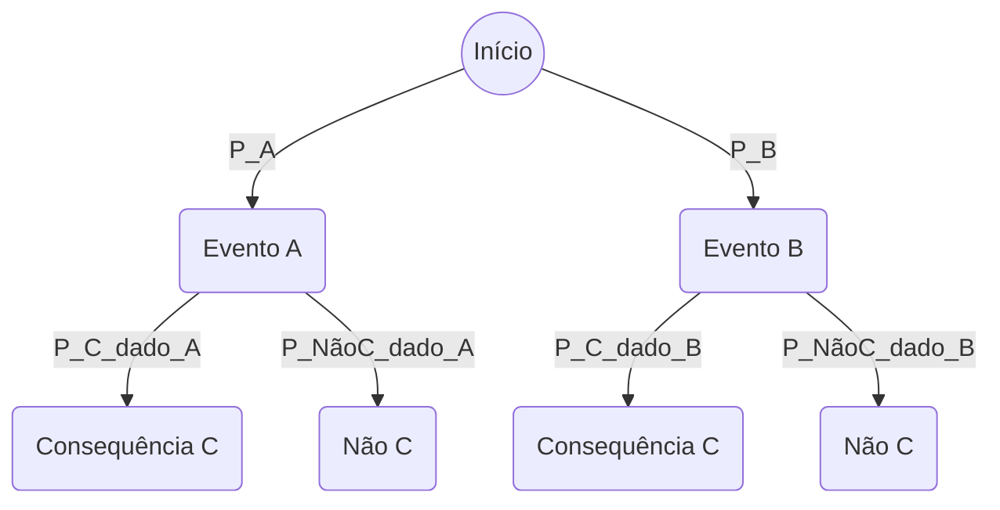
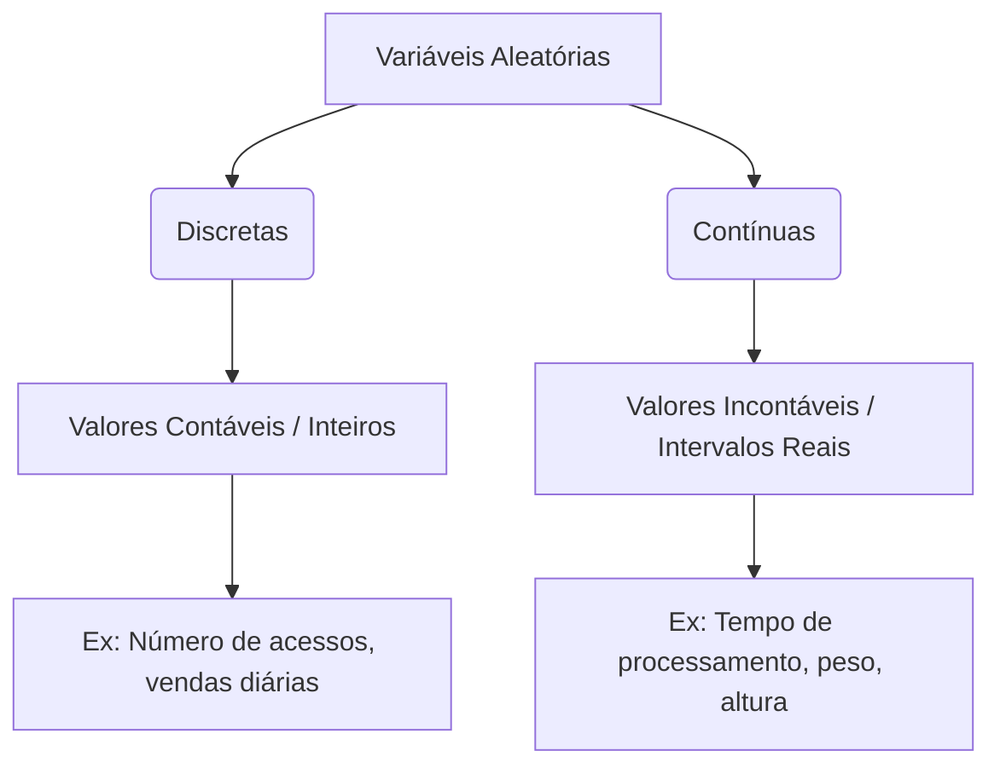
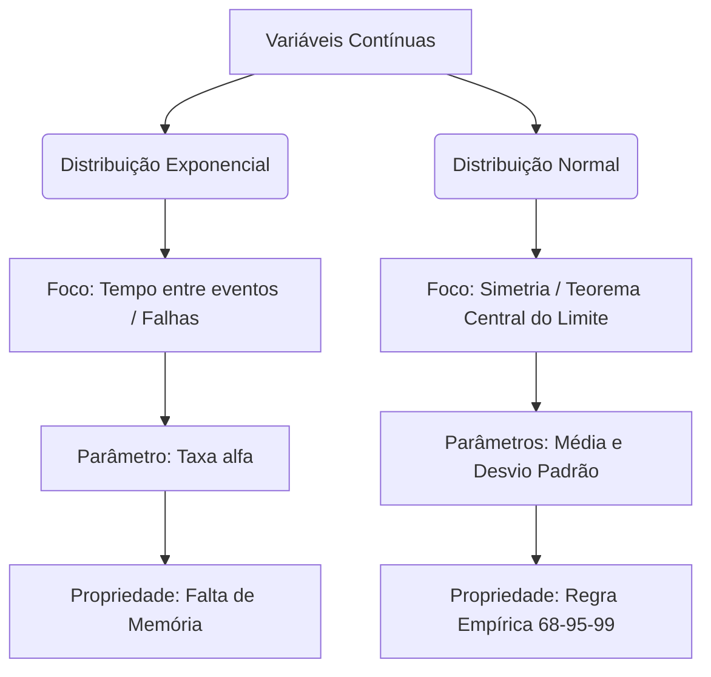

# Unidade II: Probabilidade

## Introdução à Probabilidade

A probabilidade está intrinsecamente ligada ao nosso cotidiano e ao ambiente de negócios. Longe de ser apenas um conceito abstrato, ela é a base analítica que nos permite quantificar a incerteza. No contexto corporativo Data-Driven, gestores abandonam a intuição em favor da probabilidade para embasar decisões críticas, tais como prever o impacto de variações de preço nas vendas, avaliar o retorno de novos investimentos ou estimar o cumprimento de prazos em projetos.

A probabilidade funciona como uma escala de medida que quantifica as chances de um evento ocorrer, assumindo sempre valores entre **0** (pouco provável ou impossível) e **1** (quase certo ou certeza absoluta).

---

### Conceitos Básicos

Para estruturar o raciocínio probabilístico, é essencial dominar três conceitos fundamentais:

- **Experimento Aleatório:** É qualquer processo que permite realizar observações cujos resultados são variáveis, mesmo quando repetido sob condições idênticas. Embora não seja possível prever um resultado exato a priori, o conjunto de todas as possibilidades é conhecido.
  - _Exemplos:_ Lançamento de dados, contagem de alunos aprovados ou teste de durabilidade de um hardware (como um SSD ou lâmpada).
- **Espaço Amostral ($$\Omega$$):** Representa o conjunto universo de todos os resultados possíveis de um experimento aleatório.
  - _Exemplo:_ Ao testar a vida útil de um equipamento em minutos, o espaço amostral é $$\Omega = \{t \in \mathbb{R} | t \ge 0\}$$.
- **Evento:** É um subconjunto de elementos do espaço amostral sobre o qual se tem interesse em calcular a probabilidade de ocorrência. Os eventos devem ser denotados por letras maiúsculas.

#### Axiomas da Probabilidade

O cálculo da probabilidade, denotado por $$P(A)$$ para um evento A, obedece a três regras matemáticas intransigíveis:

1. A probabilidade nunca é negativa e varia entre **0** e **1**: $$0 \le P(A) \le 1$$.
2. A probabilidade de ocorrência de todo o espaço amostral é a certeza absoluta: $$P(\Omega) = 1$$.
3. Para eventos disjuntos (que não ocorrem simultaneamente), a probabilidade da união é a soma das probabilidades individuais: $$P(A_1 \cup A_2 \cup ...) = P(A_1) + P(A_2) + ...$$.

---

### Operações com Eventos e Probabilidade Condicional

Ao analisar cenários de negócios reais, os eventos raramente ocorrem isolados. As operações probabilísticas mapeiam essas interações:

- **Interseção ($$A \cap B$$):** Ocorrência simultânea de dois eventos.
- **União ($$A \cup B$$):** Ocorrência de pelo menos um dos eventos (A ou B). Calculada por:
  $$P(A \cup B) = P(A) + P(B) - P(A \cap B)$$
- **Eventos Complementares:** Quando a união de dois eventos forma o espaço amostral e a interseção é vazia ($$A \cup B = \Omega$$e$$A \cap B = \emptyset$$). Pode-se deduzir que $$P(A) = 1 - P(B)$$.
- **Probabilidade Condicional:** Trata da probabilidade de um evento A ocorrer sabendo que um evento B já ocorreu, o que altera as chances iniciais. É a essência da atualização de crenças com novos dados:
  $$P(A|B) = \frac{P(A \cap B)}{P(B)}$$
- **Eventos Independentes:** Dois eventos são independentes se a ocorrência de um não interfere nas chances do outro, resultando na igualdade $$P(A \cap B) = P(A) \cdot P(B)$$.

---

### Teorema da Probabilidade Total e Teorema de Bayes

Quando o espaço amostral é particionado em vários eventos disjuntos ($$A_1, A_2, ... A_n$$), podemos calcular a probabilidade de um evento secundário B considerando todos os cenários possíveis que o afetam.

- **Teorema da Probabilidade Total:**
  $$P(B) = \sum_{i} P(A_i)P(B|A_i)$$

- **Teorema de Bayes:** Permite inverter a probabilidade condicional. Ou seja, se observarmos o evento B (um efeito), qual é a probabilidade de ele ter sido causado por $$A_i$$?.
  $$P(A_i|B) = \frac{P(B|A_i)P(A_i)}{\sum_{j} P(B|A_j)P(A_j)}$$

#### Árvore de Probabilidades

Para facilitar o desenvolvimento do raciocínio visual e evitar falhas conceituais nas interseções, utilizamos a Árvore de Probabilidades. Cada ramo representa um conjunto de eventos e a união dos caminhos delineia as dependências condicionais.



---

### Estudos de Caso

### 1. Controle de Qualidade na Cadeia de Suprimentos (Fábrica de Sorvetes)

Uma fábrica recebe leite de três fazendas com taxas de fornecimento diferentes e históricos distintos de adulteração:

- **F1:** Fornece **20%** do total; **20%** do seu leite é adulterado.
- **F2:** Fornece **30%** do total; **5%** do seu leite é adulterado.
- **F3:** Fornece **50%** do total; **2%** do seu leite é adulterado.

Se um galão não identificado for inspecionado:

- A probabilidade total de encontrar leite adulterado (soma das interseções de cada rota na árvore) é:
  $$P(A) = (0.2 \cdot 0.2) + (0.3 \cdot 0.05) + (0.5 \cdot 0.02) = 0.065$$
- Se for constatado que o leite **não é adulterado**, a probabilidade de ele ter vindo da Fazenda 3 (aplicando Bayes) é a interseção do leite puro da F3 dividida pela probabilidade total de leites puros:
  $$P(F_3|A^C) = \frac{0.5 \cdot 0.98}{1 - 0.065} \approx 0.5241$$

---

### Resolução de Exercícios de Fixação

**Exercício 1: Tabela Cruzada de Matrículas**
Temos **200** alunos distribuídos entre Computação, Matemática, Estatística e Atuariais.

- **a) Ser do sexo masculino:** $$P(M) = \frac{115}{200} = 0.575$$
- **b) Matriculado em Estatística:** $$P(Est) = \frac{30}{200} = 0.15$$
- **c) Sexo feminino e Matemática:** Interseção direta na tabela. $$P(F \cap Mat) = \frac{15}{200} = 0.075$$
- **d) Masculino ou Atuariais:** Regra da união. $$P(M \cup Atu) = \frac{115}{200} + \frac{30}{200} - \frac{20}{200} = 0.625$$

**Exercício 2: Produção de Peças e Defeitos**
Fábricas A (produz **50%**), B (produz **25%**) e C (produz **25%**). As taxas de falha são **2%**, **2%** e **4%**.

- **a) Probabilidade da peça ser defeituosa (D):** $$P(D) = (0.50 \cdot 0.02) + (0.25 \cdot 0.02) + (0.25 \cdot 0.04) = 0.025$$
- **b) Sabendo que é perfeita, ser da fábrica B:** Usando Bayes, queremos $$P(B|D^C)$$. A probabilidade total de peças perfeitas é $$1 - 0.025 = 0.975$$. Logo:
  $$P(B|D^C) = \frac{0.25 \cdot 0.98}{0.975} \approx 0.251$$

**Exercício 3: Escola e o Mar**
População: **40%** Meninos (M), **60%** Meninas (F). Probabilidade condicional de nunca ter visto o mar (N): $$P(N|M) = 0.20$$, $$P(N|F) = 0.50$$.

- **a) Masculino E nunca viu o mar:** $$P(M \cap N) = 0.40 \cdot 0.20 = 0.08$$
- **b) Feminino OU nunca viu o mar:** $$P(F \cup N) = P(F) + P(N) - P(F \cap N)$$. A probabilidade total de N é $$0.38$$. Portanto:
  $$P(F \cup N) = 0.60 + 0.38 - 0.30 = 0.68$$

**Exercício 4: Independência**
Dada a tabela, $$P(A) = 0.10$$, $$P(B) = 0.12$$e$$P(A \cap B) = 0.04$$.

- Eventos são independentes se $$P(A \cap B) = P(A) \cdot P(B)$$. Como $$0.10 \cdot 0.12 = 0.012$$, que é diferente de **0.04**, os eventos não são independentes.

**Exercício 5: Probabilidade na Cadeia de Mensagens**
Esquecer (E) = **0.1**; Não Esquecer = **0.9**. Extraviar (X) dado que não esqueceu = **0.1**; Não Extraviar = **0.9**. Não receber (N) dado enviado e não extraviado = **0.1**; Receber (R) = **0.9**.

- **a) Probabilidade do amigo ter esquecido (E) dado que não recebeu (NR):** A probabilidade total de não receber compreende as falhas sequenciais da árvore, totalizando **0.271**. A probabilidade condicional via Bayes é:
  $$P(E|NR) = \frac{0.10}{0.271} \approx 0.369$$
- **b) Sucesso da entrega:** O único ramo de sucesso na árvore é Não Esquecer, Não Extraviar e Receber:
  $$P(Sucesso) = 0.9 \cdot 0.9 \cdot 0.9 = 0.729$$

---

### Insights: Conexão com IA/ML

Os princípios expostos aqui marcam a fronteira exata entre decisões baseadas em instinto e a cultura analítica focada em dados (Data-Driven). No ecossistema de Inteligência Artificial e Aprendizado de Máquina, o **Teorema de Bayes** transcende o cálculo teórico para se tornar o motor principal de diversos algoritmos:

- **Classificadores Naive Bayes:** Ferramentas estatísticas amplamente utilizadas em detecção de spam e análise de sentimentos em Processamento de Linguagem Natural (NLP), que se baseiam em atualizar constantemente as probabilidades condicionais conforme recebem novos dados de texto.
- **Redes Bayesianas:** Diagramas gráficos direcionados (muito semelhantes à árvore de probabilidades estudada) que modelam a dependência e a incerteza de múltiplas variáveis.
- A própria essência do treinamento de modelos preditivos é uma busca frequente para minimizar a incerteza (reduzir o erro) utilizando axiomas probabilísticos rigorosos para generalizar padrões de um **Espaço Amostral** (dados de treinamento) para ocorrências futuras no mercado.

---

## Variáveis Aleatórias

### Introdução às Variáveis Aleatórias

Em probabilidade, o resultado de um experimento aleatório é frequentemente uma contagem ou uma medida. Quando associamos esse resultado a um valor numérico, chamamos esse valor de variável aleatória.

**Notação Importante:**

- **Letra Maiúscula ($X$, $Y$, $T$):** Representa a variável aleatória em si (o conceito ou objeto de estudo).
- **Letra Minúscula ($x$, $y$, $t$):** Representa os valores específicos e observáveis que essa variável pode assumir.

As variáveis aleatórias dividem-se em duas grandes categorias estruturais:



### Variáveis Aleatórias Discretas

Uma variável aleatória é classificada como discreta quando assume valores inteiros dentro de um conjunto finito ou enumerável de possibilidades. São tipicamente dados decorrentes de processos de contagem.

#### Distribuição Discreta de Probabilidade

A distribuição de probabilidade associa cada valor possível da variável $x$ à sua probabilidade correspondente $P(X=x)$. Para ser considerada válida, a distribuição precisa respeitar duas regras matemáticas estritas:

- A probabilidade de cada elemento deve estar contida entre 0 e 1: $0 \le P(X=x) \le 1$.
- A soma de todas as probabilidades do espaço amostral deve ser exatamente igual a 1: $\sum P(X=x_i) = 1$.

#### Função de Distribuição Acumulada (FDA)

A FDA, representada por $F(x)$, não calcula a probabilidade isolada de um ponto específico, mas sim a probabilidade acumulada de a variável assumir valores menores ou iguais a um determinado limite. É uma ferramenta útil para avaliar cenários de atingimento de metas ou cumprimento de prazos limites.

$$ F(x) = P(X \le x) $$

#### Medidas de Tendência e Dispersão

- Média ou Esperança Matemática ($E(X)$ ou $\mu$): Representa o valor médio esperado caso o experimento fosse repetido infinitas vezes sob as mesmas condições.$$ \mu = \sum[x_i \cdot P(X=x_i)] $$
- Variância ($Var(X)$ ou $\sigma^2$): Mede a dispersão dos dados em relação à média do conjunto.$$ \sigma^2 = E(X^2) - \mu^2 $$Onde o termo de segunda ordem é calculado por: $E(X^2) = \sum[x_i^2 \cdot P(X=x_i)]$.
- Desvio Padrão ($\sigma$): É definido como a raiz quadrada da variância, possuindo a vantagem prática de retornar a medida de dispersão para a mesma unidade original dos dados.$$ \sigma = \sqrt{\sigma^2} $$

### Variáveis Aleatórias Contínuas

Ao contrário das discretas, as variáveis contínuas podem assumir qualquer valor numérico dentro de um intervalo contínuo do conjunto dos números reais. Estão associadas diretamente a medições físicas ou temporais.

#### Função Densidade de Probabilidade (FDP)

Para variáveis contínuas, a probabilidade de a variável assumir um ponto exato e isolado é matematicamente considerada zero. Por esse motivo, os cálculos de probabilidade são sempre realizados com base em intervalos numéricos utilizando o cálculo integral.
Uma função $f(x)$ só é considerada uma FDP válida se obedecer a três condições fundamentais:

- A função nunca assume valores negativos: $f(x) \ge 0$.
- A área total sob a curva da função em todo o seu domínio é estritamente igual a 1: $\int_{-\infty}^{+\infty} f(x) dx = 1$.
- A probabilidade dentro de um intervalo delimitado pelos pontos "a" e "b" é calculada através da integral da função nesses limites:$$ P(a \le X \le b) = \int\_{a}^{b} f(x) dx $$

**Diferença Crucial de Intervalos**: Para variáveis contínuas, a inclusão ou exclusão dos extremos do intervalo num cálculo de probabilidade não altera o resultado final, ou seja, $P(a < X < b) = P(a \le X \le b)$. No entanto, para variáveis discretas, a presença do sinal de igualdade altera completamente o resultado, pois adiciona ou remove valores pontuais inteiros da soma.

#### Medidas de Tendência e Dispersão

Os conceitos de Esperança e Variância operam de forma análoga às discretas, substituindo formalmente o operador de somatório pelo de integração:

- Esperança Matemática: $E(X) = \int_{-\infty}^{+\infty} x \cdot f(x) dx$
- Variância: $Var(X) = \int_{-\infty}^{+\infty} x^2 \cdot f(x) dx - \mu^2$

### Resolução de Exercícios Aplicados

#### Exercício 1: Classificação de Variáveis e Medidas Discretas

##### Parte A: Classificação das variáveis aleatórias apresentadas:

- Número de acidentes numa semana: Discreta (decorrente de contagem).
- Número de defeitos em uma peça: Discreta (decorrente de contagem).
- Duração de uma conversa telefônica: Contínua (medida de tempo contínuo).
- Número de falhas numa safra: Discreta (decorrente de contagem).
- Tempo necessário para produzir uma peça: Contínua (medida de tempo contínuo).
- Peso de contêineres contendo minério de ferro: Contínua (medida de massa).

##### Parte B: Análise de Vendas (Variável Discreta):

Considere a distribuição de probabilidade de vendas diárias de um equipamento, onde $X$ é o número de unidades e $P(X=x)$ sua respectiva probabilidade:

- $(X=0: 0,16)$
- $(X=1: 0,19)$
- $(X=2: 0,15)$
- $(X=3: 0,21)$
- $(X=4: 0,09)$
- $(X=5: 0,10)$
- $(X=6: 0,08)$
- $(X=7: 0,02)$
- Cálculo da Média de Vendas ($\mu$):$$ \mu = (0 \cdot 0,16) + (1 \cdot 0,19) + (2 \cdot 0,15) + (3 \cdot 0,21) + (4 \cdot 0,09) + (5 \cdot 0,10) + (6 \cdot 0,08) + (7 \cdot 0,02) $$$$ \mu = 0 + 0,19 + 0,30 + 0,63 + 0,36 + 0,50 + 0,48 + 0,14 = 2,6 \text{ vendas/dia} $$
- Cálculo da Esperança de $X^2$ ($E(X^2)$):$$ E(X^2) = (0^2 \cdot 0,16) + (1^2 \cdot 0,19) + (2^2 \cdot 0,15) + (3^2 \cdot 0,21) + (4^2 \cdot 0,09) + (5^2 \cdot 0,10) + (6^2 \cdot 0,08) + (7^2 \cdot 0,02) $$$$ E(X^2) = 0 + 0,19 + 0,60 + 1,89 + 1,44 + 2,50 + 2,88 + 0,98 = 10,48 $$
- Cálculo da Variância ($\sigma^2$) e Desvio Padrão ($\sigma$):$$ \sigma^2 = E(X^2) - \mu^2 = 10,48 - (2,6)^2 = 10,48 - 6,76 = 3,72 $$$$ \sigma = \sqrt{3,72} \approx 1,9287 \text{ vendas/dia} $$

#### Exercício 2: Validação de FDP e Cálculo de Probabilidade Intervalar

Seja a função $f(x) = \frac{x-3}{2}$ definida para o intervalo $3 \le x \le 5$, e $0$ para qualquer outro caso.

1. Validação como Função Densidade de Probabilidade:Para ser válida, a integral de $f(x)$ no intervalo dado deve resultar em 1:$$ \int*{3}^{5} \frac{x-3}{2} dx = \left[ \frac{x^2}{4} - \frac{3x}{2} \right]*{3}^{5} $$Substituindo o limite superior (5): $\frac{25}{4} - \frac{15}{2} = 6,25 - 7,5 = -1,25$Substituindo o limite inferior (3): $\frac{9}{4} - \frac{9}{2} = 2,25 - 4,5 = -2,25$Calculando a diferença: $-1,25 - (-2,25) = 1$. Portanto, a função cumpre o requisito e é uma FDP válida.
2. Cálculo da Probabilidade $P(3,3 \le X < 4)$:$$ P(3,3 \le X < 4) = \int*{3,3}^{4} \frac{x-3}{2} dx = \left[ \frac{x^2}{4} - \frac{3x}{2} \right]*{3,3}^{4} $$Substituindo o limite superior (4): $\frac{16}{4} - \frac{12}{2} = 4 - 6 = -2$Substituindo o limite inferior (3,3): $\frac{10,89}{4} - \frac{9,9}{2} = 2,7225 - 4,95 = -2,2275$Calculando a diferença: $-2 - (-2,2275) = 0,2275$ ou $22,75\%$.

#### Exercício 3: Análise Estatística de Tempo de Teste (FDP Composta)

O tempo $T$ em minutos necessário para concluir um teste teórico é modelado por uma FDP composta pelas seguintes sentenças:

- $f(t) = \frac{1}{40}(t-4)$ para o intervalo $8 \le t < 10$
- $f(t) = \frac{3}{20}$ para o intervalo $10 \le t \le 15$
- $f(t) = 0$ para qualquer outro cenário externo.
- A) Cálculo do Tempo Médio do Teste ($E(T)$):Como a função possui duas sentenças, divide-se a integral em duas partes correspondentes aos seus domínios:$$ E(T) = \int*{8}^{10} t \cdot \frac{1}{40}(t-4) dt + \int*{10}^{15} t \cdot \frac{3}{20} dt $$$$ E(T) = \frac{1}{40} \int*{8}^{10} (t^2 - 4t) dt + \frac{3}{20} \int*{10}^{15} t dt $$$$ E(T) = \frac{1}{40} \left[ \frac{t^3}{3} - 2t^2 \right]{8}^{10} + \frac{3}{20} \left[ \frac{t^2}{2} \right]{10}^{15} $$Resolvendo a primeira parte: $\frac{1}{40} [(\frac{1000}{3} - 200) - (\frac{512}{3} - 128)] = \frac{1}{40} [133,333 - 42,667] = 2,2667$Resolvendo a segunda parte: $\frac{3}{20} [\frac{225}{2} - \frac{100}{2}] = \frac{3}{20} [62,5] = 9,375$Somando os termos: $E(T) = 2,2667 + 9,375 = 11,6417 \text{ minutos}$.
- B) Cálculo do Desvio Padrão do Tempo de Teste:Primeiramente, determina-se o momento de segunda ordem $E(T^2)$:$$ E(T^2) = \int*{8}^{10} t^2 \cdot \frac{1}{40}(t-4) dt + \int*{10}^{15} t^2 \cdot \frac{3}{20} dt $$$$ E(T^2) = \frac{1}{40} \left[ \frac{t^4}{4} - \frac{4t^3}{3} \right]{8}^{10} + \frac{3}{20} \left[ \frac{t^3}{3} \right]{10}^{15} = 139,384 $$Em seguida, aplica-se a fórmula da variância:$$ Var(T) = E(T^2) - \mu^2 = 139,384 - (11,6417)^2 = 139,384 - 135,529 = 3,855 $$O desvio padrão será:$$ \sigma = \sqrt{3,855} \approx 1,9634 \text{ minutos}. $$
- C) Cálculo da Probabilidade $P(9 < T < 12)$:O intervalo cruza a fronteira de mudança da função no ponto $t = 10$. Portanto, decompõe-se a integração:$$ P(9 < T < 12) = \int*{9}^{10} \frac{1}{40}(t-4) dt + \int*{10}^{12} \frac{3}{20} dt $$$$ P(9 < T < 12) = \frac{1}{40} \left[ \frac{t^2}{2} - 4t \right]\_{9}^{10} + \frac{3}{20} [12 - 10] $$$$ P(9 < T < 12) = 0,1375 + 0,3000 = 0,4375 \text{ ou } 43,75%. $$
- D) Cálculo da Probabilidade Condicional $P(T < 14 | T > 8)$:Pela definição de probabilidade condicional para eventos continuados:$$ P(T < 14 | T > 8) = \frac{P(8 < T < 14)}{P(T > 8)} $ $Como o tempo mínimo possível do teste definido na modelagem é de 8 minutos, a probabilidade do denominador $P(T > 8)$ representa o espaço amostral total, sendo igual a 1.Resta calcular o numerador $P(8 < T < 14)$, que pode ser obtido subtraindo a área complementar superior ($14$ a $15$) do total:$$ P(8 < T < 14) = 1 - \int\_{14}^{15} \frac{3}{20} dt = 1 - \left( \frac{3}{20} \cdot (15 - 14) \right) = 1 - 0,15 = 0,85 $$Portanto:$$ P(T < 14 | T > 8) = \frac{0,85}{1} = 0,85 \text{ ou } 85%. $$

## Conexão com IA e Machine Learning

O domínio conceitual sobre a distinção e o comportamento de variáveis discretas e contínuas define os fundamentos das duas principais vertentes de aprendizado supervisionado:

- Modelos de Classificação (Foco em Variáveis Discretas): Algoritmos como Regressão Logística, Árvores de Decisão, Random Forests e Máquinas de Vetores de Suporte (SVM) focam na predição de um rótulo ou categoria. O objetivo final é mapear os dados de entrada para uma variável aleatória discreta, como a identificação de "Churn" (Sim ou Não) ou a classificação de imagens em categorias fixas.
- Modelos de Regressão (Foco em Variáveis Contínuas): Algoritmos de Regressão Linear, Regressores de Redes Neurais e Support Vector Regression (SVR) buscam estimar um valor contínuo dentro do eixo real. O alvo de predição é uma variável contínua, a exemplo da previsão do preço de ativos financeiros, faturamento futuro ou temperatura corporal.

Além disso, os conceitos de Função Densidade de Probabilidade (FDP) e Esperança Matemática são estruturais para o desenvolvimento e otimização de algoritmos complexos:

- Funções de Perda (Loss Functions): O treinamento de redes neurais profundas utiliza o conceito de Esperança Matemática para minimizar o erro esperado ao longo de todo o lote de dados de treinamento.
- Modelos Generativos e Computação Bayesiana: Arquiteturas modernas como Variational Autoencoders (VAEs) e Redes Generativas Adversariais (GANs), além de classificadores tradicionais como o Naive Bayes, baseiam-se diretamente na modelagem e aproximação de FDPs multidimensionais para aprender a distribuição oculta dos dados reais e gerar novas amostras sintéticas altamente realistas.

---

## Modelos Probabilísticos para Variáveis Aleatórias Discretas

Existem na estatística diversos modelos probabilísticos que já foram amplamente estudados e validados para o cálculo de probabilidade. Para variáveis discretas, a estatística elenca modelos como Uniforme discreta, Bernoulli, Geométrica, Pascal, Hipergeométrica, Binomial e Poisson. O foco destas notas de estudo está nos dois modelos mais utilizados: Binomial e Poisson.

### Distribuição Binomial

O modelo binomial é específico para variáveis discretas e não pode ser aplicado a variáveis contínuas.

**Características Principais:**

- O experimento aleatório é repetido um número fixo de vezes, denotado por $n$.
- Cada repetição do experimento possui apenas duas opções de resposta, caracterizando um experimento binário.
- As respostas são usualmente denotadas como 'sucesso' e 'fracasso'.
- O 'sucesso' não significa necessariamente um resultado positivo, mas sim o evento de interesse do estudo, como a detecção de peças defeituosas.
- A probabilidade de sucesso, denotada por $p$, é constante em todas as repetições.
- A probabilidade de fracasso é denotada por $q$, de modo que a soma de $p$ e $q$ resulta em 1.

**Parâmetros e Fórmulas:**

- A notação formal da variável é $X \sim B(n, p)$.
- Os parâmetros definidores do modelo são o número de repetições ($n$) e a probabilidade de sucesso ($p$).
- A média (ou esperança matemática) é obtida por $\mu = n \cdot p$.
- A variância é calculada por $\sigma^2 = n \cdot p \cdot q$.
- A função de probabilidade é calculada por:
  $$P(X=x) = \binom{n}{x} p^x q^{n-x}$$
  Onde o coeficiente binomial $\binom{n}{x}$ é o fatorial de $n$ dividido pelo produto do fatorial de $x$ e o fatorial de $n-x$. Os possíveis valores de $x$ variam de 0 até $n$.

#### Resolução de Exercícios: Distribuição Binomial

**Estudo de Caso:** Uma empresa sabe que uma caixa de ovos com 12 unidades possui uma probabilidade de 5% de sofrer quebra durante o manuseio ou transporte.

- **Parâmetros:** $n = 12$ (unidades amostrais) e $p = 0.05$ (probabilidade de quebra).

**Exercício A:** Qual a probabilidade de que a caixa possua exatamente duas unidades quebradas?

- **Matematicamente:** $P(X=2)$.
- **Excel:** Utiliza-se a função 'DIST.BINOM(2, 12, 0.05, FALSO)' para o cálculo pontual.
- **Python:** Importa-se a função 'binom' do 'scipy.stats' e utiliza-se 'binom.pmf(2, 12, 0.05)'.

**Exercício B:** Qual a probabilidade de que a caixa possua no máximo duas unidades quebradas?

- **Matematicamente:** $P(X \le 2)$. Equivale à soma das probabilidades de $X=0, X=1$ e $X=2$.
- **Excel:** 'DIST.BINOM(2, 12, 0.05, VERDADEIRO)' para a probabilidade acumulada.
- **Python:** Utiliza-se 'binom.cdf(2, 12, 0.05)'.

**Exercício C:** Qual a probabilidade de que possua mais de duas unidades quebradas?

- **Matematicamente:** $P(X > 2)$. Por complemento: $1 - P(X \le 2)$.
- **Excel:** '1 - DIST.BINOM(2, 12, 0.05, VERDADEIRO)'.
- **Python:** Utiliza-se a função 'binom.sf(2, 12, 0.05)', que fornece a probabilidade superior.

### Distribuição de Poisson

O modelo de Poisson, assim como o Binomial, trabalha exclusivamente com variáveis inteiras discretas.

**Características Principais:**

- A variável é observada e contada dentro de um meio contínuo, que serve como uma janela limitadora de observação (como período de tempo, área ou volume).
- Exemplos incluem o número de chamadas em 30 minutos ou o número de bactérias em um litro de água.
- Ao contrário da Binomial (onde os valores variam de 0 a $n$), em Poisson as contagens variam de 0 até o infinito, pois o que é fixo é a janela de observação, não o limite da variável.

**Parâmetros e Fórmulas:**

- A distribuição possui apenas um parâmetro: $\lambda$ (lambda), que representa o número médio de ocorrências no período de observação.
- Notação formal: $X \sim P(\lambda)$.
- Uma propriedade fundamental da distribuição de Poisson é que a média e a variância são idênticas, ambas iguais ao parâmetro $\lambda$.
- A função de probabilidade é dada por:
  $$P(X=x) = \frac{e^{-\lambda} \lambda^x}{x!}$$
  Onde $e$ é a constante exponencial e $x$ é o valor da probabilidade a ser calculado.

#### Resolução de Exercícios: Distribuição de Poisson

**Estudo de Caso:** Um banco, após realizar uma coleta de dados, determinou que seis clientes adquirem um seguro em um período de uma hora.

- **Parâmetros:** O período de observação é de 1 hora e a média $\lambda = 6$ seguros por hora.

**Exercício A:** Probabilidade de que pelo menos oito seguros sejam vendidos em uma hora.

- **Matematicamente:** $P(X \ge 8)$. Como o Excel não possui cálculo nativo para o limite superior, utiliza-se a probabilidade complementar: $1 - P(X \le 7)$.
- **Excel:** '1 - DIST.POISSON(7, 6, VERDADEIRO)'.
- **Python:** Para variáveis inteiras, 'maior ou igual a 8' equivale a 'estritamente maior que 7'. Usa-se 'poisson.sf(7, 6)'.

**Exercício B:** Probabilidade de ter menos de oito seguros vendidos na mesma hora.

- **Matematicamente:** $P(X < 8)$, que para dados discretos equivale a $P(X \le 7)$.
- **Excel:** 'DIST.POISSON(7, 6, VERDADEIRO)'.
- **Python:** Utiliza-se 'poisson.cdf(7, 6)'.

**Exercício C:** Probabilidade de que 18 seguros sejam vendidos em um novo período de quatro horas.

- **Ajuste do Parâmetro:** Quando se altera a janela de observação, a média deve ser ajustada proporcionalmente. O novo parâmetro é $\lambda = 6 \cdot 4 = 24$.
- **Matematicamente:** $P(X = 18)$.
- **Excel:** 'DIST.POISSON(18, 24, FALSO)'.
- **Python:** 'poisson.pmf(18, 24)'.

### Implicações Práticas da Equivalência entre Média e Variância na Distribuição de Poisson

A propriedade de que a média e a variância são idênticas ($\mu = \sigma^2 = \lambda$) é a assinatura matemática da Distribuição de Poisson. Na prática e na vida real, essa característica impõe restrições severas sobre como os eventos se comportam e altera drasticamente a forma geométrica do gráfico de probabilidade à medida que a taxa de ocorrência muda.

#### O que isso implica na descrição do evento (Vida Real)

Em cenários do mundo real, a igualdade entre média e variância significa que **o nível de incerteza (dispersão) está diretamente amarrado à magnitude do volume esperado**.

- **Eventos de Baixa Frequência (Incerteza Controlada):** Se um banco vende em média '2 seguros por hora' ($\lambda = 2$), a variância também é 2, resultando em um desvio padrão de aproximadamente 1,41. O intervalo de flutuação realista do comportamento dos clientes é estreito. É altamente improvável ver 10 vendas acontecerem repentinamente nessa hora.
- **Eventos de Alta Frequência (Incerteza Escalada):** Se o banco passa a vender em média '100 seguros por hora' ($\lambda = 100$), a variância salta para 100, e o desvio padrão vai para 10. A flutuação natural do processo aumentou significativamente. Agora, variações diárias entre 80 e 120 vendas são perfeitamente normais e esperadas devido à pura aleatoriedade do meio contínuo.

**A Restrição Prática (Overdispersion):**
Muitos fenômenos reais parecem seguir o modelo de Poisson, mas falham justamente nesta regra. Se os dados reais de um sistema mostrarem uma média de 5 ocorrências, mas uma variância de 25, dizemos que há 'superdispersão' ('overdispersion'). Isso indica que o evento na verdade não é de Poisson puro e que existem fatores externos ocultos violando a independência das ocorrências (por exemplo, clientes entrando em grupos em vez de individualmente).

#### Como isso afeta o Gráfico de Probabilidade

A equivalência altera a assimetria e o achatamento do gráfico conforme o valor de $\lambda$ evolui. Como a contagem é bloqueada no zero (não existem ocorrências negativas), o comportamento gráfico divide-se em duas fases principais:

##### Cenário A: Taxas Baixas ($\lambda < 5$)

Quando a média é pequena, o gráfico é fortemente **assimétrico à direita** (cauda longa estendendo-se para os valores maiores).

- Como a variância é pequena, a massa de probabilidade fica severamente compactada espremida contra o eixo zero.
- O pico (moda) fica muito próximo de zero.

##### Cenário B: Taxas Altas ($\lambda > 10$)

À medida que a média aumenta, a variância expande o gráfico para os lados. A barreira do zero deixa de sufocar a distribuição.

- O gráfico se espalha, tornando-se perfeitamente simétrico e assumindo o formato de um sino.
- Na prática, a distribuição de Poisson com $\lambda$ alto converge visual e matematicamente para uma **Distribuição Normal** ($X \sim N(\lambda, \lambda)$).

### Fluxo de Decisão: Qual Modelo Utilizar?

Para auxiliar na modelagem matemática de problemas corporativos e científicos, o diagrama a seguir resume o processo de seleção entre estes dois modelos baseando-se em suas restrições:

```mermaid
graph TD
    A['Variável Aleatória'] --> B{'A variável é fruto de contagem?'}
    B -->|'Não (Medições contínuas)'| C['Modelos Contínuos']
    B -->|'Sim (Inteiros discretos)'| D{'O experimento possui n fixo?'}
    D -->|'Sim, com resposta de sucesso/fracasso'| E['Distribuição Binomial']
    D -->|'Não, as ocorrências estão em um meio contínuo'| F['Distribuição de Poisson']
```

### Insights / Conexão com IA e Machine Learning

- **Fundação para Classificação Binária**: A compreensão profunda do modelo Binomial é fundamental para os algoritmos de 'Machine Learning' focados em classificação. A 'Regressão Logística', por exemplo, modela a probabilidade de uma resposta binária assumindo que a variável dependente segue uma distribuição binomial condicionada aos recursos de entrada.
- **Detecção de Anomalias (Anomaly Detection)**: A distribuição de Poisson é amplamente aplicada na construção de modelos não-supervisionados de detecção de anomalias temporais (como ataques cibernéticos ou falhas em clusters de servidores). Como o parâmetro $\lambda$ estima a taxa de chegada esperada, eventos reais que geram probabilidades excessivamente baixas pelo modelo (ex: picos absurdos de requisições web por segundo) são imediatamente classificados como 'outliers' ou anomalias.

---

## Modelos Probabilísticos para Variáveis Contínuas

A modelagem de variáveis aleatórias contínuas é essencial quando os dados podem assumir qualquer valor dentro de um intervalo real, refletindo um número incontável de resultados possíveis. Entre os principais modelos, destacam-se as distribuições Uniforme, Normal, Exponencial, Gama, Weibull, Beta e Lognormal. Este documento foca nas distribuições Exponencial e Normal, detalhando suas características, propriedades e aplicações práticas.

---

### Distribuição Exponencial

A distribuição exponencial é amplamente utilizada para modelar o tempo decorrido entre eventos. É o modelo probabilístico padrão para situações que envolvem tempo de espera em filas, tempo de sobrevivência em tratamentos médicos ou a vida útil de componentes eletrônicos.

#### Características Principais

- **Função Densidade de Probabilidade (f.d.p.):** A variável X tem distribuição exponencial, denotada por X ~ Exp($\alpha$), se sua função é dada por:
  $f(x) = \alpha e^{-\alpha x}$ para $x > 0$ e $\alpha > 0$. Para outros valores, $f(x) = 0$.
- **Parâmetros Básicos:**
  - **Média (Esperança):** $E(X) = \frac{1}{\alpha}$
  - **Variância:** $Var(X) = \frac{1}{\alpha^2}$
- **Cálculo de Probabilidade Num Intervalo:**
  A probabilidade de X estar entre os valores 'a' e 'b' é obtida integrando a f.d.p.:
  $$P(a \le X \le b) = e^{-\alpha a} - e^{-\alpha b}$$

#### Propriedade da Falta de Memória

A distribuição exponencial é a única distribuição contínua que possui a propriedade de 'falta de memória'. Isso significa que a probabilidade de um evento ocorrer no futuro independe do tempo que já passou.
Matematicamente: $$P(X \ge t+s | X \ge s) = P(X \ge t)$$
Exemplo prático: A probabilidade de um componente eletrônico durar mais 2 anos, sabendo que ele já funcionou por 3 anos sem falhas, é exatamente a mesma de um componente novo durar 2 anos.

### Distribuição Normal (Gaussiana)

A distribuição normal é o modelo contínuo mais importante da estatística, em grande parte devido ao Teorema Central do Limite, que garante que a média de grandes amostras tende a seguir uma distribuição normal, independentemente da distribuição original dos dados.

#### Características Principais

- **Formato em Sino:** A curva é simétrica em torno do ponto central. O ponto de máximo coincide com a média.
- **Medidas de Tendência Central:** Na distribuição normal perfeita, Média = Mediana = Moda.
- **Função Densidade de Probabilidade (f.d.p.):**
  Denotada por X ~ N($\mu$, $\sigma^2$), a função é:
  $$f(x) = \frac{1}{\sigma\sqrt{2\pi}} e^{\frac{-(x-\mu)^2}{2\sigma^2}}$$
  Onde $\mu$ é a média e $\sigma$ é o desvio padrão.

#### A Regra Empírica (Regra 68-95-99.7)

Para qualquer distribuição normal:

- Aproximadamente 68,26% dos dados estão entre $\mu - \sigma$ e $\mu + \sigma$.
- Aproximadamente 95,44% dos dados estão entre $\mu - 2\sigma$ e $\mu + 2\sigma$.
- Aproximadamente 99,73% dos dados estão entre $\mu - 3\sigma$ e $\mu + 3\sigma$.

#### Distribuição Normal Padrão

Para calcular probabilidades, padronizamos a variável X para uma variável Z, que segue uma distribuição Normal Padrão Z ~ N(0, 1), com média 0 e variância 1.
A fórmula de padronização é:
$$Z = \frac{X - \mu}{\sigma}$$
Os valores de probabilidade para Z são encontrados em tabelas estatísticas ou através de funções computacionais.

### Síntese Visual dos Modelos



---

### Resolução de Exercícios Passo a Passo

#### Exercício 1: Distribuição Exponencial (Vida Útil de Lâmpadas)

**Enunciado:** A vida útil de certa marca de lâmpada tem uma distribuição aproximadamente exponencial com média de 1000 horas.
a) Determinar a porcentagem das lâmpadas que queimarão antes de 1000 horas.
b) Após quantas horas terão queimado 50% das lâmpadas?

**Resolução:**
Sabemos que $E(X) = 1000$. Portanto, o parâmetro $\alpha = \frac{1}{1000}$.

- **Letra a):** Queremos calcular $P(X < 1000)$.
  Usando a fórmula da probabilidade acumulada da exponencial: $P(X < x) = 1 - e^{-\alpha x}$.
  $$P(X < 1000) = 1 - e^{-\frac{1}{1000} \cdot 1000} = 1 - e^{-1} \approx 1 - 0,3678 = 0,6321$$
  Portanto, aproximadamente 63,21% das lâmpadas queimarão antes de 1000 horas. Em linguagens de programação (como Python), usaríamos 'expon.cdf(1000, scale=1000)'.
- **Letra b):** Queremos encontrar o valor 'b' tal que $P(X < b) = 0,5$.
  $$1 - e^{-\frac{b}{1000}} = 0,5$$
  $$e^{-\frac{b}{1000}} = 0,5$$
  Aplicando logaritmo natural (ln) em ambos os lados:
  $$-\frac{b}{1000} = \ln(0,5)$$
  $$b = -1000 \cdot (-0,6931) \approx 693,15 \text{ horas}$$
  Após aproximadamente 693 horas, 50% das lâmpadas estarão queimadas.

#### Exercício 2: Distribuição Normal (Medida de Corrente)

**Enunciado:** As medidas da corrente em um pedaço de fio seguem distribuição normal, com média de 10 miliamperes e variância de 5 miliamperes. Qual a probabilidade da corrente ser de no máximo 12 miliamperes?

**Resolução:**
Temos $\mu = 10$ e $\sigma^2 = 5$. O desvio padrão é $\sigma = \sqrt{5} \approx 2,236$.
Queremos $P(X \le 12)$.

- **Passo 1:** Padronizar a variável X para Z.
  $$Z = \frac{12 - 10}{\sqrt{5}} = \frac{2}{2,236} \approx 0,89$$
- **Passo 2:** Buscar $P(Z \le 0,89)$ na tabela normal ou via software.
  Consultando a tabela para $Z = 0,89$, encontramos a área central de 0,3133. Somando a metade inferior da curva (0,5):
  $$P(Z \le 0,89) = 0,5 + 0,3133 = 0,8133$$
  A probabilidade é de 81,33%. Em Python, a função seria 'norm.cdf(12, 10, 5\*\*0.5)'.

#### Exercício 3: Distribuição Normal com Cálculo Inverso (Gênios e QI)

**Enunciado:** Os QIs têm distribuição normal com média 100 e desvio padrão 15. Definindo como gênio uma pessoa no 1% superior dos valores de QI, determine o valor que separa os gênios das pessoas comuns.

**Resolução:**
Temos $\mu = 100$ e $\sigma = 15$. Queremos encontrar o valor de 'q' tal que $P(X > q) = 0,01$.
Isso é equivalente a encontrar a probabilidade acumulada inferior a 'q', ou seja, $P(X < q) = 0,99$.

- **Passo 1:** Encontrar o valor de Z correspondente a uma área acumulada de 0,99. Consultando a tabela ou usando o cálculo inverso ('norm.ppf(0.99, 100, 15)' no Python), encontramos $Z \approx 2,33$.
- **Passo 2:** Despadronizar usando a fórmula do Z.
  $$2,33 = \frac{q - 100}{15}$$
  $$q - 100 = 2,33 \cdot 15$$
  $$q = 100 + 34,95 = 134,95 \approx 135$$
  Uma pontuação de QI de aproximadamente 135 separa os gênios das pessoas comuns.

### Insights / Conexão com IA e ML

- **Distribuição Exponencial em ML:** É frequentemente utilizada em modelos de Análise de Sobrevivência (Survival Analysis) e manutenção preditiva em Machine Learning corporativo. Algoritmos que prevêem o tempo até a próxima falha de maquinário baseiam-se em lógicas análogas à taxa exponencial ($\alpha$). A propriedade de "falta de memória" alerta o cientista de dados sobre quando a exponencial é inadequada: se o maquinário sofre desgaste real e sua chance de falhar aumenta com o tempo, utiliza-se a distribuição de Weibull em vez da Exponencial.
- **Normalidade de Dados e Redes Neurais:** A suposição de que os dados seguem uma distribuição normal é crucial para muitos algoritmos paramétricos clássicos (como Regressão Linear e GMM - Gaussian Mixture Models). Em Deep Learning, técnicas como 'Batch Normalization' forçam as saídas das camadas da rede a terem uma média próxima de zero e variância um (assemelhando-se ao processo de calcular o Z-score: $Z = \frac{X - \mu}{\sigma}$), o que acelera drasticamente a convergência do gradiente descendente.
- **Ferramentas e Bibliotecas:** Na prática de um engenheiro de ML, o uso das tabelas estatísticas foi completamente substituído pela biblioteca 'scipy.stats' do Python, utilizando métodos como '.cdf()' para probabilidades acumuladas e '.ppf()' para cálculos inversos (quantis), agilizando a exploração de dados massivos.

---

[Previous](./01-descriptive-statistics.md) | [Next](./03-parameter-estimation.md)
