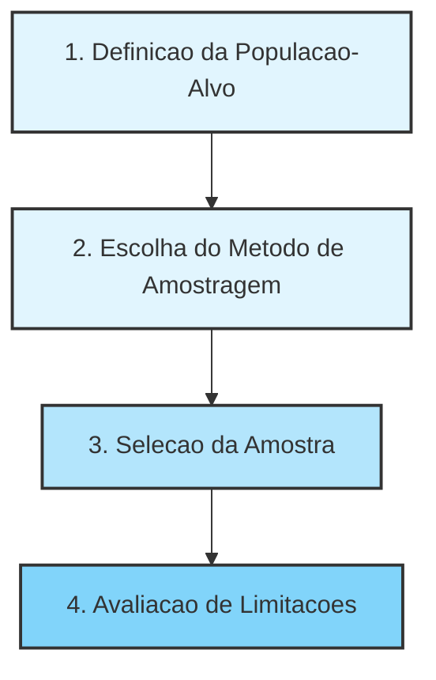

# Unidade III: Estimação de Parâmetros Estatísticos

---

## Introdução à Amostragem para Ciência de Dados e Machine Learning

Esta documentação consolida os principais conceitos de amostragem, tipos de dados, bases de armazenamento e métodos de seleção, conectando-os diretamente à prática em Inteligência Artificial e Machine Learning (IA/ML). Inclui também a resolução detalhada de exercícios práticos em Amostragem Aleatória Simples e Amostragem Sistemática.

### 1. Conceitos Fundamentais de Amostragem

A amostragem é um pilar da Estatística Inferencial. Ela permite tirar conclusões sobre um grupo inteiro analisando apenas uma parte dele. Em projetos de dados, ter um volume massivo de registros não garante qualidade; a representatividade e o controle de viés são muito mais críticos.

- População: Conjunto total de elementos de interesse (pessoas, transações, logs de sistema). Definir a população é uma decisão de modelagem (ex: 'todas as requisições' vs. 'apenas requisições válidas').
- Censo: Estudo que avalia 100% da população. Frequentemente inviável por custo ou tempo.
- Parâmetro: Medida numérica da população (geralmente desconhecida e o que queremos descobrir).
- Amostra: Subconjunto controlado e intencional da população. Não é apenas 'ter menos dados', é viabilizar análises confiáveis.
- Estatística: Medida calculada a partir da amostra, utilizada para estimar o parâmetro populacional.

### 2. Origem e Tipos de Dados

Entender de onde os dados vêm define o nível de confiança e as limitações das análises posteriores.

- Dados Primários: Coletados diretamente para o objetivo da análise (ex: pesquisa de satisfação, testes A/B). Maior controle, porém mais caros e lentos.
- Dados Secundários: Reaproveitados de coletas anteriores (ex: logs históricos, bases abertas como IBGE). Rápidos e baratos, mas com menor controle sobre a qualidade e potencial viés herdado.
- Dados Observacionais: O analista apenas observa o fenômeno (ex: histórico de prontuários). Permitem identificar correlações, mas não provam causalidade.
- Dados Experimentais: Ocorrem sob intervenção controlada (ex: testes de carga, ensaios clínicos). Permitem inferência causal se bem desenhados.

### 3. Bases de Dados: OLTP vs. OLAP

Para acessar esses dados, lidamos com diferentes arquiteturas de armazenamento:

- Bases Transacionais (OLTP): Voltadas para a operação diária em tempo quase real. Otimizadas para inserções e atualizações rápidas ('INSERT', 'UPDATE'). Não são recomendadas para análise estatística pesada direta.
- Bases Analíticas (OLAP): Construídas para apoio à decisão (ex: Data Warehouses). Agregam dados históricos e são otimizadas para consultas complexas ('SELECT', 'JOIN'). Ideais para Análise Exploratória de Dados (EDA) e Business Intelligence.

### 4. Características de uma Boa Amostra

Uma amostra precisa ter qualidade estatística para gerar modelos de IA confiáveis.

- Representatividade: Deve refletir as características-chave da população.
- Ausência de Viés: O método de seleção não pode favorecer perfis específicos sistematicamente. Se houver viés (ex: autoseleção em pesquisas por e-mail), ele deve ser mapeado e controlado.
- Tamanho Adequado: Deve ser grande o suficiente para reduzir a variabilidade e margem de erro, embora aumentar a amostra não corrija vieses de coleta.
- Independência das Observações: Cada elemento deve trazer informação nova. Logs do mesmo usuário no mesmo segundo são altamente correlacionados e reduzem a qualidade da inferência.

### 5. O Processo de Amostragem

#### Métodos Probabilísticos vs. Não Probabilísticos

Os métodos probabilísticos (como Aleatória Simples, Estratificada, Sistemática) garantem que todo elemento tenha uma probabilidade conhecida de ser selecionado, permitindo inferência estatística matemática. Métodos não probabilísticos (conveniência, voluntária) limitam severamente a generalização dos resultados.

### 6. Resolução de Exercícios Práticos

#### Exercício 1: Amostragem Aleatória Simples (AAS)

Contexto: Uma base com $N = 10000$ clientes e o valor de seus tickets. Deseja-se sortear $n = 200$ clientes.

Passo a Passo da Resolução:

1. Carregamento: Lemos o arquivo 'clientes_10000_ticket.csv' usando estruturas tabulares, como o DataFrame do Pandas em Python.
2. Fixação da Semente: Utilizamos uma semente fixa (ex: 'random_state=42') para garantir que o sorteio pseudoaleatório seja reprodutível em auditorias futuras.
3. Sorteio: Utilizamos o método 'sample(n=200, replace=False)' para extrair os registros aleatoriamente sem repetição. A probabilidade de cada cliente ser selecionado é idêntica: $\frac{200}{10000} = 0.02$.
4. Cálculo: Tiramos a média aritmética da coluna 'ticket' dos 200 registros.

Respostas Conceituais (AAS):

- Por que a amostra gerada tem tickets médios diferentes se mudarmos a semente? Porque o sorteio gera uma nova combinação de clientes. Essa variação natural chama-se Erro Amostral. O método continua sendo AAS, apenas a instância da amostra mudou.
- O ticket médio amostral é idêntico ao populacional? Não necessariamente, trata-se de uma estimativa. Com $n=1000$ no lugar de $n=200$, a margem de erro diminuiria, deixando a estimativa mais estável.
- Quando a AAS falha? Em populações altamente heterogêneas onde certos subgrupos minoritários importantes podem ficar de fora por azar do sorteio (neste caso, a amostragem Estratificada é superior).

#### Exercício 2: Amostragem Sistemática

Contexto: Mesma base de $N = 10000$ clientes, mesmo alvo de $n = 200$.

Passo a Passo da Resolução:

1. Cálculo do Intervalo de Pulo (k): $k = \frac{N}{n} = \frac{10000}{200} = 50$.
2. Ordenação: Ordenamos a base por um identificador, como o 'cliente_id'.
3. Início Aleatório: Sorteamos um número inteiro entre $0$ e $k-1$ (em Python: $0$ a $49$). Se sortearmos o número $12$, o primeiro cliente escolhido será o de índice $12$.
4. Seleção: Pegamos o cliente do índice inicial e somamos $k$ sucessivamente: índices $12, 62, 112, 162...$ até obtermos $200$ clientes.

Respostas Conceituais (Sistemática):

- Por que o início aleatório é vital? Ele é o que garante o caráter probabilístico do método. Sem ele, a seleção seria determinística e enviesada.
- Qual o maior risco deste método? Padrões periódicos nos dados. Se a base estiver ordenada por horário e o intervalo $k$ coincidir sempre com o horário de almoço, a amostra trará apenas o comportamento de clientes desse turno, arruinando a representatividade.
- Exemplo de ordenação perigosa: Ordenar os clientes ativamente pelo 'valor do ticket' (do menor para o maior). O pulo sistemático criaria uma amostragem que força uma distribuição plana irreal, destruindo a variância natural.

### 7. Insights / Conexão com IA e Machine Learning

- Big Data Não Elimina a Amostragem: Treinar um modelo de Deep Learning com 1 bilhão de registros contendo dados duplicados, desbalanceados ou enviesados resultará em um modelo falho ('Garbage In, Garbage Out'). Treinar com 100 mil registros obtidos via amostragem rigorosa, além de economizar horas de processamento (GPUs) e custos em Cloud, costuma gerar métricas de generalização superiores.
- Amostragem Estratificada em Classificação: Em problemas de ML onde a variável alvo é desbalanceada (ex: 99% de transações legítimas e 1% de fraudes), a AAS pura corre o risco de sortear um lote sem nenhuma fraude. O uso de Amostragem Estratificada preserva essa proporção natural de 99/1 nos dados de treino e teste.
- Riscos em Séries Temporais: Ao prever demandas futuras (Forecasting), utilizar a Amostragem Sistemática requer cuidado triplicado com a sazonalidade. Se um e-commerce tem picos de vendas aos sábados e seu passo $k$ resulta em saltos de exatos 7 dias, seu modelo aprenderá um padrão completamente irreal sobre a flutuação de vendas da empresa.

---

[Previous](./02-probability.md) | [Next](./04-hypothesis-testing-and-linear-regression.md)
