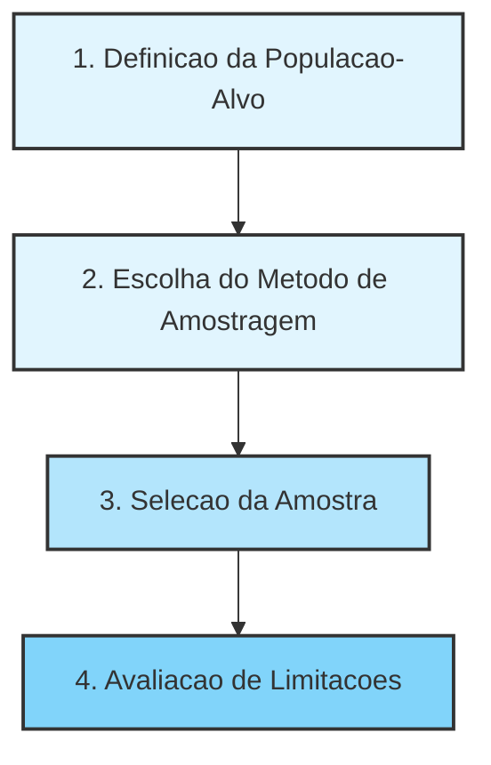
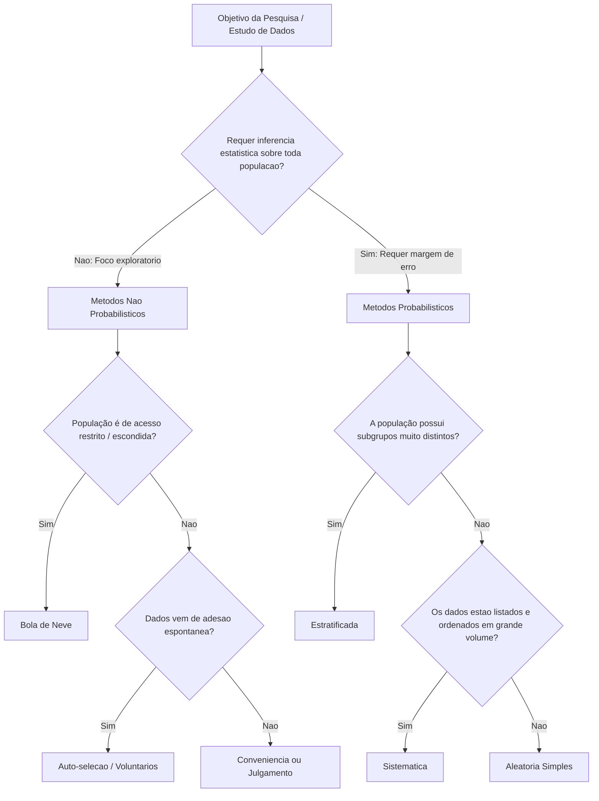

# Unidade III: Estimação de Parâmetros Estatísticos

---

## Introdução à Amostragem

Esta documentação consolida os principais conceitos de amostragem, tipos de dados, bases de armazenamento e métodos de seleção, conectando-os diretamente à prática em Inteligência Artificial e Machine Learning (IA/ML). Inclui também a resolução detalhada de exercícios práticos em Amostragem Aleatória Simples e Amostragem Sistemática.

### 1. Conceitos Fundamentais de Amostragem

A amostragem é um pilar da Estatística Inferencial. Ela permite tirar conclusões sobre um grupo inteiro analisando apenas uma parte dele. Em projetos de dados, ter um volume massivo de registros não garante qualidade; a representatividade e o controle de viés são muito mais críticos.

- População: Conjunto total de elementos de interesse (pessoas, transações, logs de sistema). Definir a população é uma decisão de modelagem (ex: 'todas as requisições' vs. 'apenas requisições válidas').
- Censo: Estudo que avalia 100% da população. Frequentemente inviável por custo ou tempo.
- Parâmetro: Medida numérica da população (geralmente desconhecida e o que queremos descobrir).
- Amostra: Subconjunto controlado e intencional da população. Não é apenas 'ter menos dados', é viabilizar análises confiáveis.
- Estatística: Medida calculada a partir da amostra, utilizada para estimar o parâmetro populacional.

### 2. Origem e Tipos de Dados

Entender de onde os dados vêm define o nível de confiança e as limitações das análises posteriores.

- Dados Primários: Coletados diretamente para o objetivo da análise (ex: pesquisa de satisfação, testes A/B). Maior controle, porém mais caros e lentos.
- Dados Secundários: Reaproveitados de coletas anteriores (ex: logs históricos, bases abertas como IBGE). Rápidos e baratos, mas com menor controle sobre a qualidade e potencial viés herdado.
- Dados Observacionais: O analista apenas observa o fenômeno (ex: histórico de prontuários). Permitem identificar correlações, mas não provam causalidade.
- Dados Experimentais: Ocorrem sob intervenção controlada (ex: testes de carga, ensaios clínicos). Permitem inferência causal se bem desenhados.

### 3. Bases de Dados: OLTP vs. OLAP

Para acessar esses dados, lidamos com diferentes arquiteturas de armazenamento:

- Bases Transacionais (OLTP): Voltadas para a operação diária em tempo quase real. Otimizadas para inserções e atualizações rápidas ('INSERT', 'UPDATE'). Não são recomendadas para análise estatística pesada direta.
- Bases Analíticas (OLAP): Construídas para apoio à decisão (ex: Data Warehouses). Agregam dados históricos e são otimizadas para consultas complexas ('SELECT', 'JOIN'). Ideais para Análise Exploratória de Dados (EDA) e Business Intelligence.

### 4. Características de uma Boa Amostra

Uma amostra precisa ter qualidade estatística para gerar modelos de IA confiáveis.

- Representatividade: Deve refletir as características-chave da população.
- Ausência de Viés: O método de seleção não pode favorecer perfis específicos sistematicamente. Se houver viés (ex: autoseleção em pesquisas por e-mail), ele deve ser mapeado e controlado.
- Tamanho Adequado: Deve ser grande o suficiente para reduzir a variabilidade e margem de erro, embora aumentar a amostra não corrija vieses de coleta.
- Independência das Observações: Cada elemento deve trazer informação nova. Logs do mesmo usuário no mesmo segundo são altamente correlacionados e reduzem a qualidade da inferência.

### 5. O Processo de Amostragem

#### Métodos Probabilísticos vs. Não Probabilísticos

Os métodos probabilísticos (como Aleatória Simples, Estratificada, Sistemática) garantem que todo elemento tenha uma probabilidade conhecida de ser selecionado, permitindo inferência estatística matemática. Métodos não probabilísticos (conveniência, voluntária) limitam severamente a generalização dos resultados.

### 6. Resolução de Exercícios Práticos

#### Exercício 1: Amostragem Aleatória Simples (AAS)

Contexto: Uma base com $N = 10000$ clientes e o valor de seus tickets. Deseja-se sortear $n = 200$ clientes.

Passo a Passo da Resolução:

1. Carregamento: Lemos o arquivo 'clientes_10000_ticket.csv' usando estruturas tabulares, como o DataFrame do Pandas em Python.
2. Fixação da Semente: Utilizamos uma semente fixa (ex: 'random_state=42') para garantir que o sorteio pseudoaleatório seja reprodutível em auditorias futuras.
3. Sorteio: Utilizamos o método 'sample(n=200, replace=False)' para extrair os registros aleatoriamente sem repetição. A probabilidade de cada cliente ser selecionado é idêntica: $\frac{200}{10000} = 0.02$.
4. Cálculo: Tiramos a média aritmética da coluna 'ticket' dos 200 registros.

Respostas Conceituais (AAS):

- Por que a amostra gerada tem tickets médios diferentes se mudarmos a semente? Porque o sorteio gera uma nova combinação de clientes. Essa variação natural chama-se Erro Amostral. O método continua sendo AAS, apenas a instância da amostra mudou.
- O ticket médio amostral é idêntico ao populacional? Não necessariamente, trata-se de uma estimativa. Com $n=1000$ no lugar de $n=200$, a margem de erro diminuiria, deixando a estimativa mais estável.
- Quando a AAS falha? Em populações altamente heterogêneas onde certos subgrupos minoritários importantes podem ficar de fora por azar do sorteio (neste caso, a amostragem Estratificada é superior).

#### Exercício 2: Amostragem Sistemática

Contexto: Mesma base de $N = 10000$ clientes, mesmo alvo de $n = 200$.

Passo a Passo da Resolução:

1. Cálculo do Intervalo de Pulo (k): $k = \frac{N}{n} = \frac{10000}{200} = 50$.
2. Ordenação: Ordenamos a base por um identificador, como o 'cliente_id'.
3. Início Aleatório: Sorteamos um número inteiro entre $0$ e $k-1$ (em Python: $0$ a $49$). Se sortearmos o número $12$, o primeiro cliente escolhido será o de índice $12$.
4. Seleção: Pegamos o cliente do índice inicial e somamos $k$ sucessivamente: índices $12, 62, 112, 162...$ até obtermos $200$ clientes.

Respostas Conceituais (Sistemática):

- Por que o início aleatório é vital? Ele é o que garante o caráter probabilístico do método. Sem ele, a seleção seria determinística e enviesada.
- Qual o maior risco deste método? Padrões periódicos nos dados. Se a base estiver ordenada por horário e o intervalo $k$ coincidir sempre com o horário de almoço, a amostra trará apenas o comportamento de clientes desse turno, arruinando a representatividade.
- Exemplo de ordenação perigosa: Ordenar os clientes ativamente pelo 'valor do ticket' (do menor para o maior). O pulo sistemático criaria uma amostragem que força uma distribuição plana irreal, destruindo a variância natural.

### 7. Insights / Conexão com IA e Machine Learning

- Big Data Não Elimina a Amostragem: Treinar um modelo de Deep Learning com 1 bilhão de registros contendo dados duplicados, desbalanceados ou enviesados resultará em um modelo falho ('Garbage In, Garbage Out'). Treinar com 100 mil registros obtidos via amostragem rigorosa, além de economizar horas de processamento (GPUs) e custos em Cloud, costuma gerar métricas de generalização superiores.
- Amostragem Estratificada em Classificação: Em problemas de ML onde a variável alvo é desbalanceada (ex: 99% de transações legítimas e 1% de fraudes), a AAS pura corre o risco de sortear um lote sem nenhuma fraude. O uso de Amostragem Estratificada preserva essa proporção natural de 99/1 nos dados de treino e teste.
- Riscos em Séries Temporais: Ao prever demandas futuras (Forecasting), utilizar a Amostragem Sistemática requer cuidado triplicado com a sazonalidade. Se um e-commerce tem picos de vendas aos sábados e seu passo $k$ resulta em saltos de exatos 7 dias, seu modelo aprenderá um padrão completamente irreal sobre a flutuação de vendas da empresa.

---

## Métodos de Amostragem

Esta documentação consolida os conceitos fundamentais sobre métodos de amostragem probabilísticos e não probabilísticos, que são pilares críticos para a coleta de dados, formulação de datasets e treinamento robusto de modelos em Inteligência Artificial e Machine Learning.

### 1. Amostragem Não Probabilística

A amostragem não probabilística ocorre quando os elementos da população não possuem probabilidade matemática conhecida, nem necessariamente igual, de serem selecionados para compor a amostra.

- Ausência de Aleatoriedade: A seleção dos indivíduos não é feita por sorteio. A escolha depende estritamente do acesso operacional, conveniência, julgamento do pesquisador ou decisão voluntária do participante.
- Risco Elevado de Viés: Determinados grupos populacionais podem ser severamente super-representados ou totalmente excluídos da base de dados.
- Limitação Inferencial: Os resultados obtidos por meio desse método são restritos à amostra coletada e não podem ser generalizados estatisticamente para toda a população.
- Ponto Crítico sobre Margem de Erro: É um erro conceitual grave calcular ou divulgar a margem de erro nesses cenários. A margem de erro quantifica a incerteza de um processo aleatório e indica o quanto uma estatística amostral pode variar de amostra para amostra. Sem probabilidade conhecida, não existe base matemática para intervalos de confiança ou testes de hipóteses clássicos.

#### 1.1 Principais Tipos de Amostragem Não Probabilística

- Amostragem por Conveniência: A seleção é guiada pela facilidade e rapidez de acesso. Muito utilizada em fases exploratórias e diagnósticos preliminares. Exemplo: realizar uma pesquisa apenas com clientes que saem de uma loja em um determinado horário, devido à sua disponibilidade imediata.
- Amostragem por Julgamento (ou Intencional): O pesquisador seleciona deliberadamente os elementos que considera mais relevantes baseado em seu conhecimento prévio ou critérios técnicos. Exemplo: focar entrevistas apenas em consumidores classificados como 'heavy users' de um software.
- Amostragem por Voluntários (Auto-seleção): Os próprios participantes decidem ingressar na pesquisa após divulgação ampla. Exemplo: reviews online de produtos e sistemas de classificação ('ratings'). Tende a sofrer do viés em que indivíduos com sentimentos extremos (muito satisfeitos ou muito insatisfeitos) respondem, enquanto os indiferentes silenciam.
- Amostragem por Bola de Neve: Um processo em cadeia onde os participantes iniciais indicam novos elementos. Estratégia valiosa para mapear nichos técnicos altamente especializados, comunidades fechadas ou influenciadores informais.

### 2. Amostragem Probabilística

Na amostragem probabilística, cada elemento da população estudada possui uma probabilidade conhecida e obrigatoriamente diferente de zero de ser selecionado. Todo o processo baseia-se em um mecanismo aleatório explícito.

- Vantagens da Aleatoriedade: Garante que a coleta não reflita preferências subjetivas. O viés é drasticamente reduzido ou tornado previsível, possibilitando a quantificação da incerteza, o cálculo da margem de erro e a construção de testes estatísticos válidos.

#### 2.1 Principais Técnicas de Amostragem Probabilística

- Amostragem Aleatória Simples (AAS): Exige uma lista completa da população onde cada unidade tem exatamente a mesma chance de seleção. O sorteio é direto.
  - Exemplo: De uma base de 10.000 clientes listados, sorteiam-se 200 para estimar o ticket médio. A probabilidade de inclusão é $P = 200 / 10.000 = 0,02$. Pode gerar amostras pouco representativas se a população for muito heterogênea.
- Amostragem Sistemática: Os elementos são selecionados em intervalos regulares com base em um início sorteado aleatoriamente. Estipula-se o intervalo a partir da razão matemática $k = N / n$.
  - Exemplo: Monitorar tempos de requisição em logs de servidor com milhões de registros no tempo. Se $N = 500.000$ e $n = 10.000$, o pulo será $k = 50$. Sorteia-se um valor entre 1 e 50 como partida e prossegue-se a cada 50 registros.
  - Risco de Periodicidade: Falha criticamente caso os dados obedeçam a um padrão cíclico coincidente com o tamanho do salto adotado (ex: o sistema roda um job pesado exatamente a cada 50 execuções).
- Amostragem Estratificada: A população é segregada em grupos (estratos) internamente homogêneos. A amostragem ocorre dentro de cada grupo, garantindo representatividade forçada dos recortes.
  - Proporcional: Cada estrato contribui para a amostra na exata proporção do seu tamanho original na população. Permite inferência direta da média.
  - Não Proporcional: Fixa-se a quantidade de coletas por estrato arbitrariamente (útil para analisar pequenos subgrupos que de outra forma sumiriam). Exige ponderação estatística posterior ao tentar inferir resultados globais, caso contrário, distorcerá a média populacional.
- Amostragem por Conglomerados: A população é naturalmente fragmentada em blocos macroscópicos que, internamente, comportam a heterogeneidade do todo. Em vez de sortear indivíduos, sorteiam-se conglomerados e avaliam-se todos os seus membros.

### 3. Diagrama de Fluxo: Decisão Metodológica

### 4. Estudo de Caso Resolvido: Desafio de Marketing

Contexto Analítico: A equipe de negócios deseja aplicar uma pesquisa de satisfação para avaliar o 'Net Promoter Score' global da companhia considerando usuários do site, aplicativo, WhatsApp e lojas físicas, além de comparar esses canais.

Resolução Estruturada:

1. Método Estatístico Recomendado:
   A técnica mais adequada é a Amostragem Estratificada, definindo os canais de atendimento como os estratos principais.

- Se a prioridade for obter o NPS Global consolidado do mês, deve-se adotar a estratificação proporcional. Assim, a composição amostral refletirá o tamanho da carteira real em cada plataforma.
- Se a prioridade for testar e comparar estatisticamente o desempenho interno dos canais (inclusive os de menor volume de tráfego), sugere-se a estratificação não proporcional (ex: coletando exatamente 250 formulários de cada canal). Para depois reportar a visão macro do NPS geral da empresa, as médias deverão ser matematicamente ponderadas pelos tamanhos reais das audiências.

2. Identificação e Mitigação de Vieses:

- Viés de Não Resposta: Clientes podem simplesmente ignorar a pesquisa. Aqueles que gastam seu tempo para preencher costumam situar-se nas extremidades opinativas (muito engajados ou detratores furiosos).
- Viés de Contato: Realizar o estudo usando envios eletrônicos deixará invisíveis os usuários de lojas físicas com cadastros desatualizados (sem telefone ou e-mail na base).
- Distorção do Momento do Envio: Enviar 'push notifications' num recorte exclusivo de tempo (ex: durante o expediente comercial) segmentará indevidamente o perfil demográfico da base.
- Risco de Auto-seleção: Se a equipe apenas inserir um botão permanente escrito 'Avalie-nos' no app, a amostragem se converterá imediatamente de probabilística para não probabilística (voluntária), invalidando a confiabilidade geral da métrica de representação populacional.

3. Parecer Técnico Final para Defesa do Plano:
   Ao defender a estratégia para a gestão de negócios, a justificativa central repousa na constatação pragmática de que o tipo de canal influencia categoricamente a experiência de consumo e o perfil demográfico do cliente. O modelo amostral não só reduz o viés metodológico como fornece embasamento probabilístico estrito, autorizando o cálculo oficial da margem de erro perante diretorias corporativas e propiciando segurança executiva total à tomada de decisão.

### 5. Insights e Conexões com IA e ML

- Qualidade da Matéria-Prima ('Garbage In, Garbage Out'): Treinar algoritmos baseando-se em amostras exclusivas de conveniência compromete pesadamente as redes neurais. Por exemplo, modelos de visão computacional ensinados com datasets compostos via 'web scraping' simples frequentemente reproduzem falhas éticas de super-representação geográfica ou demográfica. Se a fase amostral for precária, o sistema generalizará tais preconceitos disfarçados de matemática pura.
- A Ameaça dos Dados Silenciosos: Em sistemas de recomendação ('Collaborative Filtering'), os dados coletados das interações orgânicas nas plataformas comportam o mesmo viés da auto-seleção discutido nesta teoria. Há avaliações dos detratores raivosos e dos promotores assíduos; a massa do meio – o usuário passivo moderado – não produz a variável de nota explícita, o que exige das engenharias de dados lidar proativamente com essa escassez de sinais.
- Otimização em MLOps: Para pipelines modernos operando inferência em tempo real, salvar e escanear a totalidade dos logs torna a nuvem economicamente insustentável. Incorporar módulos de Amostragem Sistemática probabilística retém a solidez da observabilidade preditiva diminuindo custos absurdos de hardware, resguardada apenas a precaução imperiosa de evitar frequências amostrais que entrem em ressonância temporal com gatilhos cíclicos operacionais.

---

[Previous](./02-probability.md) | [Next](./04-hypothesis-testing-and-linear-regression.md)
