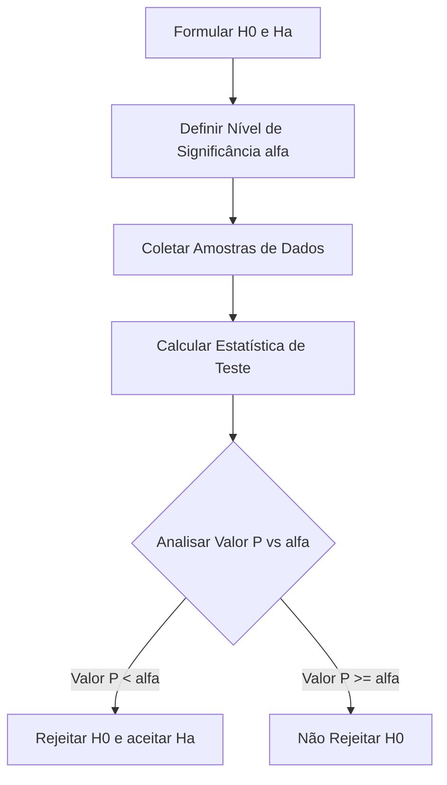
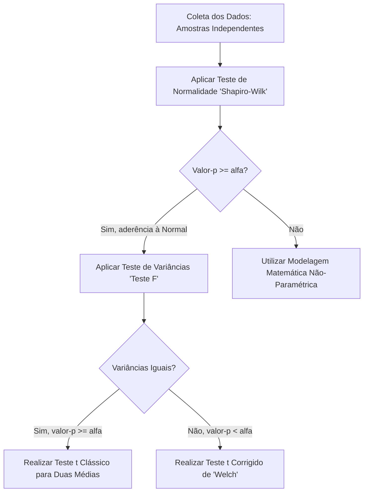
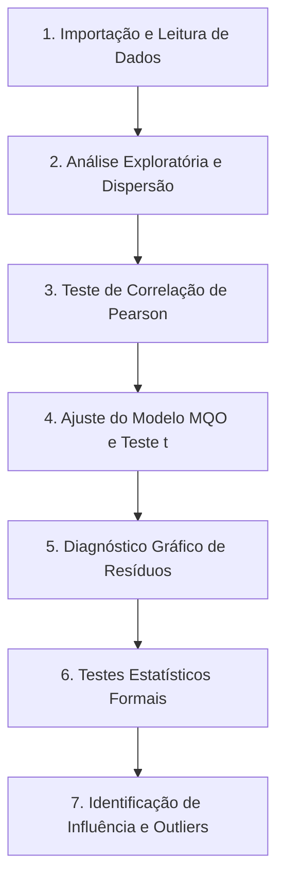

# Unidade IV: Testes de Hipóteses e Regressão Linear Simples

---

## Testes de Hipóteses

### 1. Fundamentos dos Testes de Hipóteses

Um teste de hipóteses é um procedimento analítico que utiliza estatísticas amostrais para validar alegações sobre parâmetros de uma população. No contexto de Machine Learning, esses testes são ferramentas essenciais para a tomada de decisões embasadas em dados, como validar cientificamente se um novo algoritmo possui um desempenho superior ao modelo que já está em produção (baseline).

- Hipótese Nula (H0): Representa a afirmação de igualdade ou ausência de efeito (ex.: =, <=, >=). É a premissa padrão de que não há diferença significativa entre os grupos comparados ou de que o novo modelo não é melhor que o atual.
- Hipótese Alternativa (Ha): É o complemento de H0 e representa a presença de um efeito ou diferença (ex.: =/=, <, >). É a afirmação que o cientista de dados ou pesquisador geralmente deseja comprovar.

Tipos de Erro na Decisão:

- Erro Tipo I ($\alpha$): Rejeitar H0 quando ela é, na verdade, verdadeira. No mercado, equivale a adotar um novo modelo de IA acreditando que ele é superior, quando na realidade a melhora vista na amostra ocorreu apenas por acaso (falso positivo).
- Erro Tipo II ($\beta$): Não rejeitar H0 quando ela é falsa. Equivale a descartar uma melhoria real no sistema, perdendo a oportunidade de otimização (falso negativo). O poder de um teste é dado por $1 - \beta$.

Fluxo de Decisão em Testes de Hipóteses:

### 2. Principais Testes Estatísticos e suas Aplicações

#### 2.1. Teste F para Comparação de Duas Variâncias

Utilizado para verificar a homocedasticidade (igualdade de variâncias) ou heterocedasticidade (diferença de variâncias) entre duas amostras independentes. É frequentemente executado como um passo preliminar antes de aplicar o teste t para médias.

- Premissas: Amostras aleatórias, independentes e extraídas de populações com distribuição Normal.
- Estatística de Teste: $$F = \frac{S_1^2}{S_2^2}$$ onde $S_1^2$ e $S_2^2$ são as variâncias amostrais de cada grupo.
- Aplicação em IA: Útil para comparar a estabilidade de predição de dois modelos. Se a variância dos erros de um modelo for significativamente maior que a do outro, indica que suas previsões são menos consistentes, o que pode ser indesejável em sistemas críticos.

#### 2.2. Teste Z para Comparação de Duas Proporções

Avalia a diferença entre duas proporções populacionais quando o tamanho da amostra é suficientemente grande.

- Premissas: Amostras aleatórias, independentes e grandes o suficiente (espera-se pelo menos 5 sucessos e 5 falhas em cada grupo, ou seja, $n_1 p_1 \ge 5$, $n_1 q_1 \ge 5$, etc.).
- Hipóteses Comuns: $H_0: p_1 = p_2$ contra $H_A: p_1 \neq p_2$ (teste bilateral), podendo também ser estruturado de forma unilateral.
- Aplicação em IA: Essencial em Testes A/B para métricas de conversão. Exemplo: comparar a taxa de cliques (CTR) entre o algoritmo de recomendação antigo e uma nova versão baseada em Deep Learning.

#### 2.3. Teste t-Student para Duas Médias (Amostras Independentes)

Método robusto para avaliar diferenças numéricas entre as médias de dois grupos distintos quando as variâncias populacionais são desconhecidas.

- Premissas: Amostras independentes e populações normalmente distribuídas. (Nota: Se não houver normalidade, recomendam-se testes não-paramétricos).
- Estatística de Teste: Depende do resultado do Teste F prévio. Se houver homocedasticidade, usa-se uma variância combinada na fórmula de 't'. Se houver heterocedasticidade, a fórmula é ajustada.
- Aplicação em IA: Comparar o erro médio absoluto (MAE) ou o tempo de inferência em milissegundos de duas arquiteturas de redes neurais processando tarefas de forma independente.

#### 2.4. Teste t-Student Pareado (Amostras Dependentes)

Aplicado quando os dados são coletados da mesma amostra em duas situações distintas, geralmente sob o efeito de um fator de intervenção ('antes' e 'depois').

- Premissas: Amostras dependentes, diferenças com distribuição Normal.
- Mecânica: Avalia-se a diferença $d_i = x_i - y_i$ para cada par de observações, transformando o problema em um teste de uma única média das diferenças.
- Aplicação em IA: Avaliar a acurácia de um conjunto de 30 modelos de Machine Learning antes e depois da aplicação de uma nova técnica de balanceamento de dados (como SMOTE) no dataset de treino.

### 3. Resolução de Exercícios Práticos

Abaixo, aplicamos os conceitos de formulação para estabelecer as hipóteses nula e alternativa para diferentes cenários, identificando também a direcionalidade do teste.

a) Uma universidade alega que a proporção de seus alunos formados em quatro anos é de 82%.

- Resolução: A alegação traz um sinal de igualdade.
  - $H_0: p = 0,82$
  - $H_A: p \neq 0,82$ (Hipótese bilateral).

b) Um fabricante de torneiras alega que a taxa de fluxo médio de um determinado tipo de torneira é inferior a 2,5 galões por minuto.

- Resolução: 'Inferior a' não contém igualdade, portanto essa é a hipótese alternativa.
  - $H_0: \mu \ge 2,5$
  - $H_A: \mu < 2,5$ (Hipótese unilateral à esquerda).

c) Um fabricante de pneus alega que a variância no diâmetro de um modelo é de 8,6 polegadas.

- Resolução: A afirmação é uma igualdade direta.
  - $H_0: \sigma^2 = 8,6$
  - $H_A: \sigma^2 \neq 8,6$ (Hipótese bilateral).

d) Uma companhia que fabrica cereais alega que o peso médio do conteúdo de suas caixas é de, no máximo, 200 gramas.

- Resolução: 'No máximo' significa menor ou igual, contendo a igualdade.
  - $H_0: \mu \le 200$
  - $H_A: \mu > 200$ (Hipótese unilateral à direita).

e) Uma estação de rádio alega que sua proporção de audiência local é superior a 39%.

- Resolução: 'Superior a' não engloba o caso de igualdade.
  - $H_0: p \le 0,39$
  - $H_A: p > 0,39$ (Hipótese unilateral à direita).

f) Um restaurante alega que o desvio padrão para o intervalo de atendimento é inferior a 2,9 minutos.

- Resolução: Tratando-se de 'inferior', a alegação é alternativa.
  - $H_0: \sigma \ge 2,9$
  - $H_A: \sigma < 2,9$ (Hipótese unilateral à esquerda).

### 4. Estudos de Caso / Conexão com Inteligência Artificial

Estudo de Caso: Monitoramento de Data Drift em MLOps
O ciclo de vida de um modelo de Machine Learning não termina no momento do 'deploy'. Algoritmos em produção frequentemente sofrem perda de performance com o tempo porque a distribuição dos dados de entrada (mundo real) muda, distanciando-se dos dados usados no treinamento. Isso é chamado de 'Data Drift'.
Para monitorar esse fenômeno de forma automatizada, engenheiros de MLOps utilizam rotineiramente testes de hipóteses estatísticas:

- Processo: Uma amostra de uma 'feature' contínua coletada nas últimas 24 horas (Amostra A) é comparada com a mesma feature no dataset original de treinamento (Amostra B).
- Ação: O sistema aplica um Teste t para duas médias ou um Teste F para variâncias (ou análogos mais robustos para distribuições inteiras, como o teste de Kolmogorov-Smirnov).
- Insights: Se o teste estatístico rejeitar a Hipótese Nula (indicando que as distribuições são agora matematicamente diferentes de acordo com o nível de significância adotado), um alerta é gerado no dashboard de monitoramento para que a equipe providencie o retreinamento imediato do algoritmo, garantindo a manutenção da precisão do sistema de IA.

---

## Notas de Estudo: Resolução de Exercícios e Tópicos Avançados em Testes de Hipóteses

### 1. Revisão e Definições Essenciais

Nesta etapa, consolidamos os conceitos práticos e fundamentais para a execução e interpretação de testes estatísticos.

- Nível de Significância ($\alpha$): Determina o erro máximo tolerado no teste, ou seja, a probabilidade de rejeitar a Hipótese Nula ($H_0$) quando ela é na verdade verdadeira (Erro Tipo I). Na prática, $\alpha$ representa a margem de erro que o pesquisador está disposto a assumir em sua decisão.
- Valor-p: Quantifica a probabilidade de obter os resultados observados (ou mais extremos) assumindo que a hipótese nula é verdadeira. Um valor-p muito pequeno sugere que os resultados da amostra são altamente improváveis sob $H_0$, constituindo forte evidência estatística contra ela.
- Critério Universal de Decisão:
  - Se valor-p $\le \alpha$: Rejeita-se a Hipótese Nula $H_0$.
  - Se valor-p $> \alpha$: Não se rejeita a Hipótese Nula $H_0$.

### 2. Resolução Passo a Passo de Exercícios Práticos

#### Exercício 1: Teste t para uma Média (Avaliação de Nova Dieta)

Contexto: Um pesquisador afirma que uma dieta padrão gera perda média de 12 kg no período de acompanhamento. Ele deseja verificar se uma nova dieta é significativamente mais eficaz (ou seja, se a perda média proporcionada é superior a 12 kg), testando-a em 17 pacientes e adotando um nível de significância de 5% ($\alpha = 0,05$).
Dados Amostrais (perda em kg): 12, 8, 15, 13, 10, 12, 14, 11, 12, 13, 15, 19, 15, 12, 13, 16, 15.

Passo a Passo da Resolução:

1. Formulação das Hipóteses:
   - $H_0: \mu \le 12$ (A nova dieta possui eficácia igual ou inferior à dieta padrão).
   - $H_A: \mu > 12$ (A nova dieta é mais eficaz, configurando um teste unilateral à direita).
2. Seleção do Teste: Como o desvio padrão populacional não é conhecido e a análise é sobre uma média, utiliza-se a distribuição t-Student (Teste t para uma amostra).
3. Sumarização dos Dados: A média amostral calculada a partir dos dados brutos é de aproximadamente 13,23 kg.
4. Extração de Resultados (Cálculo ou via linguagens R/Python):
   - Estatística do teste $t = 2,0068$
   - Graus de liberdade (df) $= 16$
   - Valor-p $= 0,03099$
5. Interpretação e Conclusão: Como o valor-p obtido (aproximadamente 3,1%) é inferior ao nível de significância estipulado de 5% (0,05), rejeita-se a Hipótese Nula. Concluímos, portanto, que há evidências estatísticas para afirmar que a nova dieta proporciona maior emagrecimento.

#### Exercício 2: Teste Z para uma Média (Tempo de Viagens)

Contexto: Uma empresa afirma que, com base em estudos preliminares, o tempo de viagem de uma nova rota obedece a uma distribuição Normal com média populacional de 300 minutos e desvio padrão populacional conhecido de 30 minutos. Uma amostra recente de 10 viagens obteve média de 314 minutos. Queremos validar se o tempo médio sofreu alteração, adotando $\alpha = 0,10$.

Passo a Passo da Resolução:

1. Formulação das Hipóteses:
   - $H_0: \mu = 300$ (O tempo médio de viagem permanece o mesmo do estudo).
   - $H_A: \mu \ne 300$ (O tempo médio de viagem sofreu alteração, configurando um teste bilateral).
2. Seleção do Teste: Considerando que o desvio padrão da população ($\sigma$) é conhecido (30 minutos), utilizamos o Teste Z clássico.
3. Cálculo da Estatística Z:
   - Fórmula padrão: $Z = \frac{\bar{x} - \mu}{\sigma / \sqrt{n}}$
   - $Z = \frac{314 - 300}{30 / \sqrt{10}} = \frac{14}{9,486} = 1,47$
4. Interpretação e Conclusão: Consultando a tabela de distribuição Normal para $Z = 1,47$, obtemos um valor-p aproximado de 0,1416 (para o teste bilateral). Uma vez que o valor-p (14,16%) é maior que o $\alpha$ de 10% (0,10), nós falhamos em rejeitar a $H_0$. Não há evidências estatísticas suficientes para afirmar que o tempo da nova rota seja diferente de 300 minutos.

### 3. Tópicos Além do Básico: Variâncias e Normalidade

O processo de validação de hipóteses frequentemente exige o ateste de propriedades prévias dos dados (premissas dos modelos).

#### Testes de Igualdade de Variâncias (Homocedasticidade)

É o procedimento aplicado para garantir que dois grupos sendo comparados possuem variabilidade semelhante (homocedasticidade), sendo um requisito crítico antes de realizar testes t para amostras independentes. As opções paramétricas mais comuns envolvem o Teste F, Teste de Levene e Teste de Bartlett.

- $H_0: \sigma_1^2 = \sigma_2^2$ (As variâncias populacionais são iguais).
- $H_A: \sigma_1^2 \ne \sigma_2^2$ (As variâncias populacionais são diferentes, indicando heterocedasticidade).

Exemplo Prático com Teste F (Comparação de Duas Máquinas):
Ao investigar se duas máquinas fabris apresentam a mesma variação em milímetros nos diâmetros de suas peças, recolhemos 20 amostras de cada. A execução da rotina estatística ('var.test') revelou:

- Valor da Estatística $F = 0,46557$
- Valor-p associado $= 0,1041$
- Decisão: Sendo o valor-p de 10,41% maior que o nível de $\alpha = 0,05$, não rejeitamos $H_0$. A variância estrutural no acabamento das peças é a mesma entre as duas máquinas.

#### Testes de Normalidade

Uma checagem de integridade que atesta se a distribuição amostral tem aderência ao comportamento da Curva Normal Teórica.

- $H_0$: A amostra analisada provém de uma distribuição Normal.
- $H_A$: A amostra analisada NÃO provém de uma distribuição Normal.
  Os recursos computacionais mais empregados são o Teste de Shapiro-Wilk (preferível para amostras menores) e o de Kolmogorov-Smirnov. Se houver rejeição da $H_0$, as abordagens analíticas (Testes t ou ANOVA) devem ceder espaço aos Testes Não-Paramétricos (como Mann-Whitney).

Fluxo Estrutural de Testes em Processos de Validação:

### 4. Insights / Conexão com IA e Machine Learning

- Engenharia de Features (Feature Engineering): Testes rigorosos de distribuição de normalidade e variância orientam diretamente o Cientista de Dados na escolha das ferramentas de processamento pré-treino de IA. Variáveis com heterocedasticidade agressiva ou que falham em testes de aderência paramétrica frequentemente exigem tratamento específico com Box-Cox, Logaritmos ou técnicas de padronização ('StandardScaler'). Processos que ignoram essas premissas degradam rapidamente a performance de classificadores lineares ou Redes Neurais multicamadas.
- Confiabilidade de Sistemas Concorrentes: Os mesmos testes utilizados para comparar máquinas em indústrias são rotineiramente escalados via automação para monitorar 'endpoints' ou serviços hospedados na nuvem (MLOps). Se houver discrepância identificada pela variância na inferência de predição (heterocedasticidade nos erros de previsão gerados) entre a nuvem e um equipamento em 'Edge Computing', pode-se isolar incidentes de lentidão no envio de 'arrays', compressão indevida ou sobrecarga do modelo em produção.

---

## Implementação e Diagnóstico de Regressão Linear Simples

### 1. Visão Geral do Tópico

O material em estudo foca na aplicação prática de um modelo de Regressão Linear Simples pelo método de Mínimos Quadrados Ordinários (MQO). O cenário tecnológico abordado é a análise de observabilidade de sistemas, investigando a relação entre o uso médio de recursos computacionais (CPU, atuando como variável explicativa) e o tempo de resposta do sistema (latência, atuando como variável dependente).

### 2. Fundamentos Técnicos e Estatísticos

- **Correlação de Pearson**: Avalia a intensidade e o sentido da associação linear entre duas variáveis contínuas. O coeficiente correspondente varia de -1 a 1. É imperativo destacar que uma alta correlação evidencia um padrão conjunto, mas não define obrigatoriamente uma relação de causa e efeito causal.
- **Regressão Linear (MQO)**: O método de Mínimos Quadrados Ordinários ajusta uma reta aos dados amostrais com o objetivo estatístico de minimizar a variância dos resíduos (a distância quadrática entre os pontos observados no conjunto de dados e a reta estimada pelo algoritmo).
  - Equação do modelo: $$Y = \beta_0 + \beta_1X + \epsilon$$
  - **Intercepto ($\beta_0$)**: Valor esperado da variável dependente quando a explicativa é absoluta zero.
  - **Inclinação ($\beta_1$)**: A taxa marginal de variação, ou seja, o incremento da variável Y para cada unidade adicional de X.
  - **Resíduo ($\epsilon$)**: A margem de erro, correspondendo à variação da latência que não é explicada pelo consumo da CPU no modelo ajustado.

### 3. Fluxo de Execução e Modelagem

O diagrama de fluxo abaixo consolida o pipeline de análise estatística adotado no script de desenvolvimento para diagnóstico rigoroso da regressão:

### 4. Passo a Passo da Resolução Prática

O fluxo de processamento de dados do script atua como uma progressão rigorosa de análise para validação do algoritmo. O detalhamento dessas etapas compõe o processo prático:

- **Passo A: Verificação Primária de Correlação**
  Antes de alocar poder de processamento ao algoritmo, plota-se um gráfico de dispersão inicial e processa-se a correlação de Pearson. Submete-se o achado a um teste de hipótese com nível de significância de $\alpha = 0.05$. Se o p-valor for menor ou igual a $\alpha$, rejeita-se a hipótese nula, atestando evidência estatística da linearidade e justificando prosseguir com o algoritmo MQO.
- **Passo B: Estimativa dos Parâmetros via Biblioteca de Modelagem**
  A biblioteca de estatística (como 'statsmodels' no ecossistema Python) calcula os coeficientes $\beta_0$ e $\beta_1$.
  - A interpretação técnica deste cenário dita que o coeficiente da inclinação aponta quantos milissegundos exatos a latência aumenta para cada acréscimo unitário de 1% no uso da CPU.
  - O teste t de Student individual examina se cada um desses coeficientes se distancia o suficiente de zero para atestar relevância preditiva.
- **Passo C: Extração e Diagnóstico Gráfico de Erros**
  A acurácia do modelo de regressão confia extensamente na distribuição de seus resíduos e não no mero encaixe inicial da linha.
  - Plota-se os resíduos contra a variável da CPU para validar visualmente a variância constante (homocedasticidade). A ausência de formações em formato de funil é um bom indicativo.
  - Emite-se o gráfico QQ-Plot alimentado com resíduos padronizados. Pontos acompanhando rigidamente a reta diagonal sugerem que os erros operam em formato de distribuição normal Gaussiana.
- **Passo D: Bateria de Testes Formais**
  O sistema consolida a análise gráfica com métricas duras:
  - **Normalidade**: Validada utilizando os cômputos de Shapiro-Wilk e Anderson-Darling. Premissa essencial para a posterior inferência e construção de intervalos de confiança sobre a latência projetada.
  - **Homocedasticidade**: Testada formalmente pela estatística de Breusch-Pagan. A falha neste ponto revela que a precisão da predição oscilaria arbitrariamente para cargas mais pesadas de CPU.
  - **Autocorrelação**: Avaliada superficialmente por Durbin-Watson e formalmente validada por Breusch-Godfrey. Garante que os surtos de latência em uma leitura de tempo não contaminaram ou impuseram vieses sistêmicos à leitura adjacente.
- **Passo E: Varredura de Alavancagem e Anomalias**
  A Distância de Cook apura o grau de influência de cada amostra na curvatura do algoritmo. Emprega-se a heurística de corte analítico de $4/n$ (sendo n a volumetria da base de dados). Os registros superando tal barreira representam surtos atípicos (outliers de infraestrutura), capazes de enviesar a previsão do auto-escalonamento, devendo ser isolados e investigados individualmente pela engenharia de confiabilidade.

### 5. Insights / Conexão com IA/ML

- **Baseline para Modelos de Aprendizado**: A mecânica de investigar a validade dos resíduos e remover anomalias fortemente influentes é o cerne do Machine Learning. Antes da implantação de redes profundas (Deep Learning) ou gradientes em árvore (como XGBoost), extrair padrões com a modelagem linear fornece um baseline operacional de custo mínimo, a partir do qual modelos mais pesados e avançados devem provar real superioridade antes da entrada em produção.
- **Operações Preditivas em MLOps**: Em plataformas ativas, dominar a correlação da carga de computação (CPU, memória, taxa de IO) frente ao retardo de resposta (latência) viabiliza a Engenharia de Plataforma para desenvolver módulos de Auto-Scaling Preditivo. Orquestradores como o Kubernetes utilizam princípios oriundos dessa matemática para acionar nós paralelos na nuvem segundos antes de o sistema cruzar a linha crítica de latência inaceitável.
- **Sistemas de Caixa Branca (White-Box Models)**: Em contrastes com algoritmos densos de arquitetura fechada que operam como 'caixa-preta', a regressão simples é valiosa pela transparência total. O analista de dados consegue declarar regras de negócio literais para stakeholders informando que 'cada salto de 5% no tráfego da CPU acrescentará X milissegundos no carregamento da API', facilitando a adoção do algoritmo por diretorias gerenciais avessas aos riscos de modelos inescrutáveis.

---

## Aprofundamento Matemático e Diagnóstico em Regressão Linear

### 1. Derivação Matemática dos Mínimos Quadrados Ordinários (MQO)

Para compreender a mecânica exata do aprendizado do modelo, é necessário detalhar as equações do estimador de Mínimos Quadrados Ordinários. O objetivo do algoritmo é minimizar a Soma dos Quadrados dos Erros (SQE), encontrando os parâmetros ideais de intercepto e inclinação.

- **Função Objetivo (Custo)**: O modelo busca minimizar a diferença quadrática entre a latência observada e a latência predita pelo uso de CPU.
  $$SQE = \sum_{i=1}^{n} \epsilon_i^2 = \sum_{i=1}^{n} (Y_i - \hat{Y}_i)^2 = \sum_{i=1}^{n} (Y_i - (\beta_0 + \beta_1X_i))^2$$
- **Estimador da Inclinação ($\beta_1$)**: Calculado através da razão entre a covariância das variáveis e a variância da variável explicativa (CPU).
  $$\hat{\beta}_1 = \frac{\sum_{i=1}^{n} (X_i - \bar{X})(Y_i - \bar{Y})}{\sum_{i=1}^{n} (X_i - \bar{X})^2} = \frac{Cov(X,Y)}{Var(X)}$$
- **Estimador do Intercepto ($\beta_0$)**: Garantindo que a reta passe obrigatoriamente pelo centroide dos dados (médias de X e Y).
  $$\hat{\beta}_0 = \bar{Y} - \hat{\beta}_1\bar{X}$$

### 2. Decomposição da Variância e Qualidade do Ajuste

A validação de quanto a latência do sistema é genuinamente explicada pela carga da CPU depende da decomposição total da variância do modelo.

- **Soma Total dos Quadrados (SQT)**: A variabilidade total da variável dependente em relação à sua média.
  $$SQT = \sum_{i=1}^{n} (Y_i - \bar{Y})^2$$
- **Soma dos Quadrados da Regressão (SQR)**: A parcela da variabilidade que o modelo consegue explicar.
  $$SQR = \sum_{i=1}^{n} (\hat{Y}_i - \bar{Y})^2$$
- **Coeficiente de Determinação ($R^2$)**: A métrica de performance fundamental. Um $R^2$ de 0.85 indicaria que 85% das variações no tempo de resposta são explicadas pelas variações no uso da CPU.
  $$R^2 = \frac{SQR}{SQT} = 1 - \frac{SQE}{SQT}$$

### 3. Modelagem de Testes Diagnósticos (Estatística Formal)

O Teorema de Gauss-Markov estabelece que o MQO é o Melhor Estimador Linear Não Viesado (BLUE) apenas se certas premissas rigorosas sobre os resíduos forem atendidas. O script executa as seguintes baterias de testes:

- **Teste de Normalidade de Shapiro-Wilk**:
  Avalia se a distribuição empírica dos resíduos se aproxima de uma distribuição normal teórica. Essencial para a validade dos intervalos de confiança da latência prevista.
  Estatística do Teste (W):
  $$W = \frac{(\sum_{i=1}^{n} a_i x_{(i)})^2}{\sum_{i=1}^{n} (x_i - \bar{x})^2}$$
  Onde $x_{(i)}$ são as estatísticas de ordem da amostra e $a_i$ são constantes derivadas das médias e matrizes de covariância de estatísticas de ordem de uma amostra normal.
- **Teste de Homocedasticidade de Breusch-Pagan**:
  Investiga se a variância dos erros aumenta conforme a CPU é mais exigida. O teste realiza uma regressão auxiliar dos resíduos ao quadrado contra a variável independente.
  Estatística do Multiplicador de Lagrange (LM):
  $$LM = n \cdot R_{aux}^2 \sim \chi^2_p$$
  Onde $R_{aux}^2$ é o coeficiente de determinação da regressão auxiliar. Se o p-valor for menor que o limiar (0.05), a premissa de variância constante é violada.
- **Teste de Autocorrelação de Durbin-Watson**:
  Avalia a correlação serial de primeira ordem. Fundamental em métricas de observabilidade de sistemas, pois a latência no minuto 't' não deve carregar dependência estatística do erro do minuto 't-1'.
  $$DW = \frac{\sum_{t=2}^{n} (\epsilon_t - \epsilon_{t-1})^2}{\sum_{t=1}^{n} \epsilon_t^2}$$
  O resultado varia de 0 a 4. Valores próximos a 2 garantem a ausência de autocorrelação.

### 4. Análise de Alavancagem e Distância de Cook

Para evitar que picos atípicos (outliers) na infraestrutura de servidores corrompam o modelo de previsão, calcula-se a Distância de Cook ($D_i$) para cada leitura.

- **Fórmula da Distância de Cook**:
  $$D_i = \frac{\sum_{j=1}^{n} (\hat{Y}_j - \hat{Y}_{j(i)})^2}{p \cdot S^2}$$
  Nesta equação, $\hat{Y}_{j(i)}$ representa a latência predita caso a observação 'i' seja removida do treinamento, 'p' é o número de parâmetros e $S^2$ é o erro quadrático médio.
- **Critério de Corte**: O sistema adota a regra empírica de isolar eventos onde $D_i > \frac{4}{n}$. Observações que ultrapassam esse limite puxam a reta de regressão para si, enviesando o auto-escalonamento.

### 5. Fluxo de Decisão de Diagnóstico dos Resíduos

O diagrama abaixo ilustra a esteira de decisão matemática programada para validar a integridade estatística do modelo antes de sua implantação:

<pre class='mermaid'>
graph TD
    A[Resíduos Brutos Extraídos do MQO] --> B{Shapiro-Wilk: Normal?}
    B -->|p-valor > 0.05| C[Premissa Validada: Normalidade]
    B -->|p-valor <= 0.05| D[Falha Crítica: Aplicar Log em Y]
    C --> E{Breusch-Pagan: Homocedástico?}
    E -->|p-valor > 0.05| F[Premissa Validada: Variância Estável]
    E -->|p-valor <= 0.05| G[Falha: Erros Robustos de White/HC]
    F --> H{Durbin-Watson: Independente?}
    H -->|Valor próximo a 2| I[Premissa Validada: Sem Autocorrelação]
    H -->|Valor divergente| J[Falha: Necessário Modelo ARMA/ARIMA]
    I --> K[Modelo MQO Confiável para Produção]
</pre>

### 6. Insights / Conexão com IA/ML

- **Limitações do MQO e Evolução para Regularização**: Quando a análise de diagnóstico detecta problemas de multicolinearidade (que ocorreria se adicionássemos métricas de Memória RAM e Disco junto à CPU no modelo preditivo), a variância dos estimadores matemáticos explode. Na esteira de Machine Learning moderno, o MQO é então substituído por Regressão Ridge (Penalização L2) ou Lasso (Penalização L1), que adicionam um termo de encolhimento nas equações detalhadas acima para estabilizar o aprendizado.
- **Otimização de Gradiente (Gradient Descent)**: Enquanto a regressão linear estatística clássica utiliza as equações normais de solução fechada exata (demonstradas no primeiro tópico) para encontrar $\beta_0$ e $\beta_1$, as arquiteturas de redes neurais profundas substituem essa abordagem algébrica pelo Gradiente Descendente. Elas atualizam iterativamente os pesos derivando a função de custo passo a passo, viabilizando o cálculo de matrizes colossais de dados que travariam o cálculo de matriz inversa exigido pelas equações clássicas.
- **Engenharia de Features em Observabilidade**: A análise de resíduos (como o teste de normalidade falho) frequentemente indica que a relação original não é perfeitamente linear. Em ecossistemas de ML (MLOps), isso engatilha o processo de Feature Engineering, forçando os engenheiros de dados a aplicarem transformações polinomiais ou logarítmicas na métrica de CPU ($X^2$ ou $log(X)$) para achatar a curvatura antes de expor os dados para árvores de decisão ou algoritmos preditivos de latência.

---

[Previous](./03-parameter-estimation.md) | [Next](./summary.md)
