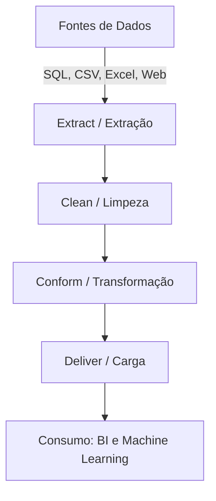

# Unidade II: Fontes, aplicações de técnicas e entrega de dados

## Notas de Estudo: Preparação e Integração de Dados (ETL)

### Introdução ao Processo ETL

O sucesso de projetos de Inteligência Artificial e Machine Learning depende fortemente da qualidade dos dados. O processo de ETL (Extract, Transform, Load) é fundamental para garantir essa qualidade, consumindo frequentemente pelo menos 70% do tempo, esforço e despesa na maioria dos projetos de Data Warehouse[cite: 3]. A arquitetura de ciclo de vida de Kimball destaca o fluxo de dados em quatro fases principais: Extração, Limpeza (Clean), Conformação (Conform) e Entrega (Deliver)[cite: 3].

### Fases do Processo ETL

- Extração (Extract):
  - É o primeiro passo e determina o sucesso de um projeto de integração[cite: 3].
  - Consiste em coletar dados de fontes heterogêneas, como bancos de dados relacionais (sistemas OLTP), arquivos planos (flat-files), planilhas, arquivos XML e páginas web[cite: 3].
  - No laboratório prático da disciplina, as fontes incluem um arquivo CSV ('FORMA_PAGAMENTO.csv'), arquivos Excel ('VENDA_PAGAMENTO.xlsx', 'EMPRESTIMO ALUNO.xlsx'), um banco de dados SQL Server ('CLIENTE.SQL') e dados extraídos via web[cite: 1].
- Transformação e Limpeza (Clean e Conform):
  - Consiste em aplicar regras de negócios ou funções sobre os dados extraídos[cite: 3].
  - Dados de qualidade devem ser corretos, sem ambiguidade, consistentes e completos[cite: 3].
  - A presença de anomalias causa retrabalho; detectá-las precocemente economiza tempo e esforço de análise[cite: 3].
  - Ações comuns incluem: selecionar apenas as colunas necessárias, desprezar campos nulos, traduzir valores codificados (por exemplo, transformar 'M' e 'F' em Masculino e Feminino), sumarizar dados, hierarquizar, transformar colunas em linhas e realizar junções cruzadas entre múltiplas origens[cite: 3].
  - Transformações matemáticas também ocorrem nesta fase, como a criação de valores calculados (exemplo prático de faturamento):
    $$ \text{ValorVenda} = \text{Quantidade} \times \text{Preço Unitário} $$
- Carga (Load / Deliver):
  - Frequência: Pode ser Incremental (executada em tempos programados, focando nas mudanças) ou Completa/Fria (executada apenas uma vez)[cite: 3].
  - Arquiteturas variam entre Batch (alta latência), Near Real Time (utilizando Change Data Capture - CDC) e Real Time (baixa latência com transformações em memória)[cite: 3].

### Estrutura dos Dados

- Estruturados: Possuem esquema predefinido, tipos de dados bem definidos e distinção clara entre estrutura e dados. Mudam com baixa frequência (exemplo: Tabelas de Banco de Dados)[cite: 3].
- Semiestruturados: Nem sempre possuem esquema rígido e a distinção entre estrutura e dados não é totalmente clara. Mudam com mais frequência (exemplos: XML, JSON)[cite: 3].
- Não Estruturados: Sem estrutura formal, representam a grande maioria dos dados gerados no mundo (exemplos: vídeos, áudios, imagens, páginas web)[cite: 3].

### Ferramentas de ETL e Self Service BI (SSBI)

- Ferramentas modernas de SSBI oferecem benefícios como extração rápida, capacidade de escalar para altos volumes de dados, soluções mais econômicas e interfaces amigáveis[cite: 3].
- O Microsoft Power BI é destacado como uma das ferramentas líderes no Quadrante Mágico do Gartner para plataformas de Analytics e Business Intelligence[cite: 3].
- A escolha da ferramenta exige entender antecipadamente seus pontos fracos para atenuar consequências, avaliando requisitos, referências e informações do fornecedor[cite: 3].

### Resolução de Exercícios: Roteiro de Laboratório Unidade 2

O laboratório prático tem o objetivo de realizar a importação de dados provenientes de fontes distintas utilizando o Power BI[cite: 1].
Abaixo está a resolução estruturada passo a passo:

1. Preparação da Arquitetura e Ferramentas:
   - Realizar o download e a instalação do SQL Server Express Edition 2019 (ou utilizar versão anterior em conjunto com o Management Studio)[cite: 1].
   - Baixar e instalar o Power BI Desktop (via portal da Microsoft com e-mail institucional ou Microsoft Store)[cite: 1].
2. Coleta dos Arquivos de Origem:
   - Localizar e baixar os arquivos da prática na plataforma Canvas: 'FORMA_PAGAMENTO.csv', 'VENDA_PAGAMENTO.xlsx' e 'EMPRESTIMO ALUNO.xlsx'[cite: 1].
3. Configuração do Banco de Dados (SQL Server):
   - Abrir o SQL Server Management Studio, conectar ao servidor local, e executar o script 'CLIENTE.SQL' para criar e popular as tabelas de origem[cite: 1].
4. Importação e Integração no Power BI (Pipeline de Carga):
   - Dados CSV: Abrir o Power BI, utilizar a opção 'Obter Dados' > 'Texto/CSV' e carregar o arquivo 'FORMA_PAGAMENTO.csv'[cite: 1].
   - Dados Excel: Retornar a 'Obter Dados' > 'Excel' e selecionar 'VENDA_PAGAMENTO.xlsx'. Repetir o processo para 'EMPRESTIMO ALUNO.xlsx', utilizando os dados para aplicar e ampliar conceitos de teoria de conjuntos (ex: uniões e intersecções lógicas no Power Query)[cite: 1].
   - Banco de Dados SQL: Selecionar 'Obter Dados' > 'SQL Server', inserir as credenciais locais e selecionar as tabelas geradas pelo script 'CLIENTE.SQL'[cite: 1].
   - Dados da Web (Web Scraping): Utilizar a opção 'Obter Dados' > 'Web' e inserir a URL 'https://valor.globo.com/valor-data/' para extrair tabelas HTML contendo indicadores econômicos em tempo real, como cotações do Dólar, Ibovespa e moedas[cite: 1, 2].
5. Refinamento Adicional:
   - Caso necessário, acessar o Power Query para manipular os dados importados utilizando a Linguagem M, consultando a documentação da Microsoft para inserção e tratamento de texto[cite: 1].

### Insights / Conexão com IA/ML

- Engenharia de Atributos (Feature Engineering): A fase de transformação do ETL é o laboratório onde cientistas de dados criam novas variáveis que alimentarão modelos de Machine Learning. O cálculo de agregações e a tradução de valores codificados geram 'features' que melhoram diretamente a precisão dos algoritmos[cite: 3].
- Prevenção do Efeito 'Garbage In, Garbage Out': Modelos preditivos de IA são extremamente sensíveis a ruídos[cite: 3]. A etapa de limpeza ('Clean'), focada em remover ambiguidades e anomalias, é essencial para garantir que a IA não aprenda padrões incorretos[cite: 3].
- Processamento de Dados Não Estruturados: Para IA avançada e Processamento de Linguagem Natural (NLP), o desafio do ETL evolui de bancos relacionais para a extração de dados não estruturados (como o texto da página do Valor Econômico[cite: 2]), transformando-os em matrizes estruturadas (embeddings) prontas para treino de redes neurais profundas.

### Diagrama de Fluxo ETL

---

[Previous](./01-fundamentals.md) | [Next](./03-data-quality.md)
