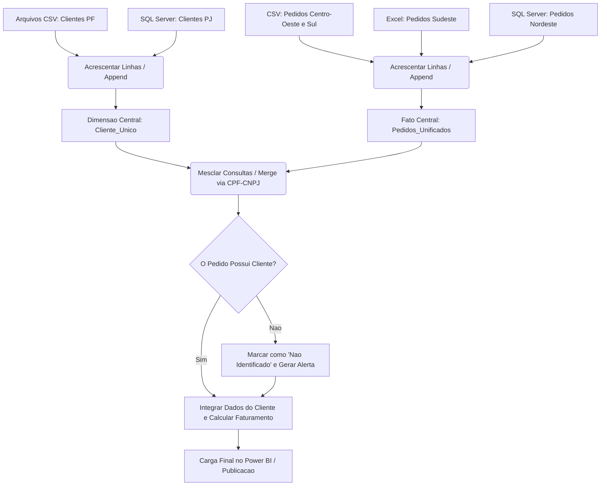

# Unidade III: Estruturação e Carga usando ferramenta Power BI

## Notas de Estudo: Projeto ETL e Integração de Dados com Power BI

### 1. Visão Geral e Objetivos do Módulo

Este módulo foca na preparação e integração de dados utilizando a ferramenta 'Power BI Desktop', atuando em um cenário prático de consolidação de bases de dados de múltiplas origens. O escopo principal é estruturar o processo de extração, transformação e carga (ETL), sem focar no momento em visualizações avançadas, mas sim na qualidade, padronização e governança da base de dados.

Objetivos principais:

- Familiarização prática com as ferramentas de ETL do 'Power BI' ('Power Query').
- Criação de uma massa de dados robusta integrando fontes heterogêneas e sistemas distintos.
- Execução de processos avançados de limpeza e transformação de dados anômalos.
- Preparação para o agendamento de cargas utilizando gateways e publicação dos dados estruturados.

### 2. Cenário do Projeto: Unificação de Vendas por Região

O estudo de caso baseia-se em um projeto real de uma Holding corporativa. A empresa comercializa um portfólio variado de produtos (desde equipamentos eletrônicos até mobília de escritório) e possui capilaridade em quatro grandes regiões do Brasil: Nordeste, Sudeste, Sul e Centro-Oeste. As operações de vendas atendem aos públicos de Pessoa Física (PF) e Pessoa Jurídica (PJ).

O grande desafio de negócio é estrutural: os sistemas regionais de vendas não são integrados. Cada região gerencia seus próprios dados em silos isolados. O objetivo do projeto é construir um fluxo de ETL que rastreie essas diferentes origens, promova a integração e limpe os dados, entregando uma base centralizada para que a área estratégica possa gerar insights valiosos.

### 3. Arquitetura, Ferramentas e Fontes de Dados

A arquitetura de integração orquestra sistemas de bancos de dados relacionais com arquivos planos dispersos.

Ferramentas selecionadas para a solução:

- 'SQL Server Express Edition' (Atuando como SGBD de origem para partes do dado).
- 'Power BI Desktop' (Motor central de self-service BI para o pipeline ETL).

Mapeamento de Fontes de Dados (Origens):

- Origens em Arquivos (CSV e Excel):
  - Clientes Pessoa Física ('CLIENTE_PF.csv').
  - Pedidos da região Centro-Oeste ('PEDIDOS_CENTRO_OESTE.csv').
  - Pedidos da região Sudeste ('PEDIDOS_SUDESTE.xlsx').
  - Pedidos da região Sul ('PEDIDOS_SUL_2016.csv' e 'PEDIDOS_SUL_2015.csv').
- Origens em Banco de Dados ('SQL Server'):
  - Clientes Pessoa Jurídica ('CLIENTE_PJ.sql').
  - Pedidos da região Nordeste ('PEDIDOS_NORDESTE.sql').

### 4. Requisitos de Negócio e Regras de Qualidade de Dados

Para o sucesso do pipeline, métricas rígidas de governança devem ser aplicadas durante o processo de transformação:

- Regra de Cliente Único: A corporação não deve mais analisar 'Clientes PF' e 'Clientes PJ' de forma isolada. Ambas as entidades devem ser consolidadas em uma única dimensão de clientes.
- Tratamento de Integridade: Pedidos que chegarem sem a informação ou chave de relacionamento com o cliente não devem ser descartados. Eles precisam ser carregados na base final e sinalizados, permitindo avaliações e correções posteriores pela equipe de qualidade na origem.
- Padronização de Schema: A tabela unificada de pedidos deve obrigatoriamente disponibilizar os seguintes atributos:
  - Logística e Temporal: Região, Data do pedido, Data de entrega, Postagem de envio, UF de entrega.
  - Produto: Código, Descrição, Categoria e Subcategoria.
  - Faturamento: Valor unitário, Valor total, Quantidade e Percentual de desconto.
  - Cliente: CPF/CNPJ, Nome, UF e Tipo (PF ou PJ).

### 5. Resolução Prática e Modelagem (Passo a Passo ETL)

Abaixo detalhamos o roteiro analítico para a resolução do laboratório utilizando a linguagem M.

- Passo 1: Extração (Extract)
  - Estabelecer conexões locais e via banco de dados ('SQL Server').
  - Importar todas as tabelas e planilhas como consultas independentes ('Queries') no 'Power Query'.

- Passo 2: Consolidação da Dimensão Cliente (Transform)
  - Renomear as colunas das fontes 'CLIENTE_PF' e 'CLIENTE_PJ' para garantir simetria nos cabeçalhos.
  - Criar uma coluna condicional ou fixa identificando o 'Tipo de Cliente' ('PF' ou 'PJ').
  - Utilizar a operação de 'Acrescentar Consultas' (Append) para empilhar as duas bases, criando a visão final corporativa de 'Cliente Único'.

- Passo 3: Empilhamento da Fato Pedidos (Transform)
  - Realizar o 'parse' de tipos de dados (Garantir que datas estejam formatadas como Date e valores como Decimal em todas as regiões).
  - Executar a união ('Append') das bases regionais (Sul, Sudeste, Centro-Oeste e Nordeste) gerando uma tabela unificada de transações.

- Passo 4: Enriquecimento de Dados Numéricos
  - Caso o valor financeiro consolidado não exista, aplicar a transformação matemática em uma nova coluna customizada:
    $$Valor Total = (Quantidade \times Valor Unitario) \times (1 - Percentual Desconto)$$

- Passo 5: Integração Relacional (Merge) e Tratamento de Exceções (Load)
  - Utilizar a operação 'Mesclar Consultas' (Left Outer Join) cruzando a Tabela Fato de Pedidos com a Tabela Dimensão de Clientes utilizando o CPF/CNPJ como chave de ligação.
  - Expandir as colunas Nome, UF e Tipo do cliente diretamente para a visão unificada.
  - Substituir valores 'Null' nos dados do cliente por 'Cliente Não Identificado' para satisfazer o requisito de negócio e evitar perda de faturamento nas métricas.

### 6. Fluxo Lógico do Processo ETL

### 7. Insights / Conexão com IA/ML

A estruturação rigorosa, limpa e rastreável de um pipeline ETL é o alicerce absoluto para a implantação futura de projetos de Machine Learning dentro de uma corporação.

- Engenharia de Features de Alta Qualidade: A unificação de esquemas (padronização de categorias de produtos e cálculos financeiros robustos) fornece um dataset limpo. O processo de ETL que resolve dados ausentes (imputação de 'Cliente Não Identificado') economiza semanas de trabalho da equipe de Ciência de Dados na etapa de 'Feature Engineering'.
- Modelos de Previsão de Demanda (Forecasting): Com a quebra dos silos de dados, algoritmos de séries temporais podem analisar todo o comportamento de vendas unificado, descobrindo sazonalidades latentes entre regiões que antes eram ofuscadas pela separação dos sistemas.
- Motores de Recomendação Integrados: Consolidar Pessoas Físicas e Jurídicas no mesmo ecossistema permite que o algoritmo cruze perfis de compras. Um cliente 'PJ' do Sudeste pode receber recomendações de infraestrutura ('Cross-sell') baseadas em tendências identificadas em compras de volume similar ocorridas no Centro-Oeste ou Sul.

---

[Previous](./02-data-delivery.md) | [Next](./04-tableau.md)
