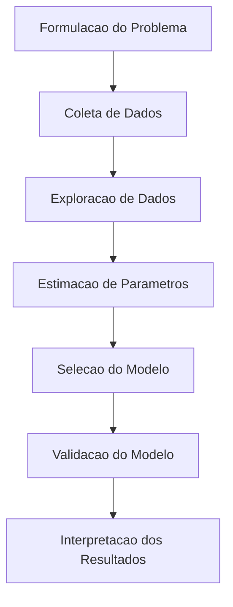
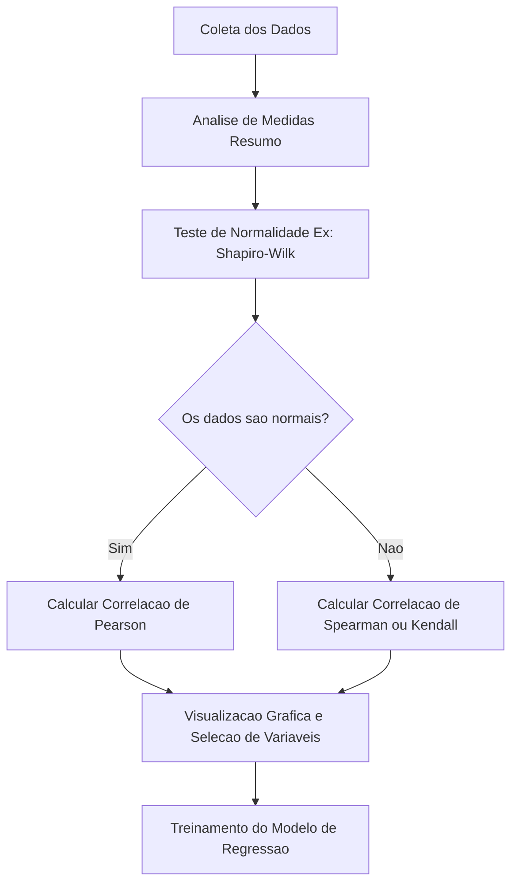

# Unidade I: Regressão Linear Simples e Múltipla

---

## Notas de Estudo: Fundamentos de Modelos Estatísticos e Regressão Linear

### Introdução à Modelagem Estatística

A modelagem estatística desempenha um papel fundamental na análise de dados e na tomada de decisões. Um modelo estatístico é uma representação simplificada e abstrata de um fenômeno ou sistema real, construída com base em princípios estatísticos e matemáticos. Seu propósito principal é descrever a relação entre variáveis, fornecendo uma estrutura estruturada para entender, analisar e prever dados em diversos contextos.

Nas ciências de dados, esses modelos são amplamente utilizados para compreender padrões complexos, explorar relações intrínsecas nos dados e embasar decisões corporativas em evidências quantitativas sólidas.

### Por Que Modelar?

A construção de modelos estatísticos é guiada por três pilares essenciais:

- Compreensão do fenômeno: Permite entender como diferentes variáveis interagem e se influenciam mutuamente, extraindo insights profundos sobre o sistema estudado.
- Previsão e predição: Possibilita a projeção de resultados futuros com base em dados históricos, sendo uma ferramenta inestimável para planejamento estratégico.
- Teste de hipóteses: Ajuda a avaliar a significância estatística de diferentes fatores, determinando se uma relação observada é genuína ou mero resultado do acaso.

### Objetivos da Modelagem Estatística

A aplicação prática dos modelos atende aos seguintes objetivos de negócios e pesquisa:

- Descrição: Resumir dados para identificar tendências e comunicar informações complexas de forma clara.
- Inferência: Generalizar conclusões sobre uma população inteira a partir do estudo de uma amostra representativa.
- Previsão: Antecipar eventos e tendências para tomada de decisão proativa.
- Controle e otimização: Identificar fatores-chave de sucesso para otimizar processos e induzir a melhoria contínua.

### Os 5 Principais Modelos Estatísticos

No arsenal do cientista de dados, destacam-se cinco famílias principais de modelos clássicos:

1. Regressão Linear
2. Análise de Variância (ANOVA)
3. Regressão Logística
4. Análise de Sobrevivência
5. Séries Temporais

### Etapas da Modelagem Estatística

O ciclo de vida do desenvolvimento de um modelo estatístico segue um fluxo lógico e iterativo. O diagrama abaixo ilustra essas etapas de forma sequencial.



### Fundamentos da Regressão Linear

A Regressão Linear é a base matemática para muitos algoritmos preditivos. Seu objetivo é modelar a relação entre uma variável dependente (alvo) e uma ou mais variáveis independentes (preditoras).

#### Formulação do Modelo

A equação clássica da reta de regressão linear simples é expressa por:

$$Y = \beta_0 + \beta_1 X + \epsilon$$

Onde:

- $Y$ representa a variável dependente (o que queremos prever).
- $X$ representa a variável independente (o preditor).
- $\beta_0$ é o coeficiente linear (intercepto), indicando o valor de $Y$ quando $X$ é zero.
- $\beta_1$ é o coeficiente angular (inclinação), indicando a taxa de variação de $Y$ para cada unidade de variação em $X$.
- $\epsilon$ é o termo de erro, que captura a variância não explicada pelo modelo.

#### Método dos Mínimos Quadrados Ordinários (OLS)

A estimação dos parâmetros $\beta_0$ e $\beta_1$ é geralmente feita pelo método dos Mínimos Quadrados. Este método busca encontrar a reta que minimiza a soma dos quadrados das diferenças (resíduos) entre os valores observados e os valores previstos pelo modelo.

### Avaliação da Qualidade do Ajuste do Modelo

Após a construção do modelo, é imprescindível validar sua confiabilidade:

- Coeficiente de Determinação (R² ajustado): Mede a proporção da variabilidade da variável dependente que é explicada pelas variáveis independentes. O R² ajustado penaliza a inclusão de variáveis irrelevantes no modelo de regressão múltipla, sendo uma métrica mais robusta que o R² simples.
- F-teste de significância global: Avalia se pelo menos uma das variáveis independentes tem poder preditivo sobre a variável dependente, validando a utilidade geral do modelo.

### Diagnósticos e Problemas Potenciais

A validade de um modelo de regressão linear depende do atendimento a certas premissas estatísticas. Violações dessas premissas exigem correção:

- Multicolinearidade: Ocorre quando variáveis independentes são altamente correlacionadas entre si. Isso distorce a interpretação dos coeficientes individuais e infla a variância das estimativas.
- Heterocedasticidade: Refere-se à situação em que a variância dos erros não é constante ao longo de todas as observações. Isso compromete a validade dos testes de significância estatística.

### Insights / Conexão com IA/ML

A transição da modelagem estatística clássica para o Aprendizado de Máquina (Machine Learning) moderno é contínua. Em IA, a 'Regressão Linear' frequentemente atua como o 'modelo baseline' fundamental. Antes de aplicar algoritmos complexos como Redes Neurais ou Gradient Boosting, cientistas de dados treinam um modelo de regressão para estabelecer um referencial de performance.

Além disso, conceitos estatísticos como 'termo de erro', 'estimação de parâmetros' e 'validação' formam a base matemática para o treinamento de qualquer inteligência artificial. A otimização dos pesos em uma rede neural profunda, por exemplo, é uma evolução conceitual do método dos mínimos quadrados, utilizando descida de gradiente para minimizar as funções de perda num espaço de alta dimensionalidade.

---

## Notas de Estudo: Fundamentos de Regressao e Medidas de Associacao

Este documento organiza os conceitos fundamentais sobre analise descritiva, modelos de regressao e calculo de correlacao, integrando teoria estatistica com implementacao pratica em Python. Estes fundamentos sao essenciais para a fase de analise exploratoria de dados (EDA) em projetos de Inteligencia Artificial e Machine Learning.

### 1. Medidas Resumo

As medidas resumo ajudam a compreender a distribuicao e o comportamento dos dados antes de aplicarmos modelos preditivos. Elas se dividem em tres categorias principais:

- **Medidas de Centralidade:** Buscam resumir o conjunto de dados em um unico valor representativo.
  - _Media:_ Valor medio do conjunto.
  - _Mediana:_ Valor central que divide os dados ao meio. Menos sensivel a valores atipicos (outliers).
  - _Moda:_ Valor que ocorre com maior frequencia.
- **Medidas de Dispersao:** Avaliam o grau de espalhamento dos dados em torno do centro.
  - _Variancia:_ Media dos quadrados das diferencas em relacao a media.
  - _Desvio Padrao:_ Raiz quadrada da variancia, retornando a medida para a escala original dos dados.
- **Medidas de Posicao Relativa:** Dividem os dados em partes iguais para entender a distribuicao percentual.
  - _Quartis:_ Dividem a amostra em quatro partes iguais (25%, 50%, 75%).
  - _Percentis:_ Dividem a amostra em cem partes iguais.

### 2. Medidas de Associacao e Correlacao

Para entender como duas variaveis se comportam em conjunto (ex: como o preco de uma casa varia em relacao ao seu tamanho), utilizamos medidas de associacao.

- **Direcao da Correlacao:**
  - _Positiva:_ Quando uma variavel cresce, a outra tambem cresce.
  - _Negativa:_ Quando uma variavel cresce, a outra decresce.
  - _Nula:_ Nao ha padrao de crescimento conjunto identificavel.
- **Forma da Correlacao:** Pode ser Linear, Exponencial ou em forma de U, por exemplo.
- **Forca da Correlacao:** Avaliada entre -1 e 1. Valores proximos as extremidades indicam associacao forte (positiva ou negativa), e valores proximos a zero indicam associacao fraca ou inexistente.

### 3. Principais Coeficientes de Correlacao

#### Coeficiente de Pearson

Mede a associacao linear entre variaveis continuas que seguem uma distribuicao normal. Avalia se a relacao pode ser bem tracada por uma linha reta.

#### Coeficientes Nao-Parametricos (Spearman e Kendall)

Utilizados quando os dados nao seguem uma distribuicao normal ou quando se trata de variaveis ordinais. Eles avaliam a relacao baseada nos postos (rank) dos dados, e nao em seus valores absolutos.

_Fórmula da Correlacao de Spearman:_
$$r_{R} = 1 - \frac{6\sum_{i}{d_{i}}^{2}}{n(n^{2}-1)}$$
Onde $d_{i}$ e a diferenca entre os postos dos pares de observacoes, e $n$ e o numero de pares.

### Fluxo de Analise de Correlacao em IA/ML



### 4. Estudo de Caso: Analise de Gorjetas com Python

Com base nos materiais, realizamos uma exploracao pratica utilizando o dataset 'tips' (gorjetas em um restaurante), que visa entender a relacao entre o total da conta, tamanho do grupo e o valor da gorjeta.

#### Passo 1: Importacao de Bibliotecas e Carga dos Dados

```python
import pandas as pd
import seaborn as sns
import matplotlib.pyplot as plt
from scipy.stats import pearsonr, spearmanr, kendalltau, shapiro

# Carregando o dataset de gorjetas
df = sns.load_dataset('tips')
```

#### Passo 2: Analise Exploratoria Inicial (Medidas Resumo)

```python
# Identificando o tipo das variaveis
print(df.dtypes)

# Isolando as variaveis numericas e extraindo medidas resumo
numericas = df.select_dtypes(include='number')
resumo = numericas.describe()
print(resumo)
```

_Resultado esperado:_ O dataset exibira as contagens, medias, desvios padroes e quartis de variaveis como 'total_bill' (total da conta) e 'tip' (gorjeta). A media do total da conta ajuda a ancorar os padroes de consumo.

#### Passo 3: Calculo das Correlacoes e Teste de Normalidade

Apos compreender as medidas de centralidade e dispersao, devemos testar a distribuicao (ex: usando o metodo de Shapiro-Wilk importado da scipy.stats) para decidir qual coeficiente adotar. Como visto no material, variaveis financeiras reais costumam ser assimetricas, validando o uso de testes nao-parametricos.

```python
# Matriz de Correlacao de Pearson (padrao do pandas)
correlacao_pearson = numericas.corr(method='pearson')

# Matriz de Correlacao de Spearman
correlacao_spearman = numericas.corr(method='spearman')

# Matriz de Correlacao de Kendall
correlacao_kendall = numericas.corr(method='kendall')
```

### 5. Insights / Conexao com IA/ML

A analise de associacao e o primeiro passo no desenvolvimento de modelos de **Regressao Linear** em Machine Learning. Na pratica industrial:

- **Selecao de Features (Feature Selection):** Variaveis que possuem forte correlacao com a variavel alvo (ex: 'total_bill' em relacao a 'tip') sao excelentes preditores para algoritmos de regressao.
- **Deteccao de Multicolinearidade:** Se duas variaveis de entrada (features) possuirem uma correlacao muito forte (proxima de 1) entre si, isso pode desestabilizar os pesos de um modelo de Regressao Linear. O analista de dados utiliza as matrizes de correlacao para descartar caracteristicas redundantes.
- **Robustez Nao-Parametrica:** Em cenarios reais, poucos dados seguem distribuicoes normais perfeitas. Dominar os conceitos de postos e as correlacoes de Spearman e Kendall e vital para validar relacoes monotonicas que modelos baseados em arvores (como Random Forest ou XGBoost) capturarao de forma muito mais eficiente do que as regressoes estritamente lineares.

---

[Previous](../05-statistical-models/summary.md) | [Next](../05-statistical-models/02-generalized-linear-models.md)
