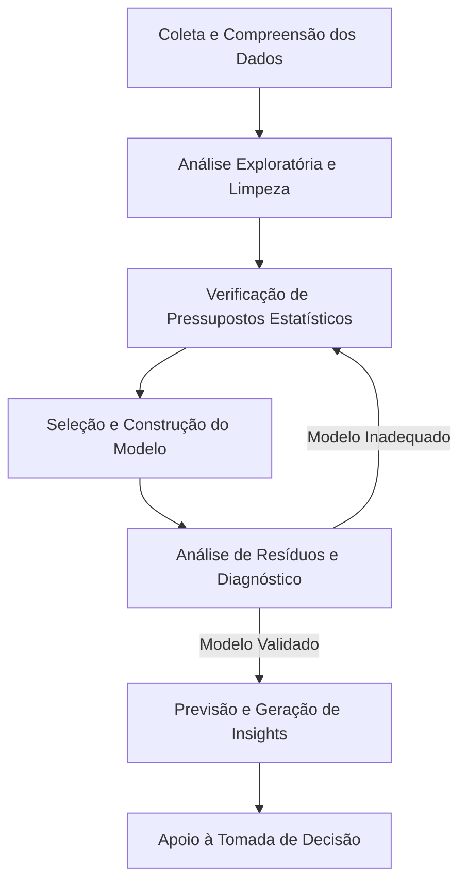

# Modelos Estatísticos

- [Unidade I: Regressão Linear Simples e Múltipla](./01-linear-gregression.md)
- [Unidade II: Modelos Lineares Generalizados](./02-generalized-linear-models.md)
- [Unidade III: Séries Temporais](./03-time-series.md)

## 1. Visão Geral da Disciplina

A disciplina de Modelos Estatísticos atua como um pilar fundamental na formação de cientistas de dados e especialistas em Inteligência Artificial. Muito além do rigor acadêmico, o domínio desses modelos é o que permite a extração de informações valiosas a partir de conjuntos de dados volumosos e complexos.

O objetivo central é capacitar o profissional a identificar padrões, modelar tendências e apoiar a tomada de decisões corporativas de forma fundamentada, mitigando riscos e reduzindo a incerteza.

## 2. Fundamentos e Aplicações de Mercado

A transição da teoria estatística para a prática de mercado exige um pensamento crítico apurado. Em um ambiente de negócios, aplicar o modelo correto pode significar a diferença entre uma estratégia de sucesso e um erro custoso.

- Regressão Linear: Utilizada para prever valores contínuos. No mercado, é frequentemente aplicada para estimar o preço de imóveis, prever o faturamento mensal de uma loja com base em investimentos em marketing ou calcular a elasticidade de preço de um produto.
- Regressão Logística (GLM): Essencial para problemas de classificação. Empresas utilizam este modelo para calcular o risco de crédito (credit scoring), prever a evasão de clientes (churn) ou identificar transações fraudulentas.
- Séries Temporais: Focadas em dados sequenciais. O varejo e o setor financeiro dependem fortemente de modelos como ARIMA e SARIMA para planejamento de estoque, previsão de demanda sazonal e análise de flutuações de mercado.

## 3. Conteúdo Programático Estruturado

### Unidade 1: Regressão Linear Simples e Múltipla

Esta unidade aborda a modelagem da relação entre uma variável dependente e uma ou mais variáveis independentes.

- Introdução a Modelos Estatísticos.
- Regressão Linear Simples e Múltipla.
- Pressupostos de Regressão: Linearidade, independência, homocedasticidade e normalidade dos resíduos.
- Diagnóstico em Regressão: Avaliação da qualidade e adequação do modelo.
- Engenharia de Recursos: Transformação e seleção de variáveis.
- Construção e Validação de Modelos.

Matematicamente, a regressão linear simples pode ser expressa como:
$$ Y = \beta_0 + \beta_1 X + \epsilon $$
Onde $Y$ é a variável resposta, $X$ é a variável preditora, $\beta_0$ é o intercepto, $\beta_1$ é o coeficiente de inclinação e $\epsilon$ representa o erro aleatório.

### Unidade 2: Modelos Lineares Generalizados (GLM)

Os GLMs expandem a regressão linear tradicional para acomodar variáveis de resposta que possuem erros não normais, utilizando a Família Exponencial de Distribuições.

- Componentes do GLM: Componente sistemática e Função de ligação.
- Modelo Logístico: O caso mais comum de GLM para respostas binárias.
- Funções e Testes: Função desvio, Função escore e Testes de Hipóteses.
- Matriz de Informação de Fisher e Análise de diagnóstico.

A função de ligação canônica para a regressão logística (logit) é dada por:
$$ \ln\left(\frac{p}{1-p}\right) = \beta_0 + \beta_1 X_1 + \dots + \beta_n X_n $$

### Unidade 3: Séries Temporais

Foco na análise de dados coletados em intervalos de tempo sequenciais, visando identificar o comportamento passado para prever o futuro.

- Introdução e Componentes: Tendência, Sazonalidade, Ciclos e Ruído Aleatório.
- Análise Exploratória de Séries Temporais: Decomposição e autocorrelação.
- Modelos de Previsão: Foco especial nas metodologias ARIMA (AutoRegressive Integrated Moving Average) e SARIMA (que adiciona o componente sazonal).

## 4. Fluxo de Trabalho em Modelagem Estatística

Abaixo, apresentamos o fluxo padrão de desenvolvimento de um modelo estatístico, desde a coleta dos dados até a tomada de decisão.

## 5. Metodologia de Estudo e Prática

A disciplina requer forte engajamento prático. O domínio das equações e da teoria deve ser complementado pela aplicação computacional.

- Aulas em vídeo e leitura de bibliografia online.
- Discussões ativas no ambiente virtual.
- Atividades práticas de fixação e validação de código.
- É imperativo programar os modelos estudados e testá-los em conjuntos de dados reais para construir o pensamento crítico necessário ao cargo de Cientista de Dados.

## 6. Bibliografia de Apoio

Para aprofundamento técnico, recomenda-se a leitura das seguintes obras:

- Estatística Básica (Bussab e Morettin).
- Introduction to Linear Regression Analysis (Montgomery, Peck, Vining).
- Regression Analysis by Example (Chatterjee e Hadi).
- Séries Temporais (Morettin e Toloi).
- Livros complementares voltados à aplicação em Python e R (ex: Regression Analysis with Python / R).

## 7. Insights / Conexão com IA/ML

- Complementaridade: Modelos estatísticos clássicos (como a Regressão Linear e Logística) são os precursores diretos das redes neurais artificiais. O neurônio artificial (Perceptron) utiliza funções de ativação que são matematicamente análogas à função de ligação da regressão logística.
- Baseline de Desempenho: No mercado de Inteligência Artificial, antes de treinar modelos complexos como Random Forests, Gradient Boosting ou Deep Learning, é uma excelente prática utilizar um GLM ou ARIMA como 'baseline'. Se um modelo estatístico simples resolve o problema de negócio com precisão aceitável, ganha-se em interpretabilidade e eficiência computacional.
- Interpretabilidade (Explainable AI - XAI): Diferente de modelos de caixa preta, os modelos estatísticos possuem alta interpretabilidade. Os coeficientes informam diretamente a magnitude e a direção do impacto de cada variável no resultado final, o que é frequentemente uma exigência legal e regulatória em setores como finanças e saúde.

---

[Previous](../04-data-preparation-and-integration/summary.md) | [Next](../06-machine-learning/summary.md)
